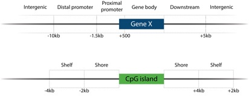

Epigenomics Practical 2019
================
Roderick Slieker and Bas Heijmans

## Important:

  - Download the following files and save them in one folder:

[Tissue data subset.csv](Tissue%20data%20subset.csv)

[Tissue data chromosome 22.csv](Tissue%20data%20chromosome%2022.csv)

[Tissue data chromosome 22
significant.csv](Tissue%20data%20chromosome%2022%20significant.csv)

[Significant probes.bed](Significant%20probes.bed)

[TissueData chr22.RData](TissueData%20chr22.RData)

  - At the end of the practical send your work to
    **<r.c.slieker@lumc.nl>** as Word document with your name(s) on top
    of the first page. The file name should contain your surname(s).

## Introduction

**A primary function of DNA methylation, a key component of the
epigenome, is to control cell differentiation. In this practical, you
will identify and annotate differential methylation between tissues
using genome-wide data generated with Illumina 450k chips. The coming
few hours you will replicate many of our groups’ findings which were
published in 2013. Good luck and have fun\!**

Slieker et al. Identification and systematic annotation of
tissue-specific differentially methylated regions using the Illumina
450k array. Epigenetics & Chromatin volume 6

<https://epigeneticsandchromatin.biomedcentral.com/articles/10.1186/1756-8935-6-26>

## Question 1

**The data that you will use in this practical consists of genome-wide
DNA methylation data (Illumina 450k methylation array) of tissues from
autopsy samples. Read the file ‘Tissue data subset.csv’ in R. The file
contains the DNA methylation data of a single CpG site with identifier
number cg21507095.**

``` r
library(ggplot2)
#Change this to the directory where you saved the files
setwd("Z:/Roderick/013 Onderwijs/2019_FOS")
TissueData <- read.table("Tissue data subset.csv", sep=";", header=T)
```

**A Which tissues were studied? And on how many cases?**

``` r
head(TissueData) # First 6 lines of the data
str(TissueData) # Characteristics of the data
unique(TissueData$Tissue) # What groups are in the vector?
```

**B Make a plot of DNA methylation in the different tissues. Also,
calculate the mean methylation and standard deviation for the tissues.
Do you think that these differences are biologically relevant?**

``` r
ggplot(TissueData, aes(x=Tissue, y=cg21507095, color=Tissue))+ # Assign variables to x, y, and fill
  stat_summary(fun.data = "mean_cl_boot",  size = 1)+
  geom_jitter(width=0.2)+
  scale_colour_manual(values=c("#009AC7","#132B41","#F9A23F"))+ # Give custom colors to the boxes using HEX colors
  ylim(0,1)
#Mean and SD
# Data = data to calculate statistic over, INDICES = grouping variable, FUN = function to be used
by(data = TissueData$cg21507095, INDICES = TissueData$Tissue, FUN=mean)
by(data = TissueData$cg21507095, INDICES = TissueData$Tissue, FUN=sd)
```

**C Test whether the difference is statistically significant using
ANOVA. Is the difference between tissues statistically significant?**

``` r
#Run the anova for one CpG
anova(lm(cg21507095~Tissue, data=TissueData)) 
```

**D Now, use the UCSC Genome Browser to annotate the CpG site. Go to
<http://genome.ucsc.edu/>, click Genomes (Assembly: Feb 2009
(GRCh37/hg19)) and look up the position of the CpG site (type the CpG
identifier in the search term box). Then scroll down to Regulation, find
CpG islands, set this feature to ‘show’ and click refresh on the right
of the screen. Describe in your own words what CpG islands do and how
they are defined ( right click on the CpG island track, Show details).**

**E Go back to the genome browser. Scroll up and use ‘zoom out’ to find
out: (1) in which gene the CpG is located, (2) what part of the gene it
is located (intron, exon, etc.) and (3) whether it is located in a CpG
island.**

**F Navigate to the EWAS datahub
(<https://bigd.big.ac.cn/ewas/datahub>), search for cg21507095. Click on
tissue and compare/validate your findings.**

**G Navigate to other diseases. From the drop down menu choose type 2
diabetes. Is there a difference? In all tissues?**

**H TBX1 has been suggested to play a role in obesity. Go to the BMI tab
look at the different tissues. What do you conclude?**

## Question 2

**You will investigate DNA methylation between tissues across a complete
chromosome instead of a single CpG site. Load the file Tissue data
chromosome 22.csv with DNA methylation data for chromosome 22 across
three tissues.**

**A How many CpGs were measured on chromosome 22?**

``` r
TissueData22 <- read.table("Tissue data chromosome 22.csv", sep=";", header=T)
head(TissueData22)
nrow(TissueData22) #Number of rows
```

**B Make a histogram for DNA methylation data for blood. Inspect the
histogram and describe the characteristics of DNA methylation in the
human genome (note that the histogram will look virtually identical for
other chromosomes and tissues).**

``` r
ggplot(TissueData22, aes(x=Blood))+
  geom_histogram(bins = 200)
```

**C The genome can be categorized in different genomic features.
Gene-centric annotations divide the genome relative to gene
structure/function. One can also annotate CpGs based on the CpG density,
that is CpG islands and their surroundings. Use the annotation figure
below to re-answer 1E.**



**D The file Tissue data chromosome 22.csv contains columns with
annotation information. Make violin plots for the gene centric
annotation for blood. Describe the differences in DNA methylation across
annotations and explain whether this is according to your expectation
given your knowledge of the function of DNA methylation.**

``` r
ggplot(TissueData22, aes(x=Gene_centric, y=Blood, fill=Gene_centric))+
  geom_violin()+
  scale_fill_manual(values=c("#440154FF","#3B528BFF","#21908CFF","#5DC863FF","#FDE725FF"))+
  theme(axis.text.x = element_text(angle=90, hjust=1, vjust=0.5)) # Rotate axis labels
```

**E Do the same for the CpG island annotation. Where is DNA methylation
lowest?**

``` r
ggplot(TissueData22, aes(x=CGI_centric, y=Blood, fill=CGI_centric))+
  geom_violin()+
  scale_fill_manual(values=c("#440154FF","#3B528BFF","#21908CFF","#5DC863FF","#FDE725FF"))+
  theme(axis.text.x = element_text(angle=90, hjust=1, vjust=0.5))
```

**F In question Q1C we calculated the P-value for one CpG site. Now we
want to run this for each of the CpGs sites across chromosome 22.
Instead of saving data as csv, one can also save it as RData files. Load
the RData file TissueData chr22.RData. This file contains two files,
namely samplesheet and TissueDataChr22. Look at both files. What are the
dimensions of both files?**

``` r
a = load("TissueData chr22.RData") # Contains two files samplesheet, TissueDataChr22
a
```

``` r
head(samplesheet)
dim(samplesheet) # Number of rows and number of columns
head(TissueDataChr22)
dim(TissueDataChr22)
```

**G In R we can use functions to easily run a model across many loci.
Run the function for the first and the second line.**

``` r
getPvalue <- function(row, data, samplesheet)
{
  fit <- anova(lm(data[row,]~samplesheet$Tissue)) # Run the model
  out <- data.frame(CG = row, Fvalue = fit$`F value`[1], Pvalue = fit$`Pr(>F)`[1]) # Make a data.frame for the output
  as.matrix(out)
}

#Run for one CpG site
getPvalue('cg00017461', data=TissueDataChr22, samplesheet=samplesheet)
```

**H Now run the model across all CpGs on chromosome 22. Note that this
takes a bit of time - after all R is running 8513 tests - and note that
this couldn’t be achieved using SPSS (only when the tests were done one
by one). Look at the output.**

``` r
#Which CpGs are there
cpgs <- rownames(TissueDataChr22)
head(cpgs)
# Now run the model for all CpGs on chromosome 22
res <- lapply(cpgs, getPvalue, data=TissueDataChr22, samplesheet=samplesheet) # Returns a list of results per CpG
head(res)
ResultsChromosome22 <- do.call(rbind, res) #Combine to a table
head(ResultsChromosome22)
```

## Question 3

**A When measuring many features (here CpGs), one must account for the
fact that many statistical tests are being performed. Small P-values
will be observed purely by chance. In this case, the number of tests
equals the number of CpGs in the file. Which P-value threshold is
commonly used to declare an association statistically significant in
case of a single statistical test? How many P-values lower than this
threshold would you expect by chance in this chromosome 22 data set?**

**B An intuitive and popular (but perhaps somewhat conservative) way to
correct the p-value is to multiply the calculated P-value by the number
of tests performed or correct the significance level, i.e. divide the
P-value threshold for a single test by the total number of tests. This
is called Bonferroni correction. What is the Bonferroni-corrected
P-value for chromosome 22 (i.e. the threshold for statistical
significance after accounting for multiple testing)?**

**C For question 1C, you calculated a P-value for the example CpG site.
Compare this P-value to the P-value calculated in 3B (after all it’s
only one of many CpG sites measured on chromosome 22). Is the difference
significant after multiple testing correction?**

**D The column Pval\_corrected contains 0 and 1’s that mark
non-significant and significant CpGs based on the P-value calculated in
3B. How many CpGs (absolute and as percentage) are significant after
multiple testing?**

``` r
table(TissueData22$Pval_corrected)
```

**E Now, we want to know whether a particular genomic feature is
overrepresented in the identified significant CpG sites. You will focus
on the two best covered genic annotations (proximal promoters and gene
bodies). The significant CpGs in these two features can be found in the
file Tissue data chromosome 22 significant.csv. Load the file. Make a
frequency table of the number of CpGs per group and split by CpG islands
and non-CpG islands.**

``` r
TissueData22sign <- read.table("Tissue data chromosome 22 significant.csv", sep=";", header=T)
head(TissueData22sign)


table(TissueData22sign$Gene_centric)
table(TissueData22sign$CGI_centric)

table3e <- table(TissueData22sign$Gene_centric, TissueData22sign$CGI_centric)
table3e
```

**F Now you have the frequency per combined feature (so for example
proximal promoter CpG islands). Calculate the percentages of the number
of significant CpGs per feature compared to the total number of
significant CpGs from 3D. What is your interpretation?**

``` r
table3f <- (table3e / 1805)*100
round(table3f,1)
```

**G Using the percentages to see where the changes occur is driven by
the design of the technology. One can also express the
overrepresentation of CpG sites in a specific feature as an odds ratio.
What does the odss ratio reflect? What does an odds ratio below 1 mean?
Calculate the odds ratio for proximal promoters, what do you conclude?**

|                   | Sign | Non-Sign | Total |
| ----------------- | ---- | -------- | ----- |
| Proximal Promoter | a    | b        | a+b   |
| Elsewhere         | c    | d        | c+d   |
| Total             | a+c  | b+d      |       |

``` r
#Calculate a
a <- table(TissueData22sign$Gene_centric)["Proximal promoter"]
n.prox <- table(TissueData22$Gene_centric)["Proximal promoter"]

#Calculate b-d
b <- n.prox - a
c <- 1805 - a
d <- 8463 - a - b - c

#Now calculate the odds ratio
OR <- (a/b)/(c/d)

#One can formally test the enrichment / depletion with a chi-squared test
chisq.test(matrix(c(a,b,c,d), ncol=2, byrow = TRUE))
#Or Fisher exact test (better)
fisher.test(x = matrix(c(a,b,c,d), ncol=2, byrow = TRUE))
```

## Question 4

**Now, you will focus on ‘top-hits’ (=CpG sites with lowest P-values)**

**A Sort the file by P-value (ascending). Select the two CpG sites with
the lowest and second lowest P-value. What is the methylation level of
these CpGs in the tissues investigated? What is the largest difference
in DNA methylation observed?**

``` r
TissueData22signOrdered <- TissueData22sign[order(TissueData22sign$Pval),]
head(TissueData22signOrdered)
```

**B Go to the UCSC genome browser at <http://genome.ucsc.edu/>. Click on
My Data at the top of the page and then Custom Tracks. Upload the
significant probe.bed as a custom track (click Choose File and then
Submit; like before, use assembly Feb 2009 (GRCh37/hg19)). Click go to
genome browser. For clarity, display the track as ‘dense’. A red
vertical line denotes a differentially methylated CpG (accounting for
multiple testing), a blue vertical line is a CpG for which there is no
statistical evidence for differential methylation.**

**C Look up to the two top-hits (See 1E how to if you don’t know how).
In which gene centric / CGI centric feature are the top-hits? Also
see/use question 2C.**

**D Go through question 1f-h again for the tophit. What do you observe**

**E Zoom out in UCSC for both top-hits. Is the differential methylation
limited to a single CpG site or does it extend across a region (Use the
custom track from 4B)? Does this influence your interest in the two CpGs
and why?**

**F The second lowest top-hit maps to the PARVG gene. How many different
transcripts can arise from this gene (track UCSC genes)? Do you observe
differential methylation near alternative transcript start sites for the
gene?**

**G Look up the nearest gene of the tophits in GeneCards
(www.genecards.org). Look at the protein expression and the mRNA
expression for the three tissues studied if available. Is the gene
expressed in a tissue-specific fashion?**

**H To gain insight into gene function related to differentially
methylation you can use GREAT (Genomic Regions Enrichment of Annotations
Tool). Go to the GREAT
website(<http://bejerano.stanford.edu/great/public/html/index.php>).
Select human hg19/ GRCh37. Select all significant CpG sites from the csv
file and copy the chromosome, start and end column and paste that into
test regions (after clicking BED data). Also, copy all CpG sites and
paste that into background regions (click BED data). Click Show Settings
and select single nearest gene. Click submit and wait (may take some
time) until the site has calculated the enrichment in gene categories
(Biological processes). Which biological processes are enriched for
differential methylation? How does that relate to the tissues studied?**

## Question 5 (Facultative)

**There is increasing evidence that DNA methylation is associated with
alternative transcription events. A paper showed that there is a role
for intragenic (differential) DNA methylation in the regulation of
alternative transcription events (Maunakea AK et al. Conserved role of
intragenic DNA methylation in regulating alternative promoters. Nature
2010; 466: 253-7).**

**A Read the abstract and inspect Figure 3a in the paper. In what
process is DNA methylation implicated to play a role in? For which gene
and which annotation within that gene do the authors provide
experimental evidence for this role? Discuss the tracks given in Figure
3a and their implication.**

**B Look up this gene in UCSC for you own data. Display the custom track
you used before and CpG island track. Argue why the data on the three
tissues is either in line or at odds with the observations of Maunakea
et al.**
