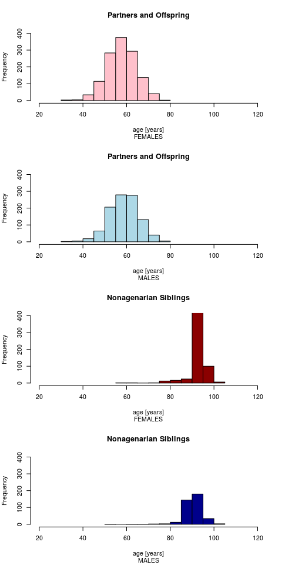
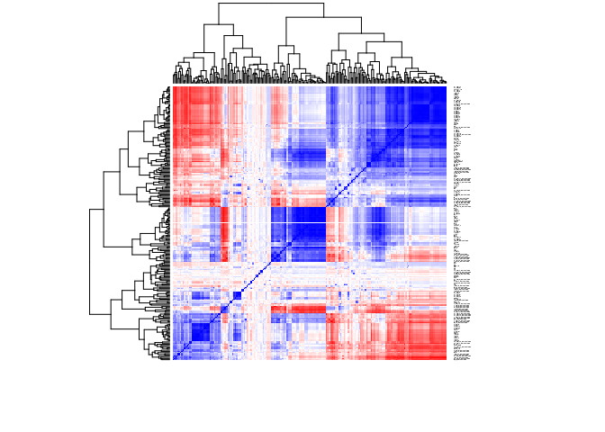
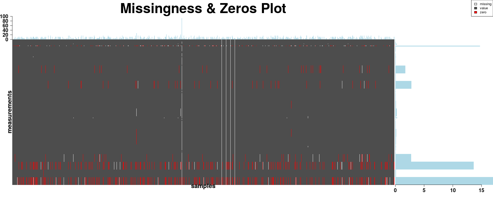
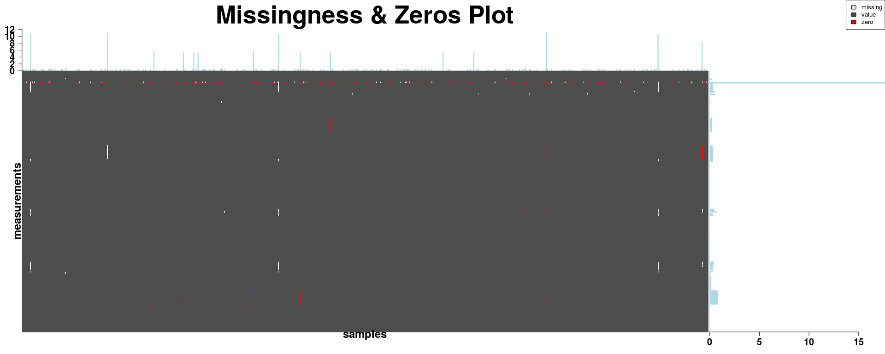
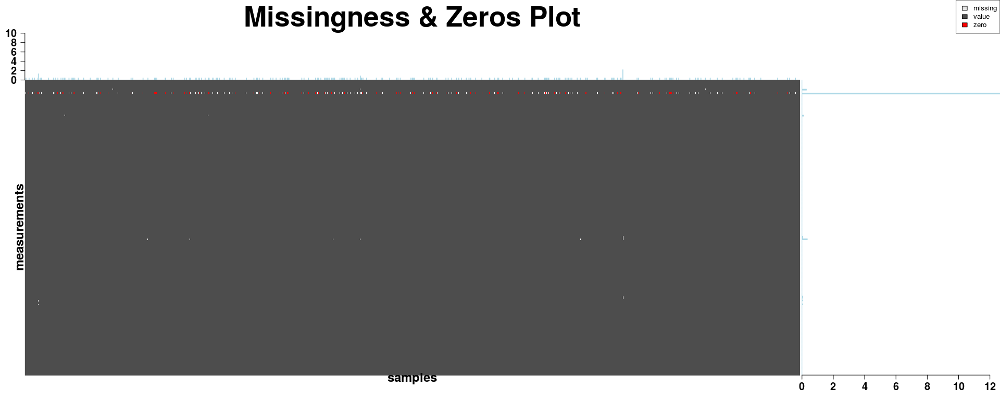
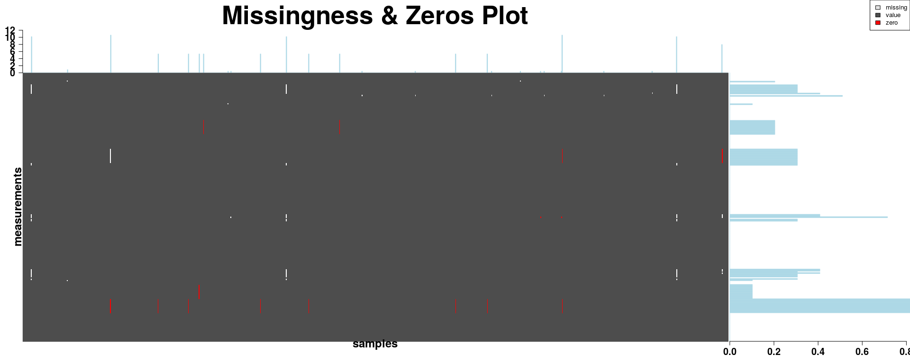
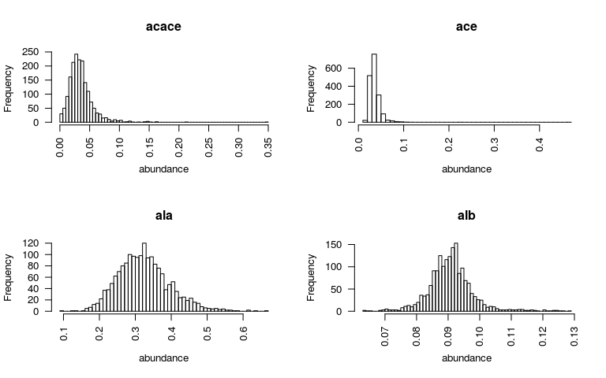
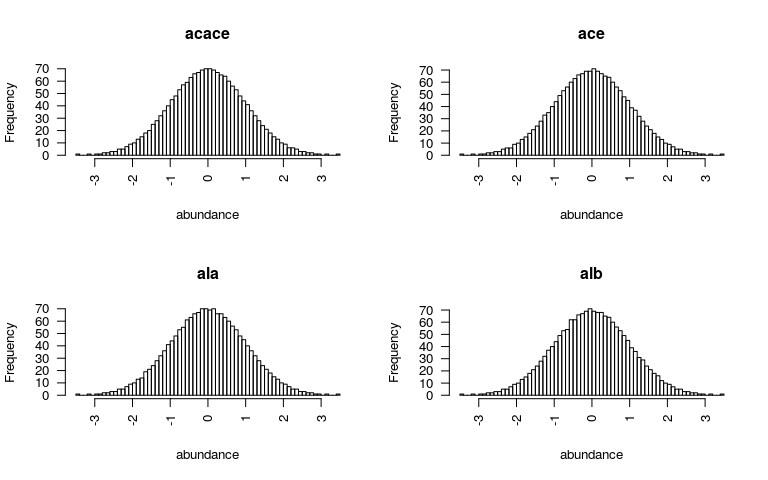
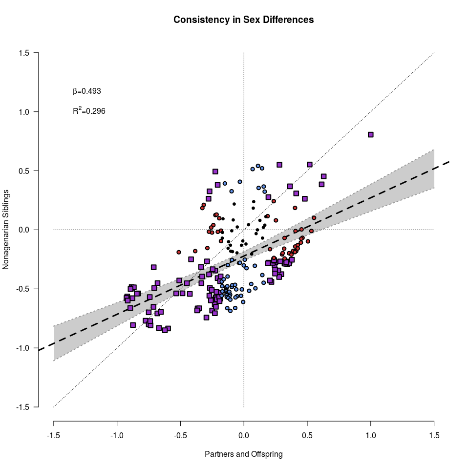

FOS 2017 METABOLOMICS
================
Erik van den Akker, Maarten van Iterson & Marian Beekman
26 June 2017

-   [DATA EXPLORATION](#data-exploration)
    -   [Phenotypes](#phenotypes)
    -   [Metabolomics](#metabolomics)
-   [QUALITY CONTROL](#quality-control)
    -   [Discontinued metabolites](#discontinued-metabolites)
    -   [QC Flags](#qc-flags)
    -   [Missingness & zeros](#missingness-zeros)
-   [DATA TRANSFORMATION](#data-transformation)
    -   [Normality & standardization](#normality-standardization)
-   [ANALYSIS](#analysis)
    -   [Metabo-WAS](#metabo-was)
    -   [beta's vs. beta's](#betas-vs.-betas)
-   [SESSIONINFO](#sessioninfo)

<!-- # STARTUP -->
<!-- We have prepared data of the Leiden Longevity Study and ready-to-use R functions for analyses for the practicals. Before you start, make sure you:    -->
<!-- 1. Create a working folder, for example H:/FOS2017METABOLOMICS.    -->
<!-- 2. Download the data and R files from [https://github.com/molepi/FOS2017/tre/master/METABOLOMICSday](https://github.com/molepi/FOS2017/tree/master/METABOLOMICSday) to your working directory. -->
<!-- 3. Set the working directory in R to your working directory using: -->
<!-- ```{r,eval=FALSE} -->
<!-- setwd("H:/FOS2017METABOLOMICS") -->
<!-- ``` -->
<!-- Now load the prepared data and functions into your workspace by: -->
<!-- ```{r,echo = FALSE, results = 'hide'} -->
<!-- # Load my own data for debug purposes: -->
<!-- load("/Users/erikvandenakker/Desktop/metabolomics_FOS_23062017.RData") -->
<!-- source("/Users/erikvandenakker/Documents/MyDropBox/Dropbox/MyGit/BBMRImetabolomics/FOS2017_METABOLOMICS_functions.R") -->
<!-- ``` -->
We have prepared data of the Leiden Longevity Study and ready-to-use R functions for analyses for the practicals. Load them like this:

``` r
load(url("https://raw.githubusercontent.com/molepi/FOS2017/master/Metabolomics_practical/metabolomics_FOS_23062017.RData"))
source(url("https://raw.githubusercontent.com/molepi/FOS2017/master/Metabolomics_practical/FOS2017_METABOLOMICS_functions.R"))
```

Load the libraries required for the practicals:

``` r
  library(limma)
  library(ggplot2)
  library(pander)
```

**Note:** Startup messages have been surpressed in this vignette for a clear overview.
**Note:** The package 'pander' might not have been installed yet. If receiving an error run: *install.packages("pander")* and try again.

DATA EXPLORATION
================

Have a look at the objects loaded to your workspace:

``` r
ls()
```

    ##  [1] "ANSWER"            "count.miss"        "dat_partoffs"     
    ##  [4] "dat_sibs"          "do.metabowas"      "phen_partoffs"    
    ##  [7] "phen_sibs"         "plot.beta_beta"    "plot.na.heatmap"  
    ## [10] "print.flag.report" "print.miss.report" "RIN"

The **L**eiden **L**ongevity **S**tudy (LLS) consists of two cohorts, **LLS\_SIBS** (elderly siblings) and **LLS\_PARTOFFS** (their offspring and partners thereoff), for which Nigthingale metabolomics data has been generated. Explore the objects storing metabolomics data, **dat\_partoffs** and **dat\_sibs** and the objects storing the phenotypic data **phen\_partoffs** and **phen\_sibs** by using *dim* and looking at the first few entries, e.g:

``` r
dim(dat_partoffs)
```

    ## [1]  231 2313

``` r
dat_partoffs[1:4,1:4]
```

    ##       LLS_PARTOFFS-937 LLS_PARTOFFS-1831 LLS_PARTOFFS-935 LLS_PARTOFFS-716
    ## acace          0.02724           0.04410          0.00362          0.02829
    ## ace            0.02652           0.02117          0.02700          0.02716
    ## ala            0.25490           0.28930          0.41290          0.35190
    ## alb            0.08420           0.08649          0.09922          0.09055

Notice that the objects storing metabolomics data are matrices with numbers, and that the *columns* in each of the data matrices correspond to *samples* and the *rows* to *measurements*.
<br>
**EXCERCISES**
**Q1:** How many measurements are there in **dat\_partoffs**? How is the first measurement called? And the first sample?
**Q2:** How many samples are there in **dat\_sibs**?

``` r
## Q1:
# Use 'dim' to show the dimensions of the data in partoffs:
# > dim(dat_partoffs)
## [1]  231 2313
# The second figure indicates the number of columns, which corresponds to the number of samples measured: 2313.
# Use '[ , ]' to subset a matrix:
# > dat_partoffs[1:4,1:4]
##       LLS_PARTOFFS-937 LLS_PARTOFFS-1831 LLS_PARTOFFS-935 LLS_PARTOFFS-716
## acace          0.02724           0.04410          0.00362          0.02829
## ace            0.02652           0.02117          0.02700          0.02716
## ala            0.25490           0.28930          0.41290          0.35190
## alb            0.08420           0.08649          0.09922          0.09055
# The first row corresponds to the first measurement and the rownames hold the names of the meaurements: acace
# The first columns corresponds to the first sample and the columnnames hold the names of the samples: LLS_PARTOFFS-937

## Q2:
# > dim(dat_sibs)
## [1] 231 998
# 998 samples
```

<br> Next to the metabolomics data, two data objects are given that hold phenotypic data: **sibs\_partoffs** and **phen\_sibs**. Again, explore these using *dim* and looking at the first few entries, e.g:

``` r
dim(phen_partoffs)
```

    ## [1] 2313   18

``` r
phen_partoffs[1:4,1:4]
```

    ##                   age   sex abnormal_macromolecule_a low_glucose
    ## LLS_PARTOFFS-937   53 FALSE                        0           0
    ## LLS_PARTOFFS-1831  59  TRUE                        0           0
    ## LLS_PARTOFFS-935   54 FALSE                        0           0
    ## LLS_PARTOFFS-716   49  TRUE                        0           0

Verify that the matrices containing the metabolomics measurements have the same ordering of samples as the matrices containing the phenotypic data, using:

``` r
all(rownames(phen_partoffs) == colnames(dat_partoffs))
```

    ## [1] TRUE

<br>
**EXCERCISES**
**Q3:** Verify this for **phen\_sibs** too. What do the functions 'colnames', and 'rownames' do?
**HINT:** Rerun part of the code above, e.g: *rownames(phen\_sibs)*

``` r
## Q3:
# > all(rownames(phen_sibs) == colnames(dat_sibs))
## TRUE
# > rownames(phen_sibs)
##   [1] "LLS_SIBS-761"  "LLS_SIBS-633"  "LLS_SIBS-617"  "LLS_SIBS-569" etc.
# Takes the row names of matrix phen_sibs
# > colnames(dat_sibs)
##   [1] "LLS_SIBS-761"  "LLS_SIBS-633"  "LLS_SIBS-617"  "LLS_SIBS-569" etc.
# Takes the column names of matrix phen_sibs; Notice how these correpond.
```

<br>

Phenotypes
----------

You will have access to data of two cohorts within the Leiden Longevity Study, each with its own age and sex distribution. To explore these distributions, repeatedly use histograms:

``` r
# Open a figure with 4 x 1 pannels:
par(mfrow=c(4,1))
# Set range in years equal for all histograms:
XLIM <- c(20,120)
# Set range in counts of histogram equal for all histograms: 
YLIM <- c(0,400)
# Plot histograms on age:
# Ages of females in partoffs:
age_fpo <- phen_partoffs[which(phen_partoffs$sex==FALSE),"age"]
# Draw a histogram:
hist(age_fpo,xlim=XLIM,ylim=YLIM,col="pink",xlab="age [years]",main="Partners and Offspring",sub="FEMALES")
# For males in partoffs:
age_mpo <- phen_partoffs[which(phen_partoffs$sex==TRUE),"age"]
hist(age_mpo,xlim=XLIM,ylim=YLIM,col="lightblue",xlab="age [years]",main="Partners and Offspring",sub="MALES")
# For females in sibs:
age_fs <- phen_sibs[which(phen_sibs$sex==FALSE),"age"]
hist(age_fs,xlim=XLIM,ylim=YLIM,col="darkred",xlab="age [years]",main="Nonagenarian Siblings",sub="FEMALES")
# For males in sibs:
age_ms <- phen_sibs[which(phen_sibs$sex==TRUE),"age"] 
hist(age_ms,xlim=XLIM,ylim=YLIM,col="darkblue",xlab="age [years]",main="Nonagenarian Siblings",sub="MALES")
```



<br>
**EXCERCISES**
**Q4:** Viewing the four age distributions, what do you think what the mean age is of each of the four groups?
**Q5:** Verify this using the function *summary*, e.g.: *summary(age\_fpo)*

``` r
## Q4:
# LLS_PARTOFFS: 60
# LLS_SIBS:     90
## Q5:
# > summary(age_fpo)
##    Min. 1st Qu.  Median    Mean 3rd Qu.    Max. 
##  30.00   54.00   58.00   58.16   63.00   76.00 
# > summary(age_mpo)
##    Min. 1st Qu.  Median    Mean 3rd Qu.    Max. 
##  30.00   55.00   59.00   59.32   64.00   80.00 
# > summary(age_fs)
##    Min. 1st Qu.  Median    Mean 3rd Qu.    Max. 
##  56.00   91.00   93.00   92.73   95.00  103.00 
# > summary(age_ms)
##    Min. 1st Qu.  Median    Mean 3rd Qu.    Max. 
##  53.00   89.00   91.00   91.01   93.00  102.00 
```

<br>

Metabolomics
------------

As previously stated, the Nightingale platform reports on different types of metabolites, but has a focus on lipid parameters. These lipid parameters measures are highly intercorrelated. To vizualize the correlation structure between metabolites draw a heatmap of of pairwise correlations of all metabolites (see function cor, use “pairwise.complete.obs”).

``` r
cors <- cor(t(dat_partoffs), use="pairwise.complete.obs")
heatmap(cors,col=colorRampPalette(c("red", "white", "blue"))(256), scale="none", labCol=NA, cexRow=0.15)
```



On the rows and columns of this heatmap are metabolites. Strong positive correlations ("blue") are observed along the diagonal (including correlations with itself), whereas strong negative correlations ("red") are only observed off diagonal.

<br>
**EXCERCISES**
**Q6:** Where do you think are the lipids located in the heatmap?

``` r
## Q6: 
# The big blue square in the upper right corner. 
```

<br>

QUALITY CONTROL
===============

Discontinued metabolites
------------------------

Nightingale discontinued reporting on 5 of the metabolites due to high technical variation. Make sure these are not these are removed from the data by typing:

``` r
IND <- which(rownames(dat_partoffs) %in% c("dag","dagtg","falen","cla","cla_fa"))
dat_partoffs <- dat_partoffs[-IND,]
dat_sibs <- dat_sibs[-IND,]
```

QC Flags
--------

The final columns in the phen matrices are actually not phenotypes, but contain quality control flags provided by Nightingale. Print an overview of these flags using print.flag.report.

``` r
print.flag.report(phen_partoffs)
```

<table style="width:53%;">
<colgroup>
<col width="41%" />
<col width="11%" />
</colgroup>
<thead>
<tr class="header">
<th align="center">QCflag</th>
<th align="center">counts</th>
</tr>
</thead>
<tbody>
<tr class="odd">
<td align="center">abnormal_macromolecule_a</td>
<td align="center">0</td>
</tr>
<tr class="even">
<td align="center">low_glucose</td>
<td align="center">0</td>
</tr>
<tr class="odd">
<td align="center">low_glutamine_high_glutamate</td>
<td align="center">0</td>
</tr>
<tr class="even">
<td align="center">low_protein_content</td>
<td align="center">0</td>
</tr>
<tr class="odd">
<td align="center">high_citrate</td>
<td align="center">0</td>
</tr>
<tr class="even">
<td align="center">high_ethanol</td>
<td align="center">36</td>
</tr>
<tr class="odd">
<td align="center">high_lactate</td>
<td align="center">0</td>
</tr>
<tr class="even">
<td align="center">high_pyruvate</td>
<td align="center">0</td>
</tr>
<tr class="odd">
<td align="center">serum_sample</td>
<td align="center">0</td>
</tr>
<tr class="even">
<td align="center">unidentified_small_molecule_a</td>
<td align="center">0</td>
</tr>
<tr class="odd">
<td align="center">unidentified_small_molecule_b</td>
<td align="center">0</td>
</tr>
<tr class="even">
<td align="center">unknown_acetylated_compound</td>
<td align="center">0</td>
</tr>
<tr class="odd">
<td align="center">isopropyl_alcohol</td>
<td align="center">0</td>
</tr>
<tr class="even">
<td align="center">polysaccharides</td>
<td align="center">0</td>
</tr>
<tr class="odd">
<td align="center">aminocaproic_acid</td>
<td align="center">0</td>
</tr>
<tr class="even">
<td align="center">fast</td>
<td align="center">0</td>
</tr>
<tr class="odd">
<td align="center">ANYFLAG</td>
<td align="center">36</td>
</tr>
<tr class="even">
<td align="center">NOFLAG</td>
<td align="center">2277</td>
</tr>
</tbody>
</table>

<br>
**EXCERCISES**
**Q7:** Some samples in partoffs have a warning of high ethanol contents. Where does this ethanol come from?
**Q8:** In **phen\_sibs** next to cases with high ethanol flags, some other types of warnings for out of range measurements are given. What are they? To what could they point?

``` r
## Q7:
# Residual ethanol might be in the sample due to the employed isolation protocol.
## Q8:
# Use 'print.flag.report':
# > print.flag.report(phen_sibs)
## --------------------------------------
##            QCflag              counts 
## ----------------------------- --------
##   abnormal_macromolecule_a       0    
##          low_glucose             0    
## low_glutamine_high_glutamate     0    
##      low_protein_content         3    
##         high_citrate             1    
##         high_ethanol             14   
##         high_lactate             0    
##         high_pyruvate            0    
##         serum_sample             0    
## unidentified_small_molecule_a    0    
## unidentified_small_molecule_b    0    
##  unknown_acetylated_compound     0    
##       isopropyl_alcohol          0    
##        polysaccharides           0    
##       aminocaproic_acid          0    
##             fast                 0    
##            ANYFLAG               18   
##            NOFLAG               980   
## --------------------------------------

# low_protein_content flagged samples could indicate errors in the employed isolation protocol. [Marian?]
# high_citrate flagged samples could indicate that blood samples were not immediately processed after withdrawal. [Marian?]
```

<br>

Lets exclude the samples having a "high\_ethanol" QCflag in dat\_partoffs. First find the rownumbers of samples having a QCflag:

``` r
IND <- which(phen_partoffs[,"high_ethanol"]==1)
IND
```

    ##  [1]    6   56   65  120  150  204  243  261  312  346  353  372  415  458
    ## [15]  492  495  697  712  735  743  756  757  834 1012 1040 1050 1097 1207
    ## [29] 1262 1458 1630 1670 1791 2071 2087 2150

Then remove these samples from **dat\_partoffs** and **phen\_partoffs**:

``` r
dat_partoffs <- dat_partoffs[,-IND]
phen_partoffs <- phen_partoffs[-IND,]
```

Check whether the two files still contain the same samples in the same ordering:

``` r
all(rownames(phen_partoffs) == colnames(dat_partoffs))
```

    ## [1] TRUE

Rerun the QC overview:

``` r
print.flag.report(phen_partoffs)
```

<table style="width:53%;">
<colgroup>
<col width="41%" />
<col width="11%" />
</colgroup>
<thead>
<tr class="header">
<th align="center">QCflag</th>
<th align="center">counts</th>
</tr>
</thead>
<tbody>
<tr class="odd">
<td align="center">abnormal_macromolecule_a</td>
<td align="center">0</td>
</tr>
<tr class="even">
<td align="center">low_glucose</td>
<td align="center">0</td>
</tr>
<tr class="odd">
<td align="center">low_glutamine_high_glutamate</td>
<td align="center">0</td>
</tr>
<tr class="even">
<td align="center">low_protein_content</td>
<td align="center">0</td>
</tr>
<tr class="odd">
<td align="center">high_citrate</td>
<td align="center">0</td>
</tr>
<tr class="even">
<td align="center">high_ethanol</td>
<td align="center">0</td>
</tr>
<tr class="odd">
<td align="center">high_lactate</td>
<td align="center">0</td>
</tr>
<tr class="even">
<td align="center">high_pyruvate</td>
<td align="center">0</td>
</tr>
<tr class="odd">
<td align="center">serum_sample</td>
<td align="center">0</td>
</tr>
<tr class="even">
<td align="center">unidentified_small_molecule_a</td>
<td align="center">0</td>
</tr>
<tr class="odd">
<td align="center">unidentified_small_molecule_b</td>
<td align="center">0</td>
</tr>
<tr class="even">
<td align="center">unknown_acetylated_compound</td>
<td align="center">0</td>
</tr>
<tr class="odd">
<td align="center">isopropyl_alcohol</td>
<td align="center">0</td>
</tr>
<tr class="even">
<td align="center">polysaccharides</td>
<td align="center">0</td>
</tr>
<tr class="odd">
<td align="center">aminocaproic_acid</td>
<td align="center">0</td>
</tr>
<tr class="even">
<td align="center">fast</td>
<td align="center">0</td>
</tr>
<tr class="odd">
<td align="center">ANYFLAG</td>
<td align="center">0</td>
</tr>
<tr class="even">
<td align="center">NOFLAG</td>
<td align="center">2277</td>
</tr>
</tbody>
</table>

<br>
**EXCERCISES**
**Q9:** Perform this QC step for **dat\_sibs** too and apply the exclusion of samples to both the data, -**dat\_sibs**-, and phenotypes, -**phen\_sibs**-.
**HINT:** You can filter for multiple QC flags by repeating the procedure you just performed.

``` r
## Q9:
# > IND <- which(phen_sibs[,"high_ethanol"]==1)
# > dat_sibs <- dat_sibs[,-IND]
# > phen_sibs <- phen_sibs[-IND,]
# > IND <- which(phen_sibs[,"low_protein_content"]==1)
# > dat_sibs <- dat_sibs[,-IND]
# > phen_sibs <- phen_sibs[-IND,]
# > IND <- which(phen_sibs[,"high_citrate"]==1)
# > dat_sibs <- dat_sibs[,-IND]
# > phen_sibs <- phen_sibs[-IND,]
```

<br>

Missingness & zeros
-------------------

Another aspect of data quality control is to look into missing or zero measurements. In case a measurement could not be succesfully obtained, this is indicated with a missing value (in our case NA). Failing measurements may have many causes, and this missingness may become problematic if it somehow relates to the outcome of your study.
Likewise, we are especially careful with measurements with a zero result. Again, there may be many reasons why a measurement for a specific sample equals 0, for instance when the measured metabolite abundances are below the detection treshhold of the machine. Often the occurence of missing or zero measurements are not randomly distributed in a dataset. To get a feeling whether the missing and zero values are linked to particular samples or measurements, we plot a missingness heatmap:

``` r
plot.na.heatmap(dat_partoffs)
```

 The colors in the heatmap indicate the status of a particular measurement (rows) for a particular sample (columns). The barplots on the sides indicate the percentage of missing + zero measurements per metabolite (right pannel) or per sample (top pannel). Note that a single sample almost completely failed, as indicated by the grey vertical bar. Also note that apparently some measurements are apparently more prone to fail than others and that missing and zero values co-occur in these particular measurements.

<br>
**EXCERCISES**
**Q10:** Draw the missingness heatmap for **dat\_sibs**. Is the degree of missing and zero measurements comparable between the studies? What is different between the studies in terms of number of failed samples and problematic measurements?
**HINT:** Also have a a look at the scale of the axis!

``` r
## Q10:
plot.na.heatmap(dat_sibs)
```



``` r
# Far less measurements in sibs compared to partoffs have a high missingess or zero rate. Whereas a totally failed sample was observed in partoffs and moreover about 10% of the samples had more than 10% failed measurements, only few problematic samples were observed in sibs.
```

<br>

As a first step we exclude problematic samples. To get an overview of the missingness in samples, we use print.miss.report:

``` r
print.miss.report(dat_partoffs,on_sample=TRUE,type="missingOrZero")
```

<table style="width:47%;">
<caption>missingOrZero in samples</caption>
<colgroup>
<col width="18%" />
<col width="8%" />
<col width="12%" />
<col width="8%" />
</colgroup>
<thead>
<tr class="header">
<th align="left"># missMeas</th>
<th align="right">[%]</th>
<th align="right"># samp</th>
<th align="right">[%]</th>
</tr>
</thead>
<tbody>
<tr class="odd">
<td align="left">0</td>
<td align="right">0</td>
<td align="right">1515</td>
<td align="right">66.5</td>
</tr>
<tr class="even">
<td align="left">1</td>
<td align="right">0.441</td>
<td align="right">230</td>
<td align="right">10.1</td>
</tr>
<tr class="odd">
<td align="left">2</td>
<td align="right">0.881</td>
<td align="right">1</td>
<td align="right">0.0439</td>
</tr>
<tr class="even">
<td align="left">3</td>
<td align="right">1.32</td>
<td align="right">1</td>
<td align="right">0.0439</td>
</tr>
<tr class="odd">
<td align="left">5</td>
<td align="right">2.2</td>
<td align="right">1</td>
<td align="right">0.0439</td>
</tr>
<tr class="even">
<td align="left">12</td>
<td align="right">5.29</td>
<td align="right">202</td>
<td align="right">8.87</td>
</tr>
<tr class="odd">
<td align="left">13</td>
<td align="right">5.73</td>
<td align="right">46</td>
<td align="right">2.02</td>
</tr>
<tr class="even">
<td align="left">24</td>
<td align="right">10.6</td>
<td align="right">178</td>
<td align="right">7.82</td>
</tr>
<tr class="odd">
<td align="left">25</td>
<td align="right">11</td>
<td align="right">49</td>
<td align="right">2.15</td>
</tr>
<tr class="even">
<td align="left">36</td>
<td align="right">15.9</td>
<td align="right">32</td>
<td align="right">1.41</td>
</tr>
<tr class="odd">
<td align="left">37</td>
<td align="right">16.3</td>
<td align="right">18</td>
<td align="right">0.791</td>
</tr>
<tr class="even">
<td align="left">48</td>
<td align="right">21.1</td>
<td align="right">2</td>
<td align="right">0.0878</td>
</tr>
<tr class="odd">
<td align="left">61</td>
<td align="right">26.9</td>
<td align="right">1</td>
<td align="right">0.0439</td>
</tr>
<tr class="even">
<td align="left">209</td>
<td align="right">92.1</td>
<td align="right">1</td>
<td align="right">0.0439</td>
</tr>
</tbody>
</table>

The first column describes the number of measurements missing for a sample; the second puts this as a percentage of all measurements; the third column states the number of samples having this missing number of measurements; the fourth again puts this as a percentage of all samples. Hence, viewing this output, we note that 1515 samples had all measurements complete (first row), whereas only a single sample almost completely failed (final row).

<br>
**EXCERCISES**
**Q11:** How many samples had at most two failed measurements?

``` r
## Q11:
# 1515 + 230 + 1 = 1746
```

<br>

Thresholds for a maximum number of missing values are always arbitrary and here we will stick to keeping samples having 5% or less zero or missing values. This corresponds to a maximum of 5 zero or missing values per sample.

<br>
**EXCERCISES**
**Q12:** What percentage of samples had at most 5 zero or missing values per sample?

``` r
## Q12:
# 66.5 + 10.1 + 0.04 + 0.04 + 0.04 = 76.7
```

<br>

Excluding samples on this criterium can be done using:

``` r
## Getting the counts per sample:
counts <- count.miss(dat_partoffs,on_sample=TRUE)
## Finding the row numbers of samples to exclude:
IND <- which(counts$miss_or_zero>5)
## Subset data:
dat_partoffs <- dat_partoffs[,-IND]
phen_partoffs <- phen_partoffs[-IND,]
```

Lets have a look at the missingness heatmap again:

``` r
plot.na.heatmap(dat_partoffs)
```



Stringent exclusion of samples off course also alleviates some of the problems with problematic measurements. However, it appears that there is still a measurement left with a high number of missing or zero values. Again use print.miss.report for a detailed overview (with 'on\_sample' set to FALSE):

``` r
print.miss.report(dat_partoffs,on_sample=FALSE,type="missingOrZero")
```

<table style="width:47%;">
<caption>missingOrZero in measurements</caption>
<colgroup>
<col width="18%" />
<col width="9%" />
<col width="12%" />
<col width="6%" />
</colgroup>
<thead>
<tr class="header">
<th align="left"># missSamp</th>
<th align="right">[%]</th>
<th align="right"># meas</th>
<th align="right">[%]</th>
</tr>
</thead>
<tbody>
<tr class="odd">
<td align="left">0</td>
<td align="right">0</td>
<td align="right">217</td>
<td align="right">95.6</td>
</tr>
<tr class="even">
<td align="left">1</td>
<td align="right">0.0572</td>
<td align="right">6</td>
<td align="right">2.64</td>
</tr>
<tr class="odd">
<td align="left">2</td>
<td align="right">0.114</td>
<td align="right">1</td>
<td align="right">0.441</td>
</tr>
<tr class="even">
<td align="left">5</td>
<td align="right">0.286</td>
<td align="right">1</td>
<td align="right">0.441</td>
</tr>
<tr class="odd">
<td align="left">6</td>
<td align="right">0.343</td>
<td align="right">1</td>
<td align="right">0.441</td>
</tr>
<tr class="even">
<td align="left">221</td>
<td align="right">12.6</td>
<td align="right">1</td>
<td align="right">0.441</td>
</tr>
</tbody>
</table>

Analogous to the previous report characterizing **samples** on the number of **missing measurements**, this overview now describes **measurements** in terms of numbers of **failed samples**. Hence, the first column describes the number of unsuccesfully measured samples ranging from 0 to 221; the second puts this as a percentage of all typed samples; the third column states the number of measurements having this missing number of failed samples; the fourth again puts this as a percentage of all measurements. Viewing this output, we note that 217 measurements were succesfully measured in all remaining samples (first row), whereas only one measurment failed in more than 12% of the samples (final row).

Thresholds for the maximum number of failed samples for a measurement is arbitrarely set to 10%, corresponding to a maximum of 6 failed samples:

``` r
## Getting the counts per measurement:
counts <- count.miss(dat_partoffs,on_sample=FALSE)
## Finding the column numbers of measurements to exclude:
IND_meas <- which(counts$miss_or_zero>6)
## Subset data:
dat_partoffs <- dat_partoffs[-IND_meas,]
```

Since we want to compare results within **partoffs** and **sibs**, we discard the same measurements in **sibs**:

``` r
## Subset data:
dat_sibs <- dat_sibs[-IND_meas,]
```

To check whether there are problematic samples or measurements left in **dat\_sibs** we run once more:

``` r
plot.na.heatmap(dat_sibs)
```



And observe that no other measurement exceeds the 10% treshhold and only a few samples exceed 5% threshold. To remove these samples too:

``` r
print.miss.report(dat_sibs,on_sample=TRUE,type="missingOrZero")
```

<table style="width:46%;">
<caption>missingOrZero in samples</caption>
<colgroup>
<col width="18%" />
<col width="8%" />
<col width="12%" />
<col width="6%" />
</colgroup>
<thead>
<tr class="header">
<th align="left"># missMeas</th>
<th align="right">[%]</th>
<th align="right"># samp</th>
<th align="right">[%]</th>
</tr>
</thead>
<tbody>
<tr class="odd">
<td align="left">0</td>
<td align="right">0</td>
<td align="right">953</td>
<td align="right">97.2</td>
</tr>
<tr class="even">
<td align="left">1</td>
<td align="right">0.442</td>
<td align="right">11</td>
<td align="right">1.12</td>
</tr>
<tr class="odd">
<td align="left">2</td>
<td align="right">0.885</td>
<td align="right">1</td>
<td align="right">0.102</td>
</tr>
<tr class="even">
<td align="left">12</td>
<td align="right">5.31</td>
<td align="right">9</td>
<td align="right">0.918</td>
</tr>
<tr class="odd">
<td align="left">18</td>
<td align="right">7.96</td>
<td align="right">1</td>
<td align="right">0.102</td>
</tr>
<tr class="even">
<td align="left">23</td>
<td align="right">10.2</td>
<td align="right">3</td>
<td align="right">0.306</td>
</tr>
<tr class="odd">
<td align="left">24</td>
<td align="right">10.6</td>
<td align="right">2</td>
<td align="right">0.204</td>
</tr>
</tbody>
</table>

``` r
## Getting the counts per sample:
counts <- count.miss(dat_sibs,on_sample=TRUE)
## Finding the row numbers of samples to exclude:
IND <- which(counts$miss_or_zero>2)
## Subset data:
dat_sibs <- dat_sibs[,-IND]
phen_sibs <- phen_sibs[-IND,]
```

DATA TRANSFORMATION
===================

Normality & standardization
---------------------------

In order to investigate whether metabolites may serve as a biomarker for partcular traits, we model the metabolite as the dependent variable and the trait as the independent variable, ergo: metabolite~age+sex+trait
In this model, we require the metabolites to be normally distributed. However, some of the measured metabolites have a skewed distribution instead. Have a look at the distributions of the first 4 metabolites, using:

``` r
par(mfrow=c(2,2))
for(i in 1:4){
  hist(dat_partoffs[i,],main=rownames(dat_partoffs)[i],50,xlab="abundance",las=2)
}
```



<br>
**EXCERCISES**
**Q13:** Which of the four metabolites has a skewed distribution, and which ones not?

``` r
## Q13:
# acace and ace are skwewed.
```

<br>

Moreover, metabolites each have their own mean and variance. To be able to compare the effects of metabolites on traits, we usually standardize the distributions of metabolites, so that each metabolite is distributed with a comparable mean and variance. We can achieve normality, -'unskewing' the distribution-, and standardization, -metabolites having the same mean and variance-, in various ways and one method is the **R**ank **I**nverse **N**ormal (RIN) transformation. When applying this to the four metabolites above, we obtain:

``` r
par(mfrow=c(2,2))
for(i in 1:4){
  hist(RIN(dat_partoffs[i,]),main=rownames(dat_partoffs)[i],50,xlab="abundance",las=2)
}
```



Apply RIN transformation on **dat\_partoffs** and **dat\_sibs** using:

``` r
new_dat_partoffs <- RIN(dat_partoffs)
new_dat_sibs <- RIN(dat_sibs)
```

ANALYSIS
========

Data is now ready for analysis! In order to identify metabolites that have a different serum level in males versus females, we will subject all metabolite measurements within a cohort to a **M**etabolome **W**ide **A**ssociation **S**tudy (Metabo-WAS) on gender. Performing the Metabo-WAS on sex in both cohorts independently, will allow us to identify metabolites whos gender differences change with age.

Metabo-WAS
----------

In the following analysis, we will associate each of the metabolite levels with sex, while adjusting for age:

``` r
res_partoffs <- do.metabowas(phen=phen_partoffs,dat=new_dat_partoffs,test_variable="sex",covariates=c("age"))
head(res_partoffs)
```

    ##             estimate     tstat          pval      pval.adj
    ## crea       1.0000928  23.05299 2.801413e-107 6.331193e-105
    ## l_hdl_p   -0.9256082 -20.90750  6.127402e-90  6.923964e-88
    ## l_hdl_l   -0.9199949 -20.76038  8.568649e-89  6.455049e-87
    ## l_hdl_pl  -0.9160153 -20.66006  5.137197e-88  2.902517e-86
    ## hdl_c     -0.8958867 -20.13086  5.876338e-84  2.656105e-82
    ## xl_hdl_pl -0.8938019 -20.07125  1.665231e-83  6.272370e-82

To find the number of significantly associated metabolites after correction for multiple testing (FDR), type:

``` r
length(which(res_partoffs$pval.adj<=0.05))
```

    ## [1] 189

Then repeat the procedure for **sibs**:

``` r
res_sibs <- do.metabowas(phen=phen_sibs,dat=new_dat_sibs,test_variable="sex",covariates=c("age"))
head(res_sibs)
```

    ##           estimate     tstat         pval     pval.adj
    ## totpg   -0.8503664 -12.77677 2.280188e-37 5.153224e-35
    ## pc      -0.8352917 -12.53816 4.750808e-36 5.368412e-34
    ## totcho  -0.8310673 -12.48680 9.065435e-36 6.829294e-34
    ## m_hdl_p -0.8096374 -12.16482 4.908769e-34 2.773455e-32
    ## apoa1   -0.8063387 -12.11525 8.992077e-34 3.765195e-32
    ## crea     0.8057605  12.10657 9.996092e-34 3.765195e-32

<br>
**EXCERCISES**
**Q14:** How many metabolite parameters are significantly associated with gender in **sibs**?

``` r
## Q14:
# > length(which(res_sibs$pval.adj<=0.05))
## 185
```

<br>

beta's vs. beta's
-----------------

To make a systematic comparisson between the gender associations in **partoffs** and **sibs**, we draw a scatterplot of observed effects in the middle-aged cohort versus the observed effects in the elderly cohort using:

``` r
plot.beta_beta(res1=res_partoffs,res2=res_sibs,main="Consistency in Sex Differences",
               xlab="Partners and Offspring",ylab="Nonagenarian Siblings")
```



Each of the dots represents a metabolite parameter. We have added a trendline with confidence intervals to illustrate the general trend. The top right and bottom left quadrants of the plot show the metabolites with consistent gender effects in the two groups, whereas the top left and bottom right show metabolites with opposite effects. The colors and shapes indicate the significance (after Bonferroni adjustment) in both cohorts. Purple squares indicate a significant effect in both cohorts; circles, -blue or red-, indicate significant effects in only one of the cohorts and solid dots indicates no significant effects in both cohorts. Notice the big group of purple squares in the bottom left quadrant. These indicate consistent significantly lowered levels within both age groups. Notice also the big group of purple squares in the bottom right corner. These indicate metabolites are significantly associated in the opposite direction across both age groups.

<br>
**EXCERCISES**
**Q15:** Browse your Metabo-WAS to find examples for which the sex-effect is significantly opposite between cohorts.

``` r
## Q15: 
## BASIC SOLUTION:
# Type:
# > res_partoffs
# And compare with:
# > res_sibs
## ADVANCED SOLUTION:
# To do this systematically, you need the command 'merge'
res <- merge(res_partoffs,res_sibs,by.x=0,by.y=0)
# Then filter:
# First group:
# > res[which(res$pval.adj.x<=0.05 & res$pval.adj.y<=0.05 & sign(res$tstat.x)!=sign(res$tstat.y) & res$tstat.x>0),"Row.names"]
##  [1] "l_hdl_pl_percentage"  "l_vldl_c"             "l_vldl_ce"            "l_vldl_fc"            "l_vldl_l"             "l_vldl_p"            
## [7] "l_vldl_pl"            "l_vldl_tg"            "m_hdl_tg_percentage"  "m_vldl_c"             "m_vldl_ce"            "m_vldl_fc"           
## [13] "m_vldl_l"             "m_vldl_p"             "m_vldl_pl"            "mufa_fa"              "s_hdl_tg"             "s_vldl_c"            
## [19] "s_vldl_fc"            "s_vldl_l"             "s_vldl_p"             "s_vldl_pl"            "serum_tg"             "vldl_c"              
## [25] "xl_hdl_fc_percentage" "xl_vldl_c"            "xl_vldl_ce"           "xl_vldl_fc"           "xl_vldl_l"            "xl_vldl_p"           
## [31] "xl_vldl_pl"           "xl_vldl_tg"           "xs_vldl_tg"           "xxl_vldl_c"           "xxl_vldl_ce"          "xxl_vldl_fc"         
## [37] "xxl_vldl_l"           "xxl_vldl_p"           "xxl_vldl_pl"          "xxl_vldl_tg" 
# Second group:
# > res[which(res$pval.adj.x<=0.05 & res$pval.adj.y<=0.05 & sign(res$tstat.x)!=sign(res$tstat.y) & res$tstat.x<0),"Row.names"]
## [1] "idl_pl_percentage"     "l_hdl_c_percentage"    "l_hdl_ce_percentage"   "l_ldl_fc_percentage"   "ldl_d"                 "xs_vldl_c_percentage" 
## [7] "xs_vldl_ce_percentage"
```

<br>

SESSIONINFO
===========

``` r
sessionInfo()
```

    ## R Under development (unstable) (2017-06-16 r72797)
    ## Platform: x86_64-pc-linux-gnu (64-bit)
    ## Running under: Ubuntu 16.04.2 LTS
    ## 
    ## Matrix products: default
    ## BLAS: /usr/local/lib/R/lib/libRblas.so
    ## LAPACK: /usr/local/lib/R/lib/libRlapack.so
    ## 
    ## locale:
    ##  [1] LC_CTYPE=en_US.UTF-8       LC_NUMERIC=C              
    ##  [3] LC_TIME=en_US.UTF-8        LC_COLLATE=en_US.UTF-8    
    ##  [5] LC_MONETARY=en_US.UTF-8    LC_MESSAGES=en_US.UTF-8   
    ##  [7] LC_PAPER=en_US.UTF-8       LC_NAME=C                 
    ##  [9] LC_ADDRESS=C               LC_TELEPHONE=C            
    ## [11] LC_MEASUREMENT=en_US.UTF-8 LC_IDENTIFICATION=C       
    ## 
    ## attached base packages:
    ## [1] stats     graphics  grDevices utils     datasets  base     
    ## 
    ## other attached packages:
    ## [1] pander_0.6.0  ggplot2_2.2.1 limma_3.33.3 
    ## 
    ## loaded via a namespace (and not attached):
    ##  [1] Rcpp_0.12.11     knitr_1.16       magrittr_1.5     munsell_0.4.3   
    ##  [5] colorspace_1.3-2 rlang_0.1.1.9000 stringr_1.2.0    plyr_1.8.4      
    ##  [9] tools_3.5.0      grid_3.5.0       gtable_0.2.0     htmltools_0.3.6 
    ## [13] yaml_2.1.14      lazyeval_0.2.0   rprojroot_1.2    digest_0.6.12   
    ## [17] tibble_1.3.3     evaluate_0.10    rmarkdown_1.6    stringi_1.1.5   
    ## [21] compiler_3.5.0   methods_3.5.0    scales_0.4.1     backports_1.1.0 
    ## [25] BiocStyle_2.5.2
