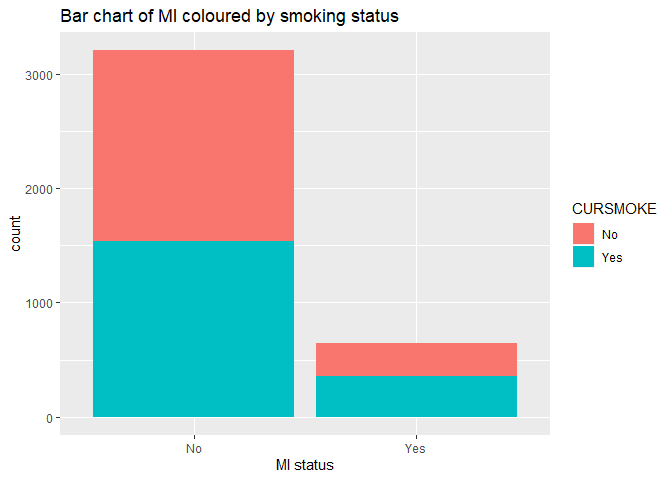
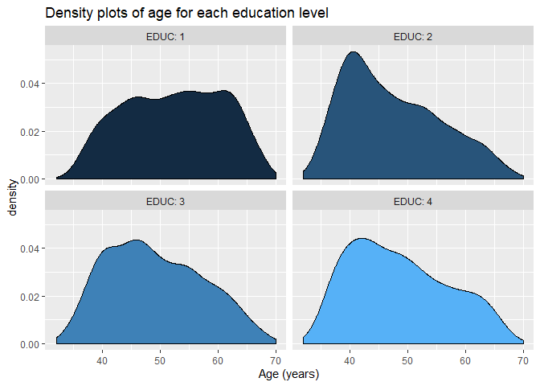
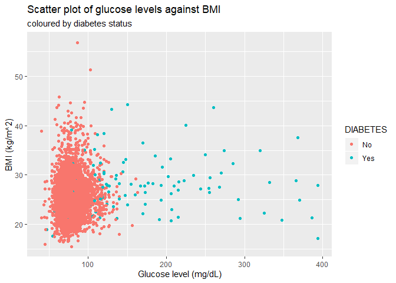
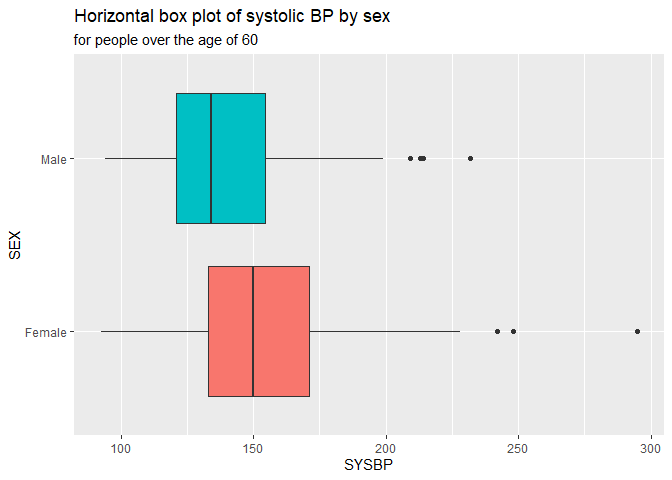
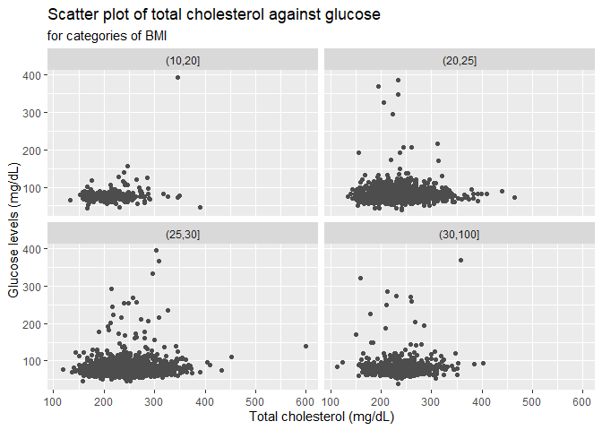

-----

## Part 1: Introduction to ggplot2

Load in data again, keeping only complete cases

``` r
fhs <- read.csv(url("https://raw.githubusercontent.com/molepi/Molecular-Data-Science/master/RIntro_practical/data.csv"))
fhs <- fhs[complete.cases(fhs), ]
```

Load `tidyverse`

``` r
library(tidyverse)
```

-----

#### Answers to Question 1:

A bar plot of MI, coloured by smoking status

``` r
fhs %>%
  ggplot() +
  geom_bar(aes(MI, fill=CURSMOKE)) +
  ggtitle("Bar chart of MI coloured by smoking status") +
  xlab("MI status") 
```

<!-- -->

A histogram of total cholesterol in overweight individuals

``` r
fhs %>%
  filter(BMI >= 30) %>%
  ggplot() +
  geom_histogram(aes(TOTCHOL), binwidth = 5, colour="cadetblue3") +
  ggtitle("Histogram of total cholesterol in overweight individuals") +
  xlab("Total cholesterol (mg/dL)") +
  geom_vline(aes(xintercept=240), colour='red', size=1.5)
```

<!-- -->

Four density plots of age for each education level

``` r
fhs %>%
  ggplot() +
  geom_density(aes(AGE, fill=EDUC), show.legend = F) +
  facet_wrap(~EDUC, labeller=label_both) +
  ggtitle("Density plots of age for each education level") +
  xlab("Age (years)")
```

<!-- -->

Two bar plots of sex in current and non-smokers for those who
experienced MI

``` r
fhs %>%
  filter(MI == "Yes") %>%
  ggplot() +
  geom_bar(aes(SEX, fill=SEX)) + 
  facet_wrap(~ CURSMOKE) +
  ggtitle("Bar chart of sex in current and non-smokers", subtitle="for those who experienced MI") +
  xlab("Sex")
```

<!-- -->

-----

## Part 2: Comparative plots

-----

#### Answers to Question 2:

A scatter plot of glucose levels against BMI, coloured by diabetes
status

``` r
fhs %>%
  ggplot() +
  geom_point(aes(GLUCOSE, BMI, colour=DIABETES)) +
  ggtitle("Scatter plot of glucose levels against BMI", subtitle="coloured by diabetes status") +
  xlab("Glucose level (mg/dL)") +
  ylab("BMI (kg/m^2)")
```

<!-- -->

A horizontal box plot of systolic BP by sex for people over the age of
60

``` r
fhs %>%
  filter(AGE >= 60) %>%
  ggplot() +
  geom_boxplot(aes(SEX, SYSBP, fill=SEX), show.legend=F) +
  coord_flip() +
  ggtitle("Horizontal box plot of systolic BP by sex", subtitle="for people over the age of 60")
```

<!-- -->

A scatter plot of total cholesterol against glucose for categories of
BMI

``` r
fhs %>%
  ggplot() +
  geom_point(aes(TOTCHOL, GLUCOSE), colour='grey30') +
  facet_wrap(~cut(BMI, c(10,20,25,30,100))) +
  ggtitle("Scatter plot of total cholesterol against glucose", subtitle="for categories of BMI") +
  xlab("Total cholesterol (mg/dL)") +
  ylab("Glucose levels (mg/dL)")
```

<!-- -->

-----

## Part 3: Statistical Tests

Define table of smoking against MI

``` r
SMOKE_MI <- xtabs(~CURSMOKE+MI, fhs)
SMOKE_MI
```

    ##         MI
    ## CURSMOKE   No  Yes
    ##      No  1671  291
    ##      Yes 1537  352

Chi-square test

``` r
chisq <- chisq.test(SMOKE_MI)
chisq
```

    ## 
    ##  Pearson's Chi-squared test with Yates' continuity correction
    ## 
    ## data:  SMOKE_MI
    ## X-squared = 9.7325, df = 1, p-value = 0.00181

This shows we have strong evidence (p=0.001) that smoking status and MI
are associated.

Looking at the Pearson residuals, we see that people who had MI
contribute most to this association.

``` r
round(chisq$residuals, 3)
```

    ##         MI
    ## CURSMOKE     No    Yes
    ##      No   0.905 -2.022
    ##      Yes -0.923  2.061

-----

Pearson’s correlation coefficient

``` r
cor <- cor.test(~ SYSBP + DIABP, fhs) 
cor
```

    ## 
    ##  Pearson's product-moment correlation
    ## 
    ## data:  SYSBP and DIABP
    ## t = 78.845, df = 3849, p-value < 2.2e-16
    ## alternative hypothesis: true correlation is not equal to 0
    ## 95 percent confidence interval:
    ##  0.7734942 0.7976652
    ## sample estimates:
    ##       cor 
    ## 0.7858797

There is very strong evidence (p\<0.001) that systolic and diastolic
blood pressure are strongly correlated (r2=0.786).

-----

T-test for age difference between MI

``` r
tt <- t.test(AGE ~ MI, fhs) 
tt
```

    ## 
    ##  Welch Two Sample t-test
    ## 
    ## data:  AGE by MI
    ## t = -9.0315, df = 918.42, p-value < 2.2e-16
    ## alternative hypothesis: true difference in means is not equal to 0
    ## 95 percent confidence interval:
    ##  -4.072404 -2.618479
    ## sample estimates:
    ##  mean in group No mean in group Yes 
    ##          49.34352          52.68896

There is very strong (p\<0.001) evidence that people who have had MI are
older than those who didn’t.

-----

Logistic regression

``` r
glmfit <- glm(MI ~ BMI + AGE + SEX, fhs, family = "binomial") 
summary(glmfit)
```

    ## 
    ## Call:
    ## glm(formula = MI ~ BMI + AGE + SEX, family = "binomial", data = fhs)
    ## 
    ## Deviance Residuals: 
    ##     Min       1Q   Median       3Q      Max  
    ## -1.2636  -0.6548  -0.4721  -0.3237   2.4734  
    ## 
    ## Coefficients:
    ##             Estimate Std. Error z value Pr(>|z|)    
    ## (Intercept) -6.14563    0.39969 -15.376  < 2e-16 ***
    ## BMI          0.05965    0.01089   5.476 4.36e-08 ***
    ## AGE          0.04537    0.00522   8.691  < 2e-16 ***
    ## SEXMale      1.19593    0.09413  12.705  < 2e-16 ***
    ## ---
    ## Signif. codes:  0 '***' 0.001 '**' 0.01 '*' 0.05 '.' 0.1 ' ' 1
    ## 
    ## (Dispersion parameter for binomial family taken to be 1)
    ## 
    ##     Null deviance: 3474  on 3850  degrees of freedom
    ## Residual deviance: 3191  on 3847  degrees of freedom
    ## AIC: 3199
    ## 
    ## Number of Fisher Scoring iterations: 5

Odds ratios can also be accessed.

``` r
exp(coef(glmfit))
```

    ## (Intercept)         BMI         AGE     SEXMale 
    ## 0.002142822 1.061466118 1.046414460 3.306636063

-----

#### Answers to Question 3:

Is age correlated with total cholesterol? **Yes, there is strong
evidence (p\<0.001) that age is mildly correlated (r=0.252) with total
cholesterol**

``` r
cor <- cor.test(~ AGE + TOTCHOL, fhs) 
cor
```

    ## 
    ##  Pearson's product-moment correlation
    ## 
    ## data:  AGE and TOTCHOL
    ## t = 16.187, df = 3849, p-value < 2.2e-16
    ## alternative hypothesis: true correlation is not equal to 0
    ## 95 percent confidence interval:
    ##  0.2226523 0.2818005
    ## sample estimates:
    ##       cor 
    ## 0.2524622

Do diabetes have significantly different glucose levels when compared to
non-diabetics? **Yes, there is strong evidence (t=-10.99, p\<0.001) that
diabetics have higher glucose levels than non-diabetics**

``` r
tt <- t.test(GLUCOSE ~ DIABETES, fhs) 
tt
```

    ## 
    ##  Welch Two Sample t-test
    ## 
    ## data:  GLUCOSE by DIABETES
    ## t = -10.989, df = 108.15, p-value < 2.2e-16
    ## alternative hypothesis: true difference in means is not equal to 0
    ## 95 percent confidence interval:
    ##  -106.3437  -73.8425
    ## sample estimates:
    ##  mean in group No mean in group Yes 
    ##          79.55826         169.65138

Is MI associated with total cholesterol in individuals over the age of
50? **Yes, there is strong evidence (p=0.003) that total cholesterol is
associated with an increased risk of MI. Increasing total cholesterol by
1 unit confers a 0.3% increased odds of MI**

``` r
fhs50 <- filter(fhs, AGE > 50)
glmfit <- glm(MI ~ TOTCHOL, fhs50, family = "binomial") 
summary(glmfit)
```

    ## 
    ## Call:
    ## glm(formula = MI ~ TOTCHOL, family = "binomial", data = fhs50)
    ## 
    ## Deviance Residuals: 
    ##     Min       1Q   Median       3Q      Max  
    ## -0.8979  -0.7050  -0.6660  -0.6099   1.9374  
    ## 
    ## Coefficients:
    ##              Estimate Std. Error z value Pr(>|z|)    
    ## (Intercept) -2.287175   0.334193  -6.844 7.71e-12 ***
    ## TOTCHOL      0.003870   0.001305   2.965  0.00303 ** 
    ## ---
    ## Signif. codes:  0 '***' 0.001 '**' 0.01 '*' 0.05 '.' 0.1 ' ' 1
    ## 
    ## (Dispersion parameter for binomial family taken to be 1)
    ## 
    ##     Null deviance: 1817.4  on 1763  degrees of freedom
    ## Residual deviance: 1808.7  on 1762  degrees of freedom
    ## AIC: 1812.7
    ## 
    ## Number of Fisher Scoring iterations: 4

``` r
exp(coef(glmfit))
```

    ## (Intercept)     TOTCHOL 
    ##   0.1015529   1.0038778

-----

## Part 4: Loops

-----

#### Answers to Question 4

Write a loop that returns the square of the first 3 elements in a vector

``` r
x <- c(1,2,3,4)

for (i in 1:3) {
  out <- paste("The square of element", i, "of the vector is", x[i]^2)
  print(out)
}
```

    ## [1] "The square of element 1 of the vector is 1"
    ## [1] "The square of element 2 of the vector is 4"
    ## [1] "The square of element 3 of the vector is 9"

Write a loop that prints each column name in the FHS dataset, alongside
the number of characters in it.

``` r
for (i in colnames(fhs)) {
  out <- paste(i, "-", nchar(i))
  print(out)
}
```

    ## [1] "SEX - 3"
    ## [1] "TOTCHOL - 7"
    ## [1] "AGE - 3"
    ## [1] "SYSBP - 5"
    ## [1] "DIABP - 5"
    ## [1] "CURSMOKE - 8"
    ## [1] "BMI - 3"
    ## [1] "DIABETES - 8"
    ## [1] "BPMEDS - 6"
    ## [1] "GLUCOSE - 7"
    ## [1] "EDUC - 4"
    ## [1] "MI - 2"

Write a loop that tells you at what integer the product of all previous
positive integers is over 5 million

``` r
x <- 1
product <- 1

while (product < 5000000) {
  x <- x + 1
  product <- product * x
}

print(x)
```

    ## [1] 11

-----

## Part 5: Functions

-----

#### Answers to Question 5

Write a function that takes x, y, and z as arguments and returns their
product

``` r
product <- function(x, y, z) {
  p <- x * y * z
  return(p)
}

product(1, 2, 3)
```

    ## [1] 6

Write a function that returns the correlation of all variables in the
FHS data with BMI

``` r
correlation <- function(x) {
  results <- vector()
  
  for (i in colnames(x)) {
    cor <- cor.test(~ as.numeric(get(i)) + BMI, x)
    results <- c(results, cor$estimate)
    }
  results <- data.frame(corr = results, row.names = colnames(x))
  results
}

correlation(fhs)
```

    ##                 corr
    ## SEX       0.06410327
    ## TOTCHOL   0.12684902
    ## AGE       0.13456282
    ## SYSBP     0.33017719
    ## DIABP     0.38256340
    ## CURSMOKE -0.16090414
    ## BMI       1.00000000
    ## DIABETES  0.09208700
    ## BPMEDS    0.10339616
    ## GLUCOSE   0.08743118
    ## EDUC     -0.14131073
    ## MI        0.10653525

A function that associates all variables in the FHS data with age

``` r
linearAllAge <- function(x) {
  results <- data.frame()
  fhsCov <- select(x, -AGE)
  
  for (i in colnames(fhsCov)) {
    fit <- lm(AGE ~ get(i), x)
    results <- rbind(results, summary(fit)$coefficients[2, , drop=F])
  }
  
  results <- cbind(Covariate = colnames(fhsCov), results)
  
  results %>%
    mutate(OR = exp(results$Estimate)) %>%
    arrange(`Pr(>|t|)`) %>%
    print
}

linearAllAge(fhs)
```

    ##    Covariate    Estimate  Std. Error     t value      Pr(>|t|)
    ## 1      SYSBP  0.15212358 0.005704571  26.6669623 6.502856e-144
    ## 2    TOTCHOL  0.04942907 0.003053592  16.1871905  4.575363e-57
    ## 3      DIABP  0.14970225 0.011252509  13.3039004  1.618282e-39
    ## 4   CURSMOKE -3.57134119 0.273466274 -13.0595307  3.590806e-38
    ## 5       EDUC -1.37785630 0.134173502 -10.2692133  1.998360e-24
    ## 6     BPMEDS  7.05546048 0.762248279   9.2561186  3.428656e-20
    ## 7         MI  3.34544180 0.370692989   9.0248316  2.781334e-19
    ## 8        BMI  0.28580468 0.033923632   8.4249434  5.032135e-17
    ## 9    GLUCOSE  0.04329230 0.005690712   7.6075365  3.490933e-14
    ## 10  DIABETES  5.86953452 0.837071643   7.0119858  2.762753e-12
    ## 11       SEX -0.19218729 0.280655552  -0.6847799  4.935240e-01
    ##              OR
    ## 1  1.164304e+00
    ## 2  1.050671e+00
    ## 3  1.161488e+00
    ## 4  2.811812e-02
    ## 5  2.521184e-01
    ## 6  1.159171e+03
    ## 7  2.837311e+01
    ## 8  1.330832e+00
    ## 9  1.044243e+00
    ## 10 3.540841e+02
    ## 11 8.251523e-01
