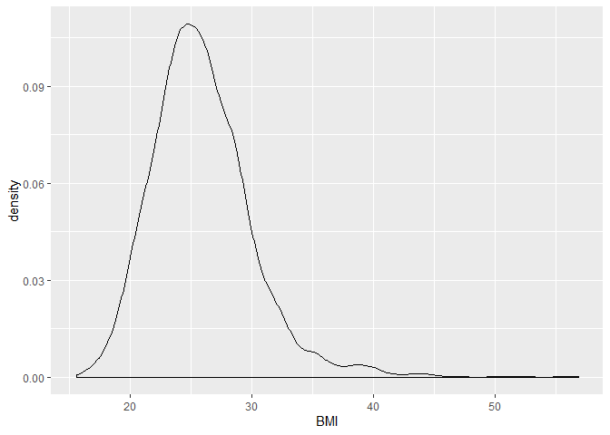
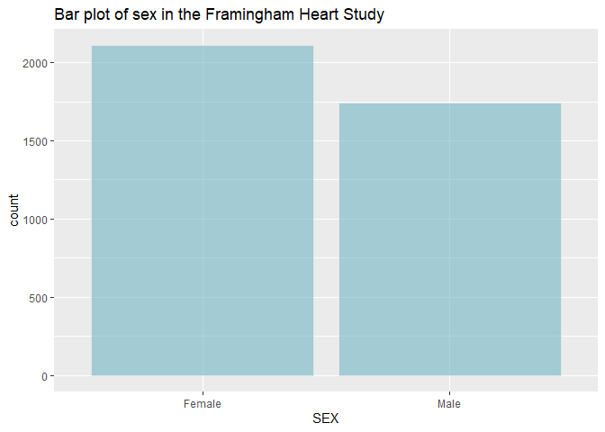
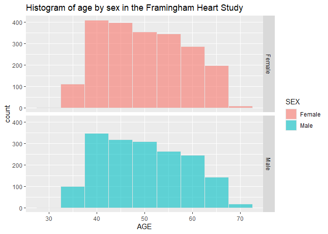

These introductory practicals are designed to teach you the basics of R.
At the end, we expect you to be able to follow along with the other
practicals of this course. Save your R-script or paste your answers in a
document and mail it to <l.j.sinke@lumc.nl>.

-----

## Part 1: Finding your way around RStudio

Open RStudio

After opening a new R-script with `ctrl + shift + N`, you should have a
layout similar to the image below.


You can type equations in the *Console* (see Figure) and R will
calculate the result. Try this by typing the following equation in the
Console:

``` r
1 + 1     
```

    ## [1] 2

-----

You can also type your code in the *R-script* (see Figure) and run a
line or a selection using `ctrl + enter`. This is preferable to typing
in the *Console* directly, since you can save the scripts for later use
or share them with collaborators. Additionally, scripts can be commented
using `#` to improve their readability.

Copy the following equations in your *R-script*, place your cursor on
the first line, and run the equations line-by-line. You can also select
multiple lines and run them together.

    5 - 2         # subtraction
    2 * 2         # multiplication
    6 / 2         # division
    3 ^ 2         # exponentiation
    sqrt(9)       # square root
    abs(-5)       # modulus

-----

Using the `up arrow` and `down arrow`, you can scroll through historical
commands. These can also be viewed in the **History** tab of the
*Environment* section (see Figure).

In the **Environment** tab of the *Environment* section, you can view
any stored variables available for use.

You can store values in variables using the assignment operator, `<-`.
Note that variable names in R are case-sensitive.

``` r
x <- 1 + 1
x
```

    ## [1] 2

You can list all currently saved variables, or remove them from memory.
Remember, `rm()` is irreversible. If you want to use the variable again,
you will need to redefine it.

``` r
ls()        # list all stored variables
```

    ## [1] "x"

``` r
rm(x)       # removing x
ls()
```

    ## character(0)

``` r
x <- 1 + 1  # redefining x
```

-----

In the *bottom right* section of RStudio, are some very useful tabs.
**Files** will display the content of the current working directory. You
can set this using `setwd()` and view the path using `getwd()`.

Any **Plots** that you create can also be viewed here, and you can
browse through your plot history with the `Forward` and `Back` buttons.

A list of currently installed packages is shown in the **Packages** tab.
The functions contained within these can be loaded into R with the
`library()` function. Try loading the graphics packages mentioned in the
lecture, ggplot2.

``` r
library(ggplot2)
```

We will use this package later in the practical. After loading a package
into R, the functions become available for use.

Lastly, the **Help** tab can be used to view documentation on any loaded
function. Find help on the function, `mean`.

    ?mean

-----

## Part 2: Vectors

You can store multiple values in a vector using the concatenate
function, `c()`.

``` r
y <- c(5, 6, 7)
y
```

    ## [1] 5 6 7

You can perform calculations on elements of a vector, using the same
operators and functions you saw above.

``` r
x + y
```

    ## [1] 7 8 9

``` r
y * 3
```

    ## [1] 15 18 21

``` r
y ^ 2
```

    ## [1] 25 36 49

-----

You can also sum the elements of a vector using `sum()`, view the
maximum value using `max()`, or return the number of elements using
`length()`. Additionally, vectors can be reversed using `rev()`.

``` r
sum(y)
```

    ## [1] 18

``` r
max(y)
```

    ## [1] 7

``` r
length(y)
```

    ## [1] 3

``` r
rev(y)
```

    ## [1] 7 6 5

-----

You can select specific values from a vector using square brackets. A
sequence of values can be defined with `:`. Values can also be added to
currently defined vectors using `c()`.

``` r
y[1]        # Return the first value of y
```

    ## [1] 5

``` r
y[2:3]      # Return the second and third value of y
```

    ## [1] 6 7

``` r
c(y, 8)     # Add an 8 as the last element of y
```

    ## [1] 5 6 7 8

``` r
y[-3]       # Return all except the third value of y
```

    ## [1] 5 6

-----

Some functions can help you explore the nature of stored variables.

``` r
str(y)
```

    ##  num [1:3] 5 6 7

``` r
class(y)
```

    ## [1] "numeric"

-----

In this case, `y` is a numeric class object. A vector can also contain
character data, defined using quotation marks.

``` r
z <- c("a", "b", "c")
z
```

    ## [1] "a" "b" "c"

``` r
c(z, "d")
```

    ## [1] "a" "b" "c" "d"

``` r
class(z)
```

    ## [1] "character"

-----

In addition to the above methods, there are other ways to subset vectors
in R.

``` r
y[c(1, 3)]    # Return the first and third value of y
```

    ## [1] 5 7

``` r
z[c(T,T,F)]   # Return the first and second value of y
```

    ## [1] "a" "b"

``` r
y[y == 6]     # Return all values of y equal to 6
```

    ## [1] 6

``` r
z[z != "a"]   # Return all values of z not equal to "a"
```

    ## [1] "b" "c"

``` r
y[y > 5]      # Return all values of y greater than 5
```

    ## [1] 6 7

-----

#### Question 1: Obtain the following vectors by adding, removing or subsetting vectors y or z. There are multiple ways to do this, but you only need to give one of them in your answers.

  - `7`
  - `"a", "c"`
  - `5, 7, 9`
  - `"c", "b", "a"`

-----

## Part 3: Data Frames

R also has a data frame class which you could compare to a spreadsheet.

You can click on a data frame in the **Environment** to view it.
However, when the data frame is large it is better to use functions such
as `str`, `summary`, `head` and `dim`.

``` r
df <- data.frame(y, z)  # Create a data frame from vectors y and z
df
```

    ##   y z
    ## 1 5 a
    ## 2 6 b
    ## 3 7 c

``` r
class(df)
```

    ## [1] "data.frame"

``` r
str(df)
```

    ## 'data.frame':    3 obs. of  2 variables:
    ##  $ y: num  5 6 7
    ##  $ z: Factor w/ 3 levels "a","b","c": 1 2 3

``` r
summary(df)
```

    ##        y       z    
    ##  Min.   :5.0   a:1  
    ##  1st Qu.:5.5   b:1  
    ##  Median :6.0   c:1  
    ##  Mean   :6.0        
    ##  3rd Qu.:6.5        
    ##  Max.   :7.0

-----

You can view the dimensions of a data frame.

``` r
nrow(df)
```

    ## [1] 3

``` r
ncol(df)
```

    ## [1] 2

``` r
dim(df)
```

    ## [1] 3 2

-----

You can add row names and column names to a data frame.

``` r
rownames(df) <- c("row1", "row2", "row3")
colnames(df) <- c("col1", "col2")
df
```

    ##      col1 col2
    ## row1    5    a
    ## row2    6    b
    ## row3    7    c

-----

You can subset data frames in a similar manner to vectors, or using the
`$` operator.

``` r
df[1, ]           # Return the first row
```

    ##      col1 col2
    ## row1    5    a

``` r
df[, 1]           # Return the first column
```

    ## [1] 5 6 7

``` r
df[1, 1]          # Return the first value in the first column
```

    ## [1] 5

``` r
df$col1           # Return column 'col1'
```

    ## [1] 5 6 7

``` r
df[df$col1 > 5, ] # Return rows where column 'col1' is greater than 5
```

    ##      col1 col2
    ## row2    6    b
    ## row3    7    c

-----

Extra columns can be added to a data frame using the `$` operator. This
column is of the logical class, where `T` represents TRUE and `F`
represents FALSE. These can also be used for subsetting as shown above.

``` r
df$col3 <- c(T, T, F) 
df
```

    ##      col1 col2  col3
    ## row1    5    a  TRUE
    ## row2    6    b  TRUE
    ## row3    7    c FALSE

Adding extra rows requires the `rbind()` function, and for values of the
new row to be of the correct class.

``` r
df2 <- data.frame(col1 = 8, col2 = "d", col3 = F) 
rownames(df2) <- "row4" 
df3 <- rbind(df, df2) 
df3
```

    ##      col1 col2  col3
    ## row1    5    a  TRUE
    ## row2    6    b  TRUE
    ## row3    7    c FALSE
    ## row4    8    d FALSE

-----

#### Question 2:

  - Add a column with the name `col4` to data frame `df` with the values
    `1, 1, 1`.
  - Make a new data frame `df4` which is a subset of data frame `df` but
    only contains columns `col1` and `col2`, and rows `row2` and `row3`.
  - Calculate the sum of `col1` of data frame `df3`.
  - Change the row names of data frame `df4` to `rowX` and `rowY`.

-----

## Part 4: Real Data

We are now going to load a data set from the Framingham heart study
[BioLINCC](https://biolincc.nhlbi.nih.gov/home/). This data is stored as
a .csv file, so we read it into R using `read.csv()`.

``` r
fhs <- read.csv(url("https://raw.githubusercontent.com/molepi/Molecular-Data-Science/master/RIntro_practical/data.csv"))
```

First, we will explore the data.

``` r
str(fhs)
```

    ## 'data.frame':    4434 obs. of  12 variables:
    ##  $ SEX     : Factor w/ 2 levels "Female","Male": 2 1 2 1 1 1 1 1 2 2 ...
    ##  $ TOTCHOL : int  195 250 245 225 285 228 205 313 260 225 ...
    ##  $ AGE     : int  39 46 48 61 46 43 63 45 52 43 ...
    ##  $ SYSBP   : num  106 121 128 150 130 ...
    ##  $ DIABP   : num  70 81 80 95 84 110 71 71 89 107 ...
    ##  $ CURSMOKE: Factor w/ 2 levels "No","Yes": 1 1 2 2 2 1 1 2 1 2 ...
    ##  $ BMI     : num  27 28.7 25.3 28.6 23.1 ...
    ##  $ DIABETES: Factor w/ 2 levels "No","Yes": 1 1 1 1 1 1 1 1 1 1 ...
    ##  $ BPMEDS  : Factor w/ 2 levels "No","Yes": 1 1 1 1 1 1 1 1 1 1 ...
    ##  $ GLUCOSE : int  77 76 70 103 85 99 85 78 79 88 ...
    ##  $ EDUC    : int  4 2 1 3 3 2 1 2 1 1 ...
    ##  $ MI      : Factor w/ 2 levels "No","Yes": 2 1 1 1 1 2 1 1 1 1 ...

``` r
summary(fhs)
```

    ##      SEX          TOTCHOL         AGE            SYSBP      
    ##  Female:2490   Min.   :107   Min.   :32.00   Min.   : 83.5  
    ##  Male  :1944   1st Qu.:206   1st Qu.:42.00   1st Qu.:117.5  
    ##                Median :234   Median :49.00   Median :129.0  
    ##                Mean   :237   Mean   :49.93   Mean   :132.9  
    ##                3rd Qu.:264   3rd Qu.:57.00   3rd Qu.:144.0  
    ##                Max.   :696   Max.   :70.00   Max.   :295.0  
    ##                NA's   :52                                   
    ##      DIABP        CURSMOKE        BMI        DIABETES    BPMEDS    
    ##  Min.   : 48.00   No :2253   Min.   :15.54   No :4313   No  :4229  
    ##  1st Qu.: 75.00   Yes:2181   1st Qu.:23.09   Yes: 121   Yes : 144  
    ##  Median : 82.00              Median :25.45              NA's:  61  
    ##  Mean   : 83.08              Mean   :25.85                         
    ##  3rd Qu.: 90.00              3rd Qu.:28.09                         
    ##  Max.   :142.50              Max.   :56.80                         
    ##                              NA's   :19                            
    ##     GLUCOSE            EDUC         MI      
    ##  Min.   : 40.00   Min.   :1.000   No :3703  
    ##  1st Qu.: 72.00   1st Qu.:1.000   Yes: 731  
    ##  Median : 78.00   Median :2.000             
    ##  Mean   : 82.19   Mean   :1.976             
    ##  3rd Qu.: 87.00   3rd Qu.:3.000             
    ##  Max.   :394.00   Max.   :4.000             
    ##  NA's   :397      NA's   :113

``` r
head(fhs)
```

    ##      SEX TOTCHOL AGE SYSBP DIABP CURSMOKE   BMI DIABETES BPMEDS GLUCOSE
    ## 1   Male     195  39 106.0    70       No 26.97       No     No      77
    ## 2 Female     250  46 121.0    81       No 28.73       No     No      76
    ## 3   Male     245  48 127.5    80      Yes 25.34       No     No      70
    ## 4 Female     225  61 150.0    95      Yes 28.58       No     No     103
    ## 5 Female     285  46 130.0    84      Yes 23.10       No     No      85
    ## 6 Female     228  43 180.0   110       No 30.30       No     No      99
    ##   EDUC  MI
    ## 1    4 Yes
    ## 2    2  No
    ## 3    1  No
    ## 4    3  No
    ## 5    3  No
    ## 6    2 Yes

From looking at the above, we can see that this data frame contains 4434
observations of 12 variables. The first 11 variables represent values
measured at baseline (e.g. sex, age), and the last variable, MI,
represents whether of not the individual had suffered a myocardial
infarction at 24 years after baseline.

-----

There are 642 missing values in the data. While there are various
methods to handle these, we will look only at complete cases in this
instance by removing observations with missing values.

``` r
sum(is.na(fhs))
```

    ## [1] 642

``` r
fhs <- fhs[complete.cases(fhs), ]
sum(is.na(fhs))
```

    ## [1] 0

-----

Formula class objects are used across multiple functions in R, including
those for cross tabulation and regression. For example, we can define a
model where `y` depends on `x` using the `~` and `+` operators.

``` r
f <- y ~ x + z
class(f)
```

    ## [1] "formula"

-----

We make use of this and create tables of variables in our data using
`xtabs()` and `prop.table()`.

``` r
xtabs(~ MI, fhs)              # Table of MI in FHS
```

    ## MI
    ##   No  Yes 
    ## 3208  643

``` r
prop.table(xtabs(~ MI, fhs))  # Proportion table of MI in FHS
```

    ## MI
    ##        No       Yes 
    ## 0.8330304 0.1669696

``` r
xtabs(~ MI + SEX, fhs)        # Table of MI by SEX
```

    ##      SEX
    ## MI    Female Male
    ##   No    1905 1303
    ##   Yes    203  440

``` r
xtabs(~ MI, fhs[fhs$AGE>50, ])# Table of MI in individuals over 50
```

    ## MI
    ##   No  Yes 
    ## 1392  372

-----

#### Question 3:

  - Make a table of CURSMOKE
  - Make a proportion table of BPMEDS
  - Make a table of EDUC for individuals who smoke
  - Cross tabulate SEX and DIABETES

-----

## Part 5: Visualisations of Distributions

Packages like `ggplot2`, which we loaded into R earlier, can extend the
functionality of R. This package is commonly used to produce
visualisations of data.

The plots will appear in the **Plots** pane, you can save the plots
using the Export button if you would like.

The `ggplot` function works by adding `geom` elements. For example,
`geom_density` can be used to investigate the distribution of a
variable.

``` r
ggplot(fhs, aes(BMI)) + geom_density()
```

<!-- -->

This is not really a very pretty visualisation, however. One of the nice
aspects of `ggplot2` is that you can iteratively build up graphics until
they look as you want them to.

-----

Let’s add some nicer colours and a title.

``` r
ggplot(fhs, aes(BMI)) + 
  geom_density(fill="#72B6C5", color="#ffffff00", alpha=0.6) +
  ggtitle("Distribution of BMI in the Framingham Heart Study")
```

<!-- -->

-----

We can also look at variable’s distribution using a bar plot with
`geom_bar` or a histogram with `geom_histogram`.

``` r
ggplot(fhs, aes(SEX)) + 
  geom_bar(fill="#72B6C5", color="grey90", alpha=0.6) +
  ggtitle("Bar plot of sex in the Framingham Heart Study")
```

<!-- -->

-----

Some themes are also available for use with `ggplot`.

``` r
ggplot(fhs, aes(AGE)) + 
  geom_histogram(binwidth = 1, color="grey90", alpha=0.6) + theme_bw() +
  ggtitle("Histogram of age in the Framingham Heart Study")
```

<!-- -->

-----

Maybe we want to view ages in males and females separately. For this, we
can use `facet_grid`.

``` r
ggplot(fhs, aes(x=AGE, fill=SEX)) + 
  geom_histogram(binwidth = 5, color="grey90", alpha=0.6) +
  ggtitle("Histogram of age by sex in the Framingham Heart Study") +
  facet_grid(SEX ~ .)
```

<!-- -->

-----

You can quickly build up attractive graphics in R. Subsetting can also
be utilised within `ggplot2`.

Say, we want to visualise the distribution of age by sex only in
overweight individuals.

``` r
ggplot(fhs[fhs$BMI > 30, ], aes(x=AGE, fill=SEX)) + 
  geom_histogram(binwidth = 5, color="grey90", alpha=0.6) +
  ggtitle("Histogram of age by sex in the Framingham Heart Study") +
  facet_grid(SEX ~ .)
```

<!-- -->

-----

#### Question 4:

  - Make a bar plot of MI
  - Make a histogram of TOTCHOL
  - Make a density plot of GLUCOSE for individuals with diabetes
  - Make a histogram of SYSBP by SEX for those who experienced MI

-----

## See you tomorrow\!

Hopefully, this introduction to the basics of R was informative and
helpful. Tomorrow, we will start by diving into variable comparison
using more graphics and statistical tests.

-----
