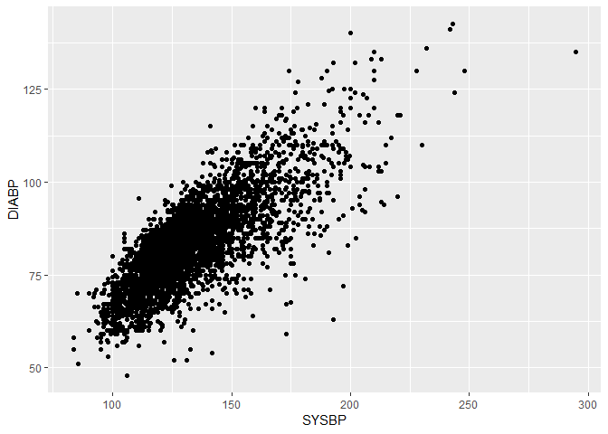

-   This practical is intended for students who have never used R before. Parts 1 and 2 are mandatory, Parts 3 and 4 are for fast students. At the end of this practical we expect you to be able to follow along with the other practicals of this course. Save your R-script or paste your answers in a Word document and mail it to <k.f.dekkers@lumc.nl>.

Part 1: Explore R-studio & use the basics
-----------------------------------------

-   Open RStudio

-   Open a new R-script with Ctrl-Shift-N, it should look like the following screenshot: 

-   You can type equations in the Console (see Figure) and R will calculate the result, try this by typing the following equation in the Console:

``` r
1 + 1
```

    ## [1] 2

-   You can also type your code in the R-script (see Figure) and run a line or a selection using Ctrl-Enter. This is prefered to typing in the Console directly, since you can save the scripts for later use or share them with collaborators.

-   Copy the following equations in your R-script, place your cursor on the first line and run the equations line by line. You can also select multiple lines and run them together.

<!-- -->

    5 - 2
    2 * 2
    6 / 2
    3 ** 2
    sqrt(9)
    abs(-5)

-   You can store values in variables for later use. You can view all your stored variables in the Environment (see Figure).

``` r
x <- 1 + 1
x
```

    ## [1] 2

-   You can store multiple values in a vector using the concatenate function **c()**.

``` r
y <- c(5, 6, 7)
y
```

    ## [1] 5 6 7

-   You can do calculus on stored variables, also on vectors.

``` r
x + 1
```

    ## [1] 3

``` r
x + y
```

    ## [1] 7 8 9

``` r
y * y
```

    ## [1] 25 36 49

-   You can select, add and remove values from vectors.
-   Tip: With **\#** you can comment your code so that other people can understand what you did. Comments are skipped when the code is run.

``` r
y[1] # first value of y
```

    ## [1] 5

``` r
y[2:3] # second and third value of y
```

    ## [1] 6 7

``` r
c(y, 8) # add 8 to y
```

    ## [1] 5 6 7 8

``` r
y[-3] # remove third value from y
```

    ## [1] 5 6

-   You can use functions on variables.

``` r
sum(y)
```

    ## [1] 18

``` r
max(y)
```

    ## [1] 7

``` r
class(y)
```

    ## [1] "numeric"

``` r
str(y)
```

    ##  num [1:3] 5 6 7

``` r
summary(y)
```

    ##    Min. 1st Qu.  Median    Mean 3rd Qu.    Max. 
    ##     5.0     5.5     6.0     6.0     6.5     7.0

-   If you want to know what the function does you can search for it in the Help pane (see Figure) or put a **?** before the function in your R-script or Console. Also, Google is often useful to get answers to R problems.

-   Look at the Help page of some of the functions, either by searching for them or by running the following commands.

<!-- -->

    ?sum
    ?class

-   A vector can also contain characters.

``` r
z <- c("a", "b", "c")
z
```

    ## [1] "a" "b" "c"

``` r
c(z, "d")
```

    ## [1] "a" "b" "c" "d"

``` r
class(z)
```

    ## [1] "character"

-   You can subset vectors in multiple ways:

``` r
y[1] # first value of y
```

    ## [1] 5

``` r
z[1:2] # first and second value of z
```

    ## [1] "a" "b"

``` r
y[c(1, 3)] # first and third value of y
```

    ## [1] 5 7

``` r
z[c(TRUE, TRUE, FALSE)] # first and second value of z
```

    ## [1] "a" "b"

``` r
y[y == 6] # all values of y where y is 6
```

    ## [1] 6

``` r
z[z != "a"] # all values of z where z is not "a"
```

    ## [1] "b" "c"

``` r
y[y > 5] # all values of y where y is greater than 5
```

    ## [1] 6 7

#### Question 1: Obtain the following vectors by adding, removing or subsetting vectors y or z. There are multiple ways to do this, but you only need to give one of them in your answers.

    7
    "a" "c"
    5 7 9
    "c" "b" "a"

-   R also has the data frame class which you could compare to a spreadsheet.

-   You can click on a data frame in the Environment (see Figure) to view it, however when the data frame is large it is better to use functions such as **str**, **summary**, **head** and **dim**.

``` r
df <- data.frame(y, z) # create data frame from vectors y and z
df
```

    ##   y z
    ## 1 5 a
    ## 2 6 b
    ## 3 7 c

``` r
class(df)
```

    ## [1] "data.frame"

``` r
str(df)
```

    ## 'data.frame':    3 obs. of  2 variables:
    ##  $ y: num  5 6 7
    ##  $ z: Factor w/ 3 levels "a","b","c": 1 2 3

``` r
summary(df)
```

    ##        y       z    
    ##  Min.   :5.0   a:1  
    ##  1st Qu.:5.5   b:1  
    ##  Median :6.0   c:1  
    ##  Mean   :6.0        
    ##  3rd Qu.:6.5        
    ##  Max.   :7.0

-   You can add row names and column names to data frames.

``` r
rownames(df) <- c("row1", "row2", "row3")
colnames(df) <- c("col1", "col2")
df
```

    ##      col1 col2
    ## row1    5    a
    ## row2    6    b
    ## row3    7    c

-   You can subset data frames.

``` r
df[1, ] # first row of df
```

    ##      col1 col2
    ## row1    5    a

``` r
df[, 1] # first column of df
```

    ## [1] 5 6 7

``` r
df[1, 1] # value at first row and first column of df
```

    ## [1] 5

``` r
df$col1 # column col1
```

    ## [1] 5 6 7

``` r
df[df$col1 > 5, ] # df where column col1 is greater than 5
```

    ##      col1 col2
    ## row2    6    b
    ## row3    7    c

``` r
df[df$col2 == "a", ] # df where column col2 is "a"
```

    ##      col1 col2
    ## row1    5    a

-   You can add extra columns or rows to data frames.

``` r
df$col3 <- c(TRUE, TRUE, FALSE) # add col3
df
```

    ##      col1 col2  col3
    ## row1    5    a  TRUE
    ## row2    6    b  TRUE
    ## row3    7    c FALSE

``` r
df2 <- data.frame(col1 = 8, col2 = "d", col3 = FALSE) # create new data frame df2
rownames(df2) <- "row4" # add row name to df2
df2
```

    ##      col1 col2  col3
    ## row4    8    d FALSE

``` r
df3 <- rbind(df, df2) # add row4 to df and store in variable df3
df3
```

    ##      col1 col2  col3
    ## row1    5    a  TRUE
    ## row2    6    b  TRUE
    ## row3    7    c FALSE
    ## row4    8    d FALSE

#### Question 2:

1.  Add a column with the name col4 to data frame df with the values 1 1 1.
2.  Make a new data frame df4 which is a subset of data frame df but only contains columns col1 and col2 and rows row2 and row3.
3.  Calculate the sum of col1 of data frame df3.
4.  Change the row names of data frame df4 to "rowX" and "rowY".

Part 2: Explore data set, plot and perform statistical tests
------------------------------------------------------------

-   We are now going to load a data set from the Framingham heart study [BioLINCC](biolincc.nhlbi.nih.gov).

``` r
fhs <- read.csv(url("https://raw.githubusercontent.com/molepi/Molecular-Data-Science/master/RIntro_practical/data.csv"))
```

-   First we will explore the data.

``` r
str(fhs)
```

    ## 'data.frame':    4434 obs. of  12 variables:
    ##  $ SEX     : Factor w/ 2 levels "Female","Male": 2 1 2 1 1 1 1 1 2 2 ...
    ##  $ TOTCHOL : int  195 250 245 225 285 228 205 313 260 225 ...
    ##  $ AGE     : int  39 46 48 61 46 43 63 45 52 43 ...
    ##  $ SYSBP   : num  106 121 128 150 130 ...
    ##  $ DIABP   : num  70 81 80 95 84 110 71 71 89 107 ...
    ##  $ CURSMOKE: Factor w/ 2 levels "No","Yes": 1 1 2 2 2 1 1 2 1 2 ...
    ##  $ BMI     : num  27 28.7 25.3 28.6 23.1 ...
    ##  $ DIABETES: Factor w/ 2 levels "No","Yes": 1 1 1 1 1 1 1 1 1 1 ...
    ##  $ BPMEDS  : Factor w/ 2 levels "No","Yes": 1 1 1 1 1 1 1 1 1 1 ...
    ##  $ GLUCOSE : int  77 76 70 103 85 99 85 78 79 88 ...
    ##  $ EDUC    : int  4 2 1 3 3 2 1 2 1 1 ...
    ##  $ MI      : Factor w/ 2 levels "No","Yes": 2 1 1 1 1 2 1 1 1 1 ...

``` r
summary(fhs)
```

    ##      SEX          TOTCHOL         AGE            SYSBP      
    ##  Female:2490   Min.   :107   Min.   :32.00   Min.   : 83.5  
    ##  Male  :1944   1st Qu.:206   1st Qu.:42.00   1st Qu.:117.5  
    ##                Median :234   Median :49.00   Median :129.0  
    ##                Mean   :237   Mean   :49.93   Mean   :132.9  
    ##                3rd Qu.:264   3rd Qu.:57.00   3rd Qu.:144.0  
    ##                Max.   :696   Max.   :70.00   Max.   :295.0  
    ##                NA's   :52                                   
    ##      DIABP        CURSMOKE        BMI        DIABETES    BPMEDS    
    ##  Min.   : 48.00   No :2253   Min.   :15.54   No :4313   No  :4229  
    ##  1st Qu.: 75.00   Yes:2181   1st Qu.:23.09   Yes: 121   Yes : 144  
    ##  Median : 82.00              Median :25.45              NA's:  61  
    ##  Mean   : 83.08              Mean   :25.85                         
    ##  3rd Qu.: 90.00              3rd Qu.:28.09                         
    ##  Max.   :142.50              Max.   :56.80                         
    ##                              NA's   :19                            
    ##     GLUCOSE            EDUC         MI      
    ##  Min.   : 40.00   Min.   :1.000   No :3703  
    ##  1st Qu.: 72.00   1st Qu.:1.000   Yes: 731  
    ##  Median : 78.00   Median :2.000             
    ##  Mean   : 82.19   Mean   :1.976             
    ##  3rd Qu.: 87.00   3rd Qu.:3.000             
    ##  Max.   :394.00   Max.   :4.000             
    ##  NA's   :397      NA's   :113

``` r
head(fhs)
```

    ##      SEX TOTCHOL AGE SYSBP DIABP CURSMOKE   BMI DIABETES BPMEDS GLUCOSE
    ## 1   Male     195  39 106.0    70       No 26.97       No     No      77
    ## 2 Female     250  46 121.0    81       No 28.73       No     No      76
    ## 3   Male     245  48 127.5    80      Yes 25.34       No     No      70
    ## 4 Female     225  61 150.0    95      Yes 28.58       No     No     103
    ## 5 Female     285  46 130.0    84      Yes 23.10       No     No      85
    ## 6 Female     228  43 180.0   110       No 30.30       No     No      99
    ##   EDUC  MI
    ## 1    4 Yes
    ## 2    2  No
    ## 3    1  No
    ## 4    3  No
    ## 5    3  No
    ## 6    2 Yes

``` r
sum(is.na(fhs))
```

    ## [1] 642

-   Description of variables at baseline: sex, total cholesterol, age, systolic blood pressure, diastolic blood pressure, current smoker, BMI, diabetis, blood pressure medication, glucose, education (four levels)

-   Description of variables at follow up (24 years after baseline): myocardiac infarction

-   There are missing values in the data. While there are different methods to handle missing data, we will in this case remove all individuals that have one or more missing values.

``` r
fhs <- fhs[complete.cases(fhs), ]
sum(is.na(fhs))
```

    ## [1] 0

-   We can make some tables of the data.

``` r
xtabs(~ MI, fhs)
```

    ## MI
    ##   No  Yes 
    ## 3208  643

``` r
prop.table(xtabs(~ MI, fhs))
```

    ## MI
    ##        No       Yes 
    ## 0.8330304 0.1669696

``` r
xtabs(~ MI, fhs[fhs$SEX == "Female", ]) # table of MI for females only
```

    ## MI
    ##   No  Yes 
    ## 1905  203

#### Question 3:

1.  Make a table of CURSMOKE
2.  Make a proportion table of BPMEDS
3.  Make a table of EDUC for individuals who smoke

-   Packages can extent the functionality of R, **ggplot2** for example is a popular package for visualizations.

-   The plots will appear in the Plots pane (see Figure), you can save the plots using the Export tab if you want.

``` r
library(ggplot2)
```

    ## Warning: package 'ggplot2' was built under R version 3.4.4

``` r
ggplot(fhs, aes(MI)) + geom_bar()
```


``` r
ggplot(fhs, aes(BMI)) + geom_histogram(binwidth = 1)
```


``` r
ggplot(fhs[fhs$BMI > 30, ], aes(BMI)) + geom_density(fill = "black") 
```


-   We can also make tables and plots of variable pairs.

``` r
xtabs(~ MI + SEX, fhs)
```

    ##      SEX
    ## MI    Female Male
    ##   No    1905 1303
    ##   Yes    203  440

``` r
ggplot(fhs, aes(x = SYSBP, y = DIABP)) + geom_point()
```



``` r
ggplot(fhs, aes(x = MI, y = AGE)) + geom_boxplot()
```


#### Question 4:

1.  Make a bar plot of SEX
2.  Make a histogram of TOTCHOL
3.  Make a density plot of GLUCOSE for individuals with diabetes.
4.  Make a table of MI AND EDUC for individuals that smoke.
5.  Make a scatter plot of TOTCHOL and AGE
6.  Make a box plot of MI and BMI for males.

-   There are a lot of options to improve your plots.
-   Tip: **ggplot2** has a website with examples for all types of plots, see for example the page for [density plots](https://ggplot2.tidyverse.org/reference/geom_density.html).
-   If you have time left you can explore some of these options and look at the ggplot2 website for inspiration.

``` r
ggplot(fhs, aes(MI, fill = SEX)) + geom_bar(position = "dodge") + ggtitle("Bar plot") + 
  scale_fill_manual(values = c("blue4", "firebrick1")) + theme_bw()
```


``` r
ggplot(fhs, aes(BMI, fill = MI)) + geom_density(color = NA, alpha = 0.5) + ggtitle("Density plot") + 
  scale_fill_manual(values = c("blue4", "firebrick1")) + theme_bw()
```


``` r
ggplot(fhs, aes(x = SYSBP, y = DIABP, color = BPMEDS)) + geom_point() + 
  geom_smooth(method = "lm", se = F, color = "black") + ggtitle("Scatter plot") + 
  scale_color_manual(values = c("blue4", "firebrick1")) + theme_minimal()
```


``` r
ggplot(fhs, aes(x = MI, y = AGE, color = MI)) + geom_boxplot() + facet_wrap(~ SEX) + 
  ggtitle("Box plot") + scale_color_manual(values = c("blue4", "firebrick1")) + 
  theme_bw() + guides(color = F)
```


-   Next we will perform some statistical tests.

``` r
cor.test(~ SYSBP + DIABP, fhs) # is SYSBP correlated with DIABP
```

    ## 
    ##  Pearson's product-moment correlation
    ## 
    ## data:  SYSBP and DIABP
    ## t = 78.845, df = 3849, p-value < 2.2e-16
    ## alternative hypothesis: true correlation is not equal to 0
    ## 95 percent confidence interval:
    ##  0.7734942 0.7976652
    ## sample estimates:
    ##       cor 
    ## 0.7858797

``` r
t.test(AGE ~ MI, fhs) # is AGE associated with MI (t-test)
```

    ## 
    ##  Welch Two Sample t-test
    ## 
    ## data:  AGE by MI
    ## t = -9.0315, df = 918.42, p-value < 2.2e-16
    ## alternative hypothesis: true difference in means is not equal to 0
    ## 95 percent confidence interval:
    ##  -4.072404 -2.618479
    ## sample estimates:
    ##  mean in group No mean in group Yes 
    ##          49.34352          52.68896

``` r
fit <- glm(MI ~ AGE, fhs, family = "binomial") # is AGE associated with MI (logistic regression)
summary(fit)
```

    ## 
    ## Call:
    ## glm(formula = MI ~ AGE, family = "binomial", data = fhs)
    ## 
    ## Deviance Residuals: 
    ##     Min       1Q   Median       3Q      Max  
    ## -0.8594  -0.6552  -0.5454  -0.4712   2.1974  
    ## 
    ## Coefficients:
    ##              Estimate Std. Error z value Pr(>|z|)    
    ## (Intercept) -3.879666   0.266737  -14.54   <2e-16 ***
    ## AGE          0.044548   0.005051    8.82   <2e-16 ***
    ## ---
    ## Signif. codes:  0 '***' 0.001 '**' 0.01 '*' 0.05 '.' 0.1 ' ' 1
    ## 
    ## (Dispersion parameter for binomial family taken to be 1)
    ## 
    ##     Null deviance: 3474.0  on 3850  degrees of freedom
    ## Residual deviance: 3394.5  on 3849  degrees of freedom
    ## AIC: 3398.5
    ## 
    ## Number of Fisher Scoring iterations: 4

#### Question 5:

1.  Is AGE correlated with TOTCHOL?
2.  Is MI associated with GLUCOSE (use t-test and logistic regression)?
3.  Is MI associated with GLUCOSE in individuals with diabetes (use t-test and logistic regression)

-   One of the advantages of using R is to use loops to perform multiple analyses at once. The following loop calculates the association of MI with all the other variables and stores them in a data frame. We don't expect you to create loops like this in these 4 hours, but try to follow along with the code and see if it makes sense. In Part 3 we will explore some simple loops and self-made functions.

``` r
results <- data.frame() # create empty data frame
for (i in colnames(fhs)[-ncol(fhs)]) { # loop over all column names except MI
  fit <- glm(MI ~ get(i), fhs, family = "binomial") # fit a model for the i-th column
  results <- rbind(results, summary(fit)$coefficients[2, , drop = FALSE]) # rbind second row of coefficients to results, first row is intercept
}
rownames(results) <- colnames(fhs)[-ncol(fhs)] # add row names
results$OR <- exp(results$Estimate) # add odds ratio
results[order(results$"Pr(>|z|)"), ] # order results by P-value
```

    ##              Estimate   Std. Error   z value     Pr(>|z|)        OR
    ## SEX       1.153381422 0.0921407197 12.517608 5.981047e-36 3.1688902
    ## SYSBP     0.018909221 0.0017797581 10.624602 2.289869e-26 1.0190891
    ## AGE       0.044548141 0.0050507477  8.820108 1.143491e-18 1.0455553
    ## TOTCHOL   0.008106879 0.0009512993  8.521902 1.569545e-17 1.0081398
    ## DIABP     0.028722602 0.0034015327  8.444018 3.066132e-17 1.0291391
    ## DIABETES  1.307439829 0.1995849643  6.550793 5.723227e-11 3.6966974
    ## BMI       0.065226891 0.0099964058  6.525034 6.798595e-11 1.0674012
    ## GLUCOSE   0.008529646 0.0014836425  5.749125 8.970668e-09 1.0085661
    ## BPMEDS    0.782504278 0.1961813118  3.988679 6.644226e-05 2.1869421
    ## CURSMOKE  0.273897693 0.0867548074  3.157147 1.593209e-03 1.3150803
    ## EDUC     -0.059809137 0.0427093732 -1.400375 1.614011e-01 0.9419443

Part 3: if-else statements, for loops and functions (optional)
--------------------------------------------------------------

-   An if-statement is only run if the condition is true.

``` r
if (1 < 2) { # if 1 smaller then 2
  print("1 is smaller than 2") # print "1 is smaller than 2"
}
```

    ## [1] "1 is smaller than 2"

-   An else-statement is only run if the condition of the if-statement is false.

``` r
if (1 > 2) {
  print("1 is greater than 2")
} else {
  print("1 is not greater than 2")
}
```

    ## [1] "1 is not greater than 2"

-   With for-loops you assign a range of values (in the example values 1 to 10) to a variable (in the example variable i) and perform the actions in the loop for all these values in order (1 first, 10 last).

``` r
for (i in 1:10) { # loop over values 1 to 10
  if (i < 5) {
    print(paste(i, "is smaller than 5"))
  } else {
    print(paste(i, "is not smaller than 5"))
  }
}
```

    ## [1] "1 is smaller than 5"
    ## [1] "2 is smaller than 5"
    ## [1] "3 is smaller than 5"
    ## [1] "4 is smaller than 5"
    ## [1] "5 is not smaller than 5"
    ## [1] "6 is not smaller than 5"
    ## [1] "7 is not smaller than 5"
    ## [1] "8 is not smaller than 5"
    ## [1] "9 is not smaller than 5"
    ## [1] "10 is not smaller than 5"

-   You can also make your own functions in R.

``` r
greater <- function(x, y) { # function requires arguments x and y
  if (x > y) {
    paste(x, "is greater than", y)
  } else {
    paste(x, "is not greater than", y)
  }
}
greater(1, 2)
```

    ## [1] "1 is not greater than 2"

``` r
greater(2, 1)
```

    ## [1] "2 is greater than 1"

#### Question 6:

1.  Make a for-loop, don't use subsetting like we practiced earlier, that returns all values of MI (of data frame fhs) where BMI is greater than 30.
2.  Make a function that requires as arguments x, y and z and returns their product.
3.  Make a loop that returns the association of all columns of data frame fhs with AGE, instead of using *glm* you can use *lm*.

Part 4: Genomic ranges (optional)
---------------------------------

-   [Bioconductor](https://www.bioconductor.org/) contains a lot of packages to analyse biological data sets.

-   The genomic ranges (?GRanges) object of the **GenomicRanges** package is often used in Bioconductor packages to store genomic data (SNP data, gene expression data, DNA methylation data, etc).

-   Explore the following example of how to make and use genomic ranges.

``` r
library(GenomicRanges)
```

    ## Loading required package: stats4

    ## Loading required package: BiocGenerics

    ## Loading required package: parallel

    ## 
    ## Attaching package: 'BiocGenerics'

    ## The following objects are masked from 'package:parallel':
    ## 
    ##     clusterApply, clusterApplyLB, clusterCall, clusterEvalQ,
    ##     clusterExport, clusterMap, parApply, parCapply, parLapply,
    ##     parLapplyLB, parRapply, parSapply, parSapplyLB

    ## The following objects are masked from 'package:stats':
    ## 
    ##     IQR, mad, sd, var, xtabs

    ## The following objects are masked from 'package:base':
    ## 
    ##     anyDuplicated, append, as.data.frame, cbind, colMeans,
    ##     colnames, colSums, do.call, duplicated, eval, evalq, Filter,
    ##     Find, get, grep, grepl, intersect, is.unsorted, lapply,
    ##     lengths, Map, mapply, match, mget, order, paste, pmax,
    ##     pmax.int, pmin, pmin.int, Position, rank, rbind, Reduce,
    ##     rowMeans, rownames, rowSums, sapply, setdiff, sort, table,
    ##     tapply, union, unique, unsplit, which, which.max, which.min

    ## Loading required package: S4Vectors

    ## 
    ## Attaching package: 'S4Vectors'

    ## The following object is masked from 'package:base':
    ## 
    ##     expand.grid

    ## Loading required package: IRanges

    ## Loading required package: GenomeInfoDb

``` r
# make a genomic ranges object that resembles snp data
gr1 <- GRanges("chr1", IRanges(1:5, width = 1, names = paste0("snp", 1:5)), 
               ref_allele = sample(c("A", "G", "C", "T"), 5, replace = T), 
               alt_allele = sample(c("A", "G", "C", "T"), 5, replace = T)) 
gr1
```

    ## GRanges object with 5 ranges and 2 metadata columns:
    ##        seqnames    ranges strand |  ref_allele  alt_allele
    ##           <Rle> <IRanges>  <Rle> | <character> <character>
    ##   snp1     chr1    [1, 1]      * |           A           C
    ##   snp2     chr1    [2, 2]      * |           T           G
    ##   snp3     chr1    [3, 3]      * |           A           G
    ##   snp4     chr1    [4, 4]      * |           G           C
    ##   snp5     chr1    [5, 5]      * |           C           C
    ##   -------
    ##   seqinfo: 1 sequence from an unspecified genome; no seqlengths

``` r
gr1[1]
```

    ## GRanges object with 1 range and 2 metadata columns:
    ##        seqnames    ranges strand |  ref_allele  alt_allele
    ##           <Rle> <IRanges>  <Rle> | <character> <character>
    ##   snp1     chr1    [1, 1]      * |           A           C
    ##   -------
    ##   seqinfo: 1 sequence from an unspecified genome; no seqlengths

``` r
values(gr1)
```

    ## DataFrame with 5 rows and 2 columns
    ##    ref_allele  alt_allele
    ##   <character> <character>
    ## 1           A           C
    ## 2           T           G
    ## 3           A           G
    ## 4           G           C
    ## 5           C           C

``` r
ranges(gr1)
```

    ## IRanges object with 5 ranges and 0 metadata columns:
    ##            start       end     width
    ##        <integer> <integer> <integer>
    ##   snp1         1         1         1
    ##   snp2         2         2         1
    ##   snp3         3         3         1
    ##   snp4         4         4         1
    ##   snp5         5         5         1

``` r
start(gr1)
```

    ## [1] 1 2 3 4 5

``` r
end(gr1)
```

    ## [1] 1 2 3 4 5

``` r
seqnames(gr1)
```

    ## factor-Rle of length 5 with 1 run
    ##   Lengths:    5
    ##   Values : chr1
    ## Levels(1): chr1

``` r
seqlevels(gr1)
```

    ## [1] "chr1"

``` r
# make a genomic ranges object that resembles gene expression data
gr2 <- GRanges("chr1", IRanges(4:8, width = 5,
                names = paste0("gene", 1:5)), GC_content = sample(1:100 / 100, 5))
gr2
```

    ## GRanges object with 5 ranges and 1 metadata column:
    ##         seqnames    ranges strand | GC_content
    ##            <Rle> <IRanges>  <Rle> |  <numeric>
    ##   gene1     chr1   [4,  8]      * |       0.91
    ##   gene2     chr1   [5,  9]      * |       0.41
    ##   gene3     chr1   [6, 10]      * |       0.39
    ##   gene4     chr1   [7, 11]      * |       0.97
    ##   gene5     chr1   [8, 12]      * |       0.12
    ##   -------
    ##   seqinfo: 1 sequence from an unspecified genome; no seqlengths

``` r
# find snps in genes
hits <- findOverlaps(gr1, gr2)
hits
```

    ## Hits object with 3 hits and 0 metadata columns:
    ##       queryHits subjectHits
    ##       <integer>   <integer>
    ##   [1]         4           1
    ##   [2]         5           1
    ##   [3]         5           2
    ##   -------
    ##   queryLength: 5 / subjectLength: 5

``` r
gr1[queryHits(hits)]
```

    ## GRanges object with 3 ranges and 2 metadata columns:
    ##        seqnames    ranges strand |  ref_allele  alt_allele
    ##           <Rle> <IRanges>  <Rle> | <character> <character>
    ##   snp4     chr1    [4, 4]      * |           G           C
    ##   snp5     chr1    [5, 5]      * |           C           C
    ##   snp5     chr1    [5, 5]      * |           C           C
    ##   -------
    ##   seqinfo: 1 sequence from an unspecified genome; no seqlengths

``` r
gr2[subjectHits(hits)]
```

    ## GRanges object with 3 ranges and 1 metadata column:
    ##         seqnames    ranges strand | GC_content
    ##            <Rle> <IRanges>  <Rle> |  <numeric>
    ##   gene1     chr1    [4, 8]      * |       0.91
    ##   gene1     chr1    [4, 8]      * |       0.91
    ##   gene2     chr1    [5, 9]      * |       0.41
    ##   -------
    ##   seqinfo: 1 sequence from an unspecified genome; no seqlengths

``` r
data.frame(snps = names(gr1[queryHits(hits)]), genes = names(gr2[subjectHits(hits)]))
```

    ##   snps genes
    ## 1 snp4 gene1
    ## 2 snp5 gene1
    ## 3 snp5 gene2

``` r
# make another genomic ranges object that resembles snp data
gr3 <- GRanges("chr1", IRanges(6:10, width = 1, names = paste0("snp", 6:10)), 
               ref_allele = sample(c("A", "G", "C", "T"), 5, replace = T), 
               alt_allele = sample(c("A", "G", "C", "T"), 5, replace = T))
gr3
```

    ## GRanges object with 5 ranges and 2 metadata columns:
    ##         seqnames    ranges strand |  ref_allele  alt_allele
    ##            <Rle> <IRanges>  <Rle> | <character> <character>
    ##    snp6     chr1  [ 6,  6]      * |           G           T
    ##    snp7     chr1  [ 7,  7]      * |           A           A
    ##    snp8     chr1  [ 8,  8]      * |           T           T
    ##    snp9     chr1  [ 9,  9]      * |           A           G
    ##   snp10     chr1  [10, 10]      * |           T           A
    ##   -------
    ##   seqinfo: 1 sequence from an unspecified genome; no seqlengths

``` r
# combine both snp data genomic ranges
gr4 <- c(gr1, gr3)
gr4
```

    ## GRanges object with 10 ranges and 2 metadata columns:
    ##         seqnames    ranges strand |  ref_allele  alt_allele
    ##            <Rle> <IRanges>  <Rle> | <character> <character>
    ##    snp1     chr1  [ 1,  1]      * |           A           C
    ##    snp2     chr1  [ 2,  2]      * |           T           G
    ##    snp3     chr1  [ 3,  3]      * |           A           G
    ##    snp4     chr1  [ 4,  4]      * |           G           C
    ##    snp5     chr1  [ 5,  5]      * |           C           C
    ##    snp6     chr1  [ 6,  6]      * |           G           T
    ##    snp7     chr1  [ 7,  7]      * |           A           A
    ##    snp8     chr1  [ 8,  8]      * |           T           T
    ##    snp9     chr1  [ 9,  9]      * |           A           G
    ##   snp10     chr1  [10, 10]      * |           T           A
    ##   -------
    ##   seqinfo: 1 sequence from an unspecified genome; no seqlengths

``` r
# find snps (of both snp data genomic ranges) in or near (within 2 base pairs) genes
hits <- findOverlaps(gr4, gr2, maxgap = 2)
hits
```

    ## Hits object with 35 hits and 0 metadata columns:
    ##        queryHits subjectHits
    ##        <integer>   <integer>
    ##    [1]         2           1
    ##    [2]         3           1
    ##    [3]         3           2
    ##    [4]         4           1
    ##    [5]         4           2
    ##    ...       ...         ...
    ##   [31]        10           1
    ##   [32]        10           2
    ##   [33]        10           3
    ##   [34]        10           4
    ##   [35]        10           5
    ##   -------
    ##   queryLength: 10 / subjectLength: 5

``` r
data.frame(snps = names(gr4[queryHits(hits)]), genes = names(gr2[subjectHits(hits)]))
```

    ##     snps genes
    ## 1   snp2 gene1
    ## 2   snp3 gene1
    ## 3   snp3 gene2
    ## 4   snp4 gene1
    ## 5   snp4 gene2
    ## 6   snp4 gene3
    ## 7   snp5 gene1
    ## 8   snp5 gene2
    ## 9   snp5 gene3
    ## 10  snp5 gene4
    ## 11  snp6 gene1
    ## 12  snp6 gene2
    ## 13  snp6 gene3
    ## 14  snp6 gene4
    ## 15  snp6 gene5
    ## 16  snp7 gene1
    ## 17  snp7 gene2
    ## 18  snp7 gene3
    ## 19  snp7 gene4
    ## 20  snp7 gene5
    ## 21  snp8 gene1
    ## 22  snp8 gene2
    ## 23  snp8 gene3
    ## 24  snp8 gene4
    ## 25  snp8 gene5
    ## 26  snp9 gene1
    ## 27  snp9 gene2
    ## 28  snp9 gene3
    ## 29  snp9 gene4
    ## 30  snp9 gene5
    ## 31 snp10 gene1
    ## 32 snp10 gene2
    ## 33 snp10 gene3
    ## 34 snp10 gene4
    ## 35 snp10 gene5
