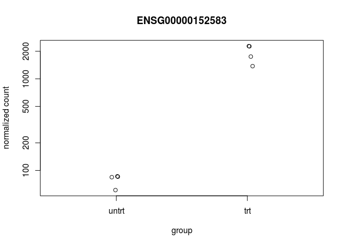

RNAseq practical
================

-   [Introduction](#introduction)
    -   [Experimental Data](#experimental-data)
-   [Exploratory analysis and visualization](#exploratory-analysis-and-visualization)
    -   [Loading and Exploring the data](#loading-and-exploring-the-data)
    -   [The *DESeqDataSet* object, sample information and the design formula](#the-deseqdataset-object-sample-information-and-the-design-formula)
    -   [Clustering and PCA](#clustering-and-pca)
-   [Differential expression analysis](#differential-expression-analysis)
    -   [Running the differential expression pipeline](#running-the-differential-expression-pipeline)
    -   [Multiple testing](#multiple-testing)
    -   [visualizing results](#visualizing-results)
-   [Reference](#reference)

**PLEASE WRITE DOWN THE ANSWERS TO THE QUESTIONS IN A SEPARATED DOCUMENT!**

Introduction
============

This practical is based on the BioConductors' *RNA-seq workflow: gene-level exploratory analysis and differential expression*; a comprehensive workflow that the describes how to go from FASTQ-files to perform a differential expression analysis and annotating results. Here, we will only explore a few steps and focus on the differential expression analysis. The full workflow is described [here](https://www.bioconductor.org/help/workflows/rnaseqGene/). The workflow also appread as a F1000 paper(Love et al. 2015) and a slightly shorter version is available as the [DESeq2 vignette](https://bioconductor.org/packages/release/bioc/vignettes/DESeq2/inst/doc/DESeq2.html).

Experimental Data
-----------------

The data used in this workflow is stored in the `airway` package that summarizes an RNA-seq experiment wherein airway smooth muscle cells were treated with dexamethasone, a synthetic glucocorticoid steroid with anti-inflammatory effects (Himes et al. 2014). Glucocorticoids are used, for example, by people with asthma to reduce inflammation of the airways. In the experiment, four primary human airway smooth muscle cell lines were treated with 1 micromolar dexamethasone for 18 hours. For each of the four cell lines, we have a treated and an untreated sample. For more description of the experiment see the [PubMed entry 24926665](https://www.ncbi.nlm.nih.gov/pubmed/24926665) and for raw data see the GEO entry [GSE52778](https://www.ncbi.nlm.nih.gov/geo/query/acc.cgi?acc=GSE52778).

Exploratory analysis and visualization
======================================

Loading and Exploring the data
------------------------------

The [airway](http://bioconductor.org/packages/airway/)-package is available from BioConductor as a data-package and contains both the gene expression counts as well as metadata on the experiment and samples. This prepared dataset is what we will use in the practical.

We won't go into the details of how to construct such a dataset or object but it is good to known that many BioConductor package use specialized objects to ease various analyses, for example, later we will see an *DESeqDataSet* which we will use specifically for doing differential expression analysis using the `DESeq2`-package.

> Use the following code to figure out how many samples and genes are in the dataset, i.e. what is the dimension of the object?

<script src="toggleR.js"></script> 
``` r
library(airway)                         #loading the airway library 
data("airway")                          #loading the airway data
se <- airway                            #for ease of typing shorter name
se 
```

    ## class: RangedSummarizedExperiment 
    ## dim: 64102 8 
    ## metadata(1): ''
    ## assays(1): counts
    ## rownames(64102): ENSG00000000003 ENSG00000000005 ... LRG_98 LRG_99
    ## rowData names(0):
    ## colnames(8): SRR1039508 SRR1039509 ... SRR1039520 SRR1039521
    ## colData names(9): SampleName cell ... Sample BioSample

``` r
colData(se)
```

    ## DataFrame with 8 rows and 9 columns
    ##            SampleName     cell      dex    albut        Run avgLength
    ##              <factor> <factor> <factor> <factor>   <factor> <integer>
    ## SRR1039508 GSM1275862   N61311    untrt    untrt SRR1039508       126
    ## SRR1039509 GSM1275863   N61311      trt    untrt SRR1039509       126
    ## SRR1039512 GSM1275866  N052611    untrt    untrt SRR1039512       126
    ## SRR1039513 GSM1275867  N052611      trt    untrt SRR1039513        87
    ## SRR1039516 GSM1275870  N080611    untrt    untrt SRR1039516       120
    ## SRR1039517 GSM1275871  N080611      trt    untrt SRR1039517       126
    ## SRR1039520 GSM1275874  N061011    untrt    untrt SRR1039520       101
    ## SRR1039521 GSM1275875  N061011      trt    untrt SRR1039521        98
    ##            Experiment    Sample    BioSample
    ##              <factor>  <factor>     <factor>
    ## SRR1039508  SRX384345 SRS508568 SAMN02422669
    ## SRR1039509  SRX384346 SRS508567 SAMN02422675
    ## SRR1039512  SRX384349 SRS508571 SAMN02422678
    ## SRR1039513  SRX384350 SRS508572 SAMN02422670
    ## SRR1039516  SRX384353 SRS508575 SAMN02422682
    ## SRR1039517  SRX384354 SRS508576 SAMN02422673
    ## SRR1039520  SRX384357 SRS508579 SAMN02422683
    ## SRR1039521  SRX384358 SRS508580 SAMN02422677

> Use the following code to see which are the three most abundant [gene biotypes](http://www.ensembl.org/Help/Faq?id=468).

``` r
library(EnsDb.Hsapiens.v75)
listGenebiotypes(EnsDb.Hsapiens.v75)
```

    ##  [1] "protein_coding"           "pseudogene"              
    ##  [3] "processed_transcript"     "antisense"               
    ##  [5] "lincRNA"                  "polymorphic_pseudogene"  
    ##  [7] "IG_V_pseudogene"          "IG_V_gene"               
    ##  [9] "sense_overlapping"        "sense_intronic"          
    ## [11] "TR_V_gene"                "misc_RNA"                
    ## [13] "snRNA"                    "miRNA"                   
    ## [15] "snoRNA"                   "rRNA"                    
    ## [17] "Mt_tRNA"                  "Mt_rRNA"                 
    ## [19] "IG_C_gene"                "IG_J_gene"               
    ## [21] "TR_J_gene"                "TR_C_gene"               
    ## [23] "TR_V_pseudogene"          "TR_J_pseudogene"         
    ## [25] "IG_D_gene"                "IG_C_pseudogene"         
    ## [27] "TR_D_gene"                "IG_J_pseudogene"         
    ## [29] "3prime_overlapping_ncrna" "processed_pseudogene"    
    ## [31] "LRG_gene"

``` r
gene_length <- lengthOf(EnsDb.Hsapiens.v75) #extract gene lengths
annotation <- genes(EnsDb.Hsapiens.v75)     #extract gene annotation
annotation$gene_length <- gene_length       #add gene lengths
mid <- match(rownames(se), names(annotation)) #matching to se object
annotation[mid, ]                             #verify match
```

    ## GRanges object with 64102 ranges and 7 metadata columns:
    ##                   seqnames                 ranges strand |         gene_id
    ##                      <Rle>              <IRanges>  <Rle> |     <character>
    ##   ENSG00000000003        X [ 99883667,  99894988]      - | ENSG00000000003
    ##   ENSG00000000005        X [ 99839799,  99854882]      + | ENSG00000000005
    ##   ENSG00000000419       20 [ 49551404,  49575092]      - | ENSG00000000419
    ##   ENSG00000000457        1 [169818772, 169863408]      - | ENSG00000000457
    ##   ENSG00000000460        1 [169631245, 169823221]      + | ENSG00000000460
    ##               ...      ...                    ...    ... .             ...
    ##            LRG_94       10   [72357104, 72362531]      - |          LRG_94
    ##            LRG_96       15   [55495792, 55582001]      - |          LRG_96
    ##            LRG_97       22   [37621310, 37640305]      - |          LRG_97
    ##            LRG_98       11   [36589563, 36601312]      + |          LRG_98
    ##            LRG_99       11   [36613493, 36619812]      - |          LRG_99
    ##                     gene_name    entrezid   gene_biotype seq_coord_system
    ##                   <character> <character>    <character>      <character>
    ##   ENSG00000000003      TSPAN6        7105 protein_coding       chromosome
    ##   ENSG00000000005        TNMD       64102 protein_coding       chromosome
    ##   ENSG00000000419        DPM1        8813 protein_coding       chromosome
    ##   ENSG00000000457       SCYL3       57147 protein_coding       chromosome
    ##   ENSG00000000460    C1orf112       55732 protein_coding       chromosome
    ##               ...         ...         ...            ...              ...
    ##            LRG_94      LRG_94        5551       LRG_gene       chromosome
    ##            LRG_96      LRG_96        5873       LRG_gene       chromosome
    ##            LRG_97      LRG_97        5880       LRG_gene       chromosome
    ##            LRG_98      LRG_98        5896       LRG_gene       chromosome
    ##            LRG_99      LRG_99        5897       LRG_gene       chromosome
    ##                        symbol gene_length
    ##                   <character>   <integer>
    ##   ENSG00000000003      TSPAN6         106
    ##   ENSG00000000005        TNMD         415
    ##   ENSG00000000419        DPM1         412
    ##   ENSG00000000457       SCYL3        6928
    ##   ENSG00000000460    C1orf112        9865
    ##               ...         ...         ...
    ##            LRG_94      LRG_94        4554
    ##            LRG_96      LRG_96        1640
    ##            LRG_97      LRG_97         981
    ##            LRG_98      LRG_98        1682
    ##            LRG_99      LRG_99        6813
    ##   -------
    ##   seqinfo: 273 sequences from GRCh37 genome

``` r
head(rownames(se))
```

    ## [1] "ENSG00000000003" "ENSG00000000005" "ENSG00000000419" "ENSG00000000457"
    ## [5] "ENSG00000000460" "ENSG00000000938"

``` r
tail(rownames(se))
```

    ## [1] "LRG_93" "LRG_94" "LRG_96" "LRG_97" "LRG_98" "LRG_99"

``` r
rowRanges(se)  <- annotation[mid,]      #add to se object
rowRanges(se)                           #inspect annotation
```

    ## GRanges object with 64102 ranges and 7 metadata columns:
    ##                   seqnames                 ranges strand |         gene_id
    ##                      <Rle>              <IRanges>  <Rle> |     <character>
    ##   ENSG00000000003        X [ 99883667,  99894988]      - | ENSG00000000003
    ##   ENSG00000000005        X [ 99839799,  99854882]      + | ENSG00000000005
    ##   ENSG00000000419       20 [ 49551404,  49575092]      - | ENSG00000000419
    ##   ENSG00000000457        1 [169818772, 169863408]      - | ENSG00000000457
    ##   ENSG00000000460        1 [169631245, 169823221]      + | ENSG00000000460
    ##               ...      ...                    ...    ... .             ...
    ##            LRG_94       10   [72357104, 72362531]      - |          LRG_94
    ##            LRG_96       15   [55495792, 55582001]      - |          LRG_96
    ##            LRG_97       22   [37621310, 37640305]      - |          LRG_97
    ##            LRG_98       11   [36589563, 36601312]      + |          LRG_98
    ##            LRG_99       11   [36613493, 36619812]      - |          LRG_99
    ##                     gene_name    entrezid   gene_biotype seq_coord_system
    ##                   <character> <character>    <character>      <character>
    ##   ENSG00000000003      TSPAN6        7105 protein_coding       chromosome
    ##   ENSG00000000005        TNMD       64102 protein_coding       chromosome
    ##   ENSG00000000419        DPM1        8813 protein_coding       chromosome
    ##   ENSG00000000457       SCYL3       57147 protein_coding       chromosome
    ##   ENSG00000000460    C1orf112       55732 protein_coding       chromosome
    ##               ...         ...         ...            ...              ...
    ##            LRG_94      LRG_94        5551       LRG_gene       chromosome
    ##            LRG_96      LRG_96        5873       LRG_gene       chromosome
    ##            LRG_97      LRG_97        5880       LRG_gene       chromosome
    ##            LRG_98      LRG_98        5896       LRG_gene       chromosome
    ##            LRG_99      LRG_99        5897       LRG_gene       chromosome
    ##                        symbol gene_length
    ##                   <character>   <integer>
    ##   ENSG00000000003      TSPAN6         106
    ##   ENSG00000000005        TNMD         415
    ##   ENSG00000000419        DPM1         412
    ##   ENSG00000000457       SCYL3        6928
    ##   ENSG00000000460    C1orf112        9865
    ##               ...         ...         ...
    ##            LRG_94      LRG_94        4554
    ##            LRG_96      LRG_96        1640
    ##            LRG_97      LRG_97         981
    ##            LRG_98      LRG_98        1682
    ##            LRG_99      LRG_99        6813
    ##   -------
    ##   seqinfo: 273 sequences from GRCh37 genome

``` r
rowData(se)
```

    ## DataFrame with 64102 rows and 7 columns
    ##               gene_id   gene_name    entrezid   gene_biotype
    ##           <character> <character> <character>    <character>
    ## 1     ENSG00000000003      TSPAN6        7105 protein_coding
    ## 2     ENSG00000000005        TNMD       64102 protein_coding
    ## 3     ENSG00000000419        DPM1        8813 protein_coding
    ## 4     ENSG00000000457       SCYL3       57147 protein_coding
    ## 5     ENSG00000000460    C1orf112       55732 protein_coding
    ## ...               ...         ...         ...            ...
    ## 64098          LRG_94      LRG_94        5551       LRG_gene
    ## 64099          LRG_96      LRG_96        5873       LRG_gene
    ## 64100          LRG_97      LRG_97        5880       LRG_gene
    ## 64101          LRG_98      LRG_98        5896       LRG_gene
    ## 64102          LRG_99      LRG_99        5897       LRG_gene
    ##       seq_coord_system      symbol gene_length
    ##            <character> <character>   <integer>
    ## 1           chromosome      TSPAN6         106
    ## 2           chromosome        TNMD         415
    ## 3           chromosome        DPM1         412
    ## 4           chromosome       SCYL3        6928
    ## 5           chromosome    C1orf112        9865
    ## ...                ...         ...         ...
    ## 64098       chromosome      LRG_94        4554
    ## 64099       chromosome      LRG_96        1640
    ## 64100       chromosome      LRG_97         981
    ## 64101       chromosome      LRG_98        1682
    ## 64102       chromosome      LRG_99        6813

``` r
table(rowData(se)$gene_biotype)
```

    ## 
    ## 3prime_overlapping_ncrna                antisense                IG_C_gene 
    ##                       24                     5485                       23 
    ##          IG_C_pseudogene                IG_D_gene                IG_J_gene 
    ##                       11                       64                       24 
    ##          IG_J_pseudogene                IG_V_gene          IG_V_pseudogene 
    ##                        6                      178                      255 
    ##                  lincRNA                 LRG_gene                    miRNA 
    ##                     7340                      425                     3361 
    ##                 misc_RNA                  Mt_rRNA                  Mt_tRNA 
    ##                     2174                        2                       22 
    ##   polymorphic_pseudogene     processed_pseudogene     processed_transcript 
    ##                       53                        1                      819 
    ##           protein_coding               pseudogene                     rRNA 
    ##                    22810                    15583                      566 
    ##           sense_intronic        sense_overlapping                   snoRNA 
    ##                      767                      208                     1549 
    ##                    snRNA                TR_C_gene                TR_D_gene 
    ##                     2067                        6                        3 
    ##                TR_J_gene          TR_J_pseudogene                TR_V_gene 
    ##                       82                        4                      150 
    ##          TR_V_pseudogene 
    ##                       40

> What is the library-size or sequencing depth of each sample/run?

``` r
counts <- assay(se)
colnames(counts) <- paste( se$dex, se$cell, sep = " - " )
colSums(counts)
```

    ##  untrt - N61311    trt - N61311 untrt - N052611   trt - N052611 
    ##        20637971        18809481        25348649        15163415 
    ## untrt - N080611   trt - N080611 untrt - N061011   trt - N061011 
    ##        24448408        30818215        19126151        21164133

``` r
round(colSums(counts)/1e6 , 1) #this is often represented as counts
```

    ##  untrt - N61311    trt - N61311 untrt - N052611   trt - N052611 
    ##            20.6            18.8            25.3            15.2 
    ## untrt - N080611   trt - N080611 untrt - N061011   trt - N061011 
    ##            24.4            30.8            19.1            21.2

``` r
                               #per million
```

> How many genes are there without any reads?

> To which biotypes belong these genes; give a few examples?

``` r
zeroReads <- rowSums(counts) == 0            #identify genes with zero number of reads across all samples
table(zeroReads)                             #how many genes are there
```

    ## zeroReads
    ## FALSE  TRUE 
    ## 33469 30633

``` r
data <- data.frame(zeroReads = zeroReads,
                   biotype = rowData(se)$gene_biotype)
gp <- ggplot(data, aes(biotype, fill=zeroReads))
gp + geom_bar() + coord_flip() + ggtitle("#Some biotypes do not have any reads")
```


For example, microRNA are overrepresented among the genes with zero reads.

> Could you give an explanation for this?

Actually we can formally test this using the Fisher exact test.

``` r
miRNAs <- rowData(se)$gene_biotype == "miRNA"
table(miRNAs, zeroReads)
```

    ##        zeroReads
    ## miRNAs  FALSE  TRUE
    ##   FALSE 32861 27880
    ##   TRUE    608  2753

``` r
fisher.test(table(miRNAs, zeroReads))
```

    ## 
    ##  Fisher's Exact Test for Count Data
    ## 
    ## data:  table(miRNAs, zeroReads)
    ## p-value < 2.2e-16
    ## alternative hypothesis: true odds ratio is not equal to 1
    ## 95 percent confidence interval:
    ##  4.879031 5.845114
    ## sample estimates:
    ## odds ratio 
    ##   5.337562

Tests for enrichment of a certain group of genes are performed frequently in downstream analysis of gene expression data.

The number of reads for a given gene depends on the expression level of the gene but also on the length. This is because mRNA (or actually the cDNA) is fragmented into reads and long genes/transcripts produce more reads.

``` r
pc <- se[rowData(se)$gene_biotype == "protein_coding",]
qs <- c(0, quantile(rowData(pc)$gene_length, 0:4/4))
lengths <- cut(rowData(pc)$gene_length, qs)
data <- data.frame(lengths = rep(lengths, ncol(pc)),
                   counts = as.vector(assay(pc)),
                   sample = rep(colnames(pc), each=nrow(pc)))
gp <- ggplot(data, aes(lengths, log2(1 + counts), fill=sample))
gp + geom_boxplot() + ggtitle("#Reads dependent on gene length")
```


Actually, for differential expression analysis this is not a concern since the interest is on comparisons among samples, e.g. dexamethasone treated versus untreated and not among genes. However, tests for enrichment of a certain group of genes should take this in account(Young et al. 2010).

The *DESeqDataSet* object, sample information and the design formula
--------------------------------------------------------------------

For the differential expression analysis we will use the [`DESeq2`](http://bioconductor.org/packages/DESeq2/)-package(Love, Huber, and Anders 2014).

Here we will construct a *DESeqDataSet* from the airway data and add the design formula containing the covariates on which we will perform the differential expression analysis.

``` r
library(DESeq2)
## it is prefered in R that the first level of a factor be the
## reference level (e.g. control, or untreated samples), so we need to
## relevel the dex factor
se$dex <- relevel(se$dex, "untrt")
dds <- DESeqDataSet(se, design = ~ cell + dex) #add formula
dds
```

    ## class: DESeqDataSet 
    ## dim: 64102 8 
    ## metadata(2): '' version
    ## assays(1): counts
    ## rownames(64102): ENSG00000000003 ENSG00000000005 ... LRG_98 LRG_99
    ## rowData names(7): gene_id gene_name ... symbol gene_length
    ## colnames(8): SRR1039508 SRR1039509 ... SRR1039520 SRR1039521
    ## colData names(9): SampleName cell ... Sample BioSample

Our *DESeqDataSet* contains many rows with only zeros, and additionally many rows with only a few fragments total. In order to reduce the size of the object, and to increase the speed of our functions, we can remove the rows that have no or nearly no information about the amount of gene expression. Here we apply the most minimal filtering rule: removing rows of the *DESeqDataSet* that have no counts, or only a single count across all samples. Still some ambiguous biotypes are present using this mild filter rule.

``` r
nrow(dds)
```

    ## [1] 64102

``` r
dds <- dds[ rowSums(counts(dds)) > 1, ]
nrow(dds)
```

    ## [1] 29391

Clustering and PCA
------------------

A useful first step in an RNA-seq analysis is often to assess overall similarity between samples: Which samples are similar to each other, which are different? Does this fit to the expectation from the experiment’s design?

We use the R function `dist` to calculate the Euclidean distance between samples. To ensure we have a roughly equal contribution from all genes, we use it on the rlog-transformed data. We need to transpose the matrix of values using `t`, because the `dist` function expects the different samples to be rows of its argument, and different dimensions (here, genes) to be columns.

``` r
library(vsn)
rld <- rlog(dds, blind = FALSE)
sampleDists <- dist(t(assay(rld)))
sampleDists
```

    ##            SRR1039508 SRR1039509 SRR1039512 SRR1039513 SRR1039516
    ## SRR1039509   45.69859                                            
    ## SRR1039512   39.25239   54.90828                                 
    ## SRR1039513   62.63201   44.52740   48.72579                      
    ## SRR1039516   44.50557   59.06364   43.57856   63.74275           
    ## SRR1039517   64.49410   51.44882   59.22962   49.87992   47.48200
    ## SRR1039520   39.57693   57.46259   36.74434   58.49014   46.40786
    ## SRR1039521   63.36124   45.05732   57.87616   36.49484   65.54600
    ##            SRR1039517 SRR1039520
    ## SRR1039509                      
    ## SRR1039512                      
    ## SRR1039513                      
    ## SRR1039516                      
    ## SRR1039517                      
    ## SRR1039520   63.59942           
    ## SRR1039521   52.31695   50.13430

We visualize the distances in a heatmap in a figure below, using the function `pheatmap` from the [pheatmap](https://cran.r-project.org/web/packages/pheatmap) package.

``` r
library(pheatmap)
library(RColorBrewer)
sampleDistMatrix <- as.matrix( sampleDists )
rownames(sampleDistMatrix) <- paste( rld$dex, rld$cell, sep = " - " )
colnames(sampleDistMatrix) <- NULL
colors <- colorRampPalette( rev(brewer.pal(9, "Blues")) )(255)
pheatmap(sampleDistMatrix,
         clustering_distance_rows = sampleDists,
         clustering_distance_cols = sampleDists,
         col = colors)
```


> Which samples are more similar to each other?

Another way to visualize sample-to-sample distances is a principal components analysis (PCA). In this ordination method, the data points (here, the samples) are projected onto the 2D plane such that they spread out in the two directions that explain most of the differences (figure below). The x-axis is the direction that separates the data points the most. The values of the samples in this direction are written PC1. The y-axis is a direction (it must be orthogonal to the first direction) that separates the data the second most. The values of the samples in this direction are written PC2. The percent of the total variance that is contained in the direction is printed in the axis label. Note that these percentages do not add to 100%, because there are more dimensions that contain the remaining variance (although each of these remaining dimensions will explain less than the two that we see).

``` r
pcaData <- plotPCA(rld, intgroup = c( "dex", "cell"), returnData = TRUE)
pcaData
```

    ##                  PC1        PC2           group   dex    cell       name
    ## SRR1039508 -17.81773  -4.020836  untrt : N61311 untrt  N61311 SRR1039508
    ## SRR1039509   8.38790  -1.490805    trt : N61311   trt  N61311 SRR1039509
    ## SRR1039512 -10.22735  -5.004069 untrt : N052611 untrt N052611 SRR1039512
    ## SRR1039513  17.53277  -3.909890   trt : N052611   trt N052611 SRR1039513
    ## SRR1039516 -14.67169  15.873239 untrt : N080611 untrt N080611 SRR1039516
    ## SRR1039517  10.98782  20.598625   trt : N080611   trt N080611 SRR1039517
    ## SRR1039520 -12.06035 -11.985876 untrt : N061011 untrt N061011 SRR1039520
    ## SRR1039521  17.86863 -10.060389   trt : N061011   trt N061011 SRR1039521

``` r
percentVar <- round(100 * attr(pcaData, "percentVar"))
ggplot(pcaData, aes(x = PC1, y = PC2, color = dex, shape = cell)) +
  geom_point(size =3) +
  xlab(paste0("PC1: ", percentVar[1], "% variance")) +
  ylab(paste0("PC2: ", percentVar[2], "% variance")) +
  coord_fixed()
```


> Which samples are more similar to each other? What can you say about the impact of different cell-lines?

Differential expression analysis
================================

Running the differential expression pipeline
--------------------------------------------

As we have already specified an experimental design when we created the `DESeqDataSet`, we can run the differential expression pipeline on the raw counts with a single call to the function `DESeq`:

``` r
dds <- DESeq(dds)
```

    ## estimating size factors

    ## estimating dispersions

    ## gene-wise dispersion estimates

    ## mean-dispersion relationship

    ## final dispersion estimates

    ## fitting model and testing

This function will print out a message for the various steps it performs. These are described in more detail in the manual page for DESeq, which can be accessed by typing `?DESeq`. Briefly these are: - the estimation of size factors (controlling for differences in the sequencing depth of the samples), - the estimation of dispersion values for each gene, -and fitting a generalized linear model.

A *DESeqDataSet* is returned that contains all the fitted parameters within it, and the following section describes how to extract out results tables of interest from this object.

``` r
res <- results(dds)
res
```

    ## log2 fold change (MAP): dex trt vs untrt 
    ## Wald test p-value: dex trt vs untrt 
    ## DataFrame with 29391 rows and 6 columns
    ##                    baseMean log2FoldChange      lfcSE       stat
    ##                   <numeric>      <numeric>  <numeric>  <numeric>
    ## ENSG00000000003 708.6021697    -0.37415193 0.09884432 -3.7852648
    ## ENSG00000000419 520.2979006     0.20206144 0.10974240  1.8412340
    ## ENSG00000000457 237.1630368     0.03616620 0.13834538  0.2614196
    ## ENSG00000000460  57.9326331    -0.08446385 0.24990676 -0.3379815
    ## ENSG00000000938   0.3180984    -0.08413904 0.15133427 -0.5559814
    ## ...                     ...            ...        ...        ...
    ## ENSG00000273485   1.2864477     0.03398815  0.2932360  0.1159071
    ## ENSG00000273486  15.4525365    -0.09560732  0.3410333 -0.2803460
    ## ENSG00000273487   8.1632350     0.55007412  0.3725061  1.4766847
    ## ENSG00000273488   8.5844790     0.10515293  0.3683834  0.2854442
    ## ENSG00000273489   0.2758994     0.06947900  0.1512520  0.4593591
    ##                      pvalue       padj
    ##                   <numeric>  <numeric>
    ## ENSG00000000003 0.000153545 0.00128686
    ## ENSG00000000419 0.065587276 0.19676183
    ## ENSG00000000457 0.793768939 0.91372953
    ## ENSG00000000460 0.735377161 0.88385059
    ## ENSG00000000938 0.578223585         NA
    ## ...                     ...        ...
    ## ENSG00000273485   0.9077261         NA
    ## ENSG00000273486   0.7792120  0.9062268
    ## ENSG00000273487   0.1397602  0.3389275
    ## ENSG00000273488   0.7753038  0.9039857
    ## ENSG00000273489   0.6459763         NA

``` r
res[order(res$padj),]
```

    ## log2 fold change (MAP): dex trt vs untrt 
    ## Wald test p-value: dex trt vs untrt 
    ## DataFrame with 29391 rows and 6 columns
    ##                   baseMean log2FoldChange     lfcSE       stat
    ##                  <numeric>      <numeric> <numeric>  <numeric>
    ## ENSG00000152583   997.4398       4.313968 0.1721375   25.06117
    ## ENSG00000165995   495.0929       3.186818 0.1281563   24.86665
    ## ENSG00000101347 12703.3871       3.618751 0.1489433   24.29616
    ## ENSG00000120129  3409.0294       2.871488 0.1182491   24.28338
    ## ENSG00000189221  2341.7673       3.230386 0.1366745   23.63562
    ## ...                    ...            ...       ...        ...
    ## ENSG00000273474  1.5868550    0.006251418 0.3008329 0.02078037
    ## ENSG00000273476  0.5334215    0.081543999 0.1636397 0.49831434
    ## ENSG00000273483  2.6895651    0.162556697 0.3311375 0.49090397
    ## ENSG00000273485  1.2864477    0.033988148 0.2932360 0.11590715
    ## ENSG00000273489  0.2758994    0.069479001 0.1512520 0.45935911
    ##                        pvalue          padj
    ##                     <numeric>     <numeric>
    ## ENSG00000152583 1.319002e-138 2.373412e-134
    ## ENSG00000165995 1.708334e-136 1.536988e-132
    ## ENSG00000101347 2.152388e-130 1.291002e-126
    ## ENSG00000120129 2.937637e-130 1.321496e-126
    ## ENSG00000189221 1.659454e-123 5.972044e-120
    ## ...                       ...           ...
    ## ENSG00000273474     0.9834209            NA
    ## ENSG00000273476     0.6182625            NA
    ## ENSG00000273483     0.6234944            NA
    ## ENSG00000273485     0.9077261            NA
    ## ENSG00000273489     0.6459763            NA

Calling results without any arguments will extract the estimated log2 fold changes and p values for the last variable in the design formula. If there are more than 2 levels for this variable, results will extract the results table for a comparison of the last level over the first level. The comparison is printed at the top of the output: dex trt vs untrt.

The first column, baseMean, is a just the average of the normalized count values, divided by the size factors, taken over all samples in the DESeqDataSet. The remaining four columns refer to a specific contrast, namely the comparison of the trt level over the untrt level for the factor variable dex. We will find out below how to obtain other contrasts.

The column log2FoldChange is the effect size estimate. It tells us how much the gene's expression seems to have changed due to treatment with dexamethasone in comparison to untreated samples. This value is reported on a logarithmic scale to base 2: for example, a log2 fold change of 1.5 means that the gene's expression is increased by a multiplicative factor of 2^1.5 ~ 2.82.

Of course, this estimate has an uncertainty associated with it, which is available in the column lfcSE, the standard error estimate for the log2 fold change estimate. We can also express the uncertainty of a particular effect size estimate as the result of a statistical test. The purpose of a test for differential expression is to test whether the data provides sufficient evidence to conclude that this value is really different from zero. DESeq2 performs for each gene a hypothesis test to see whether evidence is sufficient to decide against the null hypothesis that there is zero effect of the treatment on the gene and that the observed difference between treatment and control was merely caused by experimental variability (i.e., the type of variability that you can expect between different samples in the same treatment group). As usual in statistics, the result of this test is reported as a p value, and it is found in the column pvalue. Remember that a p value indicates the probability that a fold change as strong as the observed one, or even stronger, would be seen under the situation described by the null hypothesis.

We can also summarize the results with the following line of code, which reports some additional information.

``` r
summary(res)
```

    ## 
    ## out of 29391 with nonzero total read count
    ## adjusted p-value < 0.1
    ## LFC > 0 (up)     : 2617, 8.9% 
    ## LFC < 0 (down)   : 2204, 7.5% 
    ## outliers [1]     : 0, 0% 
    ## low counts [2]   : 11397, 39% 
    ## (mean count < 5)
    ## [1] see 'cooksCutoff' argument of ?results
    ## [2] see 'independentFiltering' argument of ?results

Note that there are many genes with differential expression due to dexamethasone treatment at the FDR level of 10%. This makes sense, as the smooth muscle cells of the airway are known to react to glucocorticoid steroids. However, there are two ways to be more strict about which set of genes are considered significant:

    lower the false discovery rate threshold (the threshold on padj in
    the results table) 

    raise the log2 fold change threshold from 0 using the lfcThreshold
    argument of results

If we lower the false discovery rate threshold, we should also inform the results() function about it, so that the function can use this threshold for the optimal independent filtering that it performs:

``` r
res.05 <- results(dds, alpha = 0.05)
table(res.05$padj < 0.05)
```

    ## 
    ## FALSE  TRUE 
    ## 12841  4014

If we want to raise the log2 fold change threshold, so that we test for genes that show more substantial changes due to treatment, we simply supply a value on the log2 scale. For example, by specifying lfcThreshold = 1, we test for genes that show significant effects of treatment on gene counts more than doubling or less than halving, because 2^1 = 2.

``` r
resLFC1 <- results(dds, lfcThreshold=1)
table(resLFC1$padj < 0.1)
```

    ## 
    ## FALSE  TRUE 
    ## 18368   196

> What is the effect of treatment with dexamethasone on the top differentially expressed gene?

> How strong is this effect in fold-change comparing treated vs untreated?

Multiple testing
----------------

In high-throughput biology, we are careful to not use the p values directly as evidence against the null, but to correct for multiple testing. What would happen if we were to simply threshold the p values at a low value, say 0.05? There are 5676 genes with a p value below 0.05 among the 29391 genes for which the test succeeded in reporting a p value:

``` r
sum(res$pvalue < 0.05, na.rm=TRUE)
```

    ## [1] 5648

``` r
sum(!is.na(res$pvalue))
```

    ## [1] 29391

Now, assume for a moment that the null hypothesis is true for all genes, i.e., no gene is affected by the treatment with dexamethasone. Then, by the definition of the p value, we expect up to 5% of the genes to have a p value below 0.05. This amounts to 1470 genes. If we just considered the list of genes with a p value below 0.05 as differentially expressed, this list should therefore be expected to contain up to 1470 / 5676 = 26% false positives.

`DESeq2` uses the Benjamini-Hochberg (BH) adjustment (Benjamini and Hochberg 1995) as implemented in the base R `p.adjust` function; in brief, this method calculates for each gene an adjusted p value that answers the following question: if one called significant all genes with an adjusted p value less than or equal to this gene's adjusted p value threshold, what would be the fraction of false positives (the false discovery rate, FDR) among them, in the sense of the calculation outlined above? These values, called the BH-adjusted p values, are given in the column `padj` of the `res` object.

The FDR is a useful statistic for many high-throughput experiments, as we are often interested in reporting or focusing on a set of interesting genes, and we would like to put an upper bound on the percent of false positives in this set.

Hence, if we consider a fraction of 10% false positives acceptable, we can consider all genes with an adjusted p value below 10% = 0.1 as significant. How many such genes are there?

``` r
sum(res$padj < 0.1, na.rm=TRUE)
```

    ## [1] 4821

We subset the results table to these genes and then sort it by the log2 fold change estimate to get the significant genes with the strongest down-regulation:

``` r
resSig <- subset(res, padj < 0.1)
head(resSig[ order(resSig$log2FoldChange), ])
```

    ## log2 fold change (MAP): dex trt vs untrt 
    ## Wald test p-value: dex trt vs untrt 
    ## DataFrame with 6 rows and 6 columns
    ##                  baseMean log2FoldChange     lfcSE       stat       pvalue
    ##                 <numeric>      <numeric> <numeric>  <numeric>    <numeric>
    ## ENSG00000162692 508.17023      -3.449451 0.1767133 -19.520040 7.418019e-85
    ## ENSG00000105989 333.21469      -2.847367 0.1763077 -16.149989 1.135822e-58
    ## ENSG00000146006  46.80760      -2.828103 0.3377002  -8.374596 5.541346e-17
    ## ENSG00000214814 243.27698      -2.753580 0.2235524 -12.317379 7.302919e-35
    ## ENSG00000267339  26.23357      -2.704529 0.3519704  -7.683967 1.542363e-14
    ## ENSG00000013293 244.49733      -2.641033 0.1992865 -13.252442 4.367569e-40
    ##                         padj
    ##                    <numeric>
    ## ENSG00000162692 9.534273e-82
    ## ENSG00000105989 5.839423e-56
    ## ENSG00000146006 2.702195e-15
    ## ENSG00000214814 1.228119e-32
    ## ENSG00000267339 5.904954e-13
    ## ENSG00000013293 8.830342e-38

... and with the strongest up-regulation:

``` r
head(resSig[ order(resSig$log2FoldChange, decreasing = TRUE), ])
```

    ## log2 fold change (MAP): dex trt vs untrt 
    ## Wald test p-value: dex trt vs untrt 
    ## DataFrame with 6 rows and 6 columns
    ##                  baseMean log2FoldChange     lfcSE      stat        pvalue
    ##                 <numeric>      <numeric> <numeric> <numeric>     <numeric>
    ## ENSG00000109906 385.07103       4.847146 0.3313650  14.62781  1.866877e-48
    ## ENSG00000179593  67.24305       4.830826 0.3314188  14.57620  3.980821e-48
    ## ENSG00000152583 997.43977       4.313968 0.1721375  25.06117 1.319002e-138
    ## ENSG00000163884 561.10717       4.074334 0.2104702  19.35824  1.737077e-83
    ## ENSG00000250978  56.31819       4.054730 0.3294741  12.30667  8.339021e-35
    ## ENSG00000168309 159.52692       3.977125 0.2558468  15.54495  1.721597e-54
    ##                          padj
    ##                     <numeric>
    ## ENSG00000109906  5.893437e-46
    ## ENSG00000179593  1.193848e-45
    ## ENSG00000152583 2.373412e-134
    ## ENSG00000163884  1.953560e-80
    ## ENSG00000250978  1.389373e-32
    ## ENSG00000168309  7.744606e-52

visualizing results
-------------------

A quick way to visualize the counts for a particular gene is to use the plotCounts function that takes as arguments the DESeqDataSet, a gene name, and the group over which to plot the counts (figure below).

``` r
topGene <- rownames(res)[which.min(res$padj)]
plotCounts(dds, gene = topGene, intgroup=c("dex"))
```



> Did you find the same gene as top differentially expressed and in the same direction as the previous two questions?

> What is the gene symbol of this top gene?

In the sample distance heatmap made previously, the dendrogram at the side shows us a hierarchical clustering of the samples. Such a clustering can also be performed for the genes. Since the clustering is only relevant for genes that actually carry a signal, one usually would only cluster a subset of the most highly variable genes. Here, for demonstration, let us select the 20 genes with the highest variance across samples. We will work with the rlog transformed counts:

The heatmap becomes more interesting if we do not look at absolute expression strength but rather at the amount by which each gene deviates in a specific sample from the gene's average across all samples. Hence, we center each genes' values across samples, and plot a heatmap (figure below). We provide a data.frame that instructs the pheatmap function how to label the columns.

``` r
library(genefilter)
topVarGenes <- head(order(rowVars(assay(rld)), decreasing = TRUE), 20)
mat  <- assay(rld)[ topVarGenes, ]
mat  <- mat - rowMeans(mat)
anno <- as.data.frame(colData(rld)[, c("cell","dex")])
pheatmap(mat, annotation_col = anno)
```


> What are the gene symbols of these genes?

> Repeat the analysis but now keeping genes with at least 1 count per million in at least for samples!

Reference
=========

Himes, B. E., X. Jiang, P. Wagner, R. Hu, Q. Wang, B. Klanderman, R. M. Whitaker, et al. 2014. “RNA-Seq transcriptome profiling identifies CRISPLD2 as a glucocorticoid responsive gene that modulates cytokine function in airway smooth muscle cells.” *PLoS ONE* 9 (6): e99625.

Love, M. I., S. Anders, V. Kim, and W. Huber. 2015. “RNA-Seq workflow: gene-level exploratory analysis and differential expression.” *F1000Res* 4: 1070.

Love, M. I., W. Huber, and S. Anders. 2014. “Moderated estimation of fold change and dispersion for RNA-seq data with DESeq2.” *Genome Biol.* 15 (12): 550.

Young, M. D., M. J. Wakefield, G. K. Smyth, and A. Oshlack. 2010. “Gene ontology analysis for RNA-seq: accounting for selection bias.” *Genome Biol.* 11 (2): R14.
