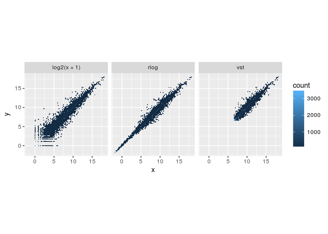
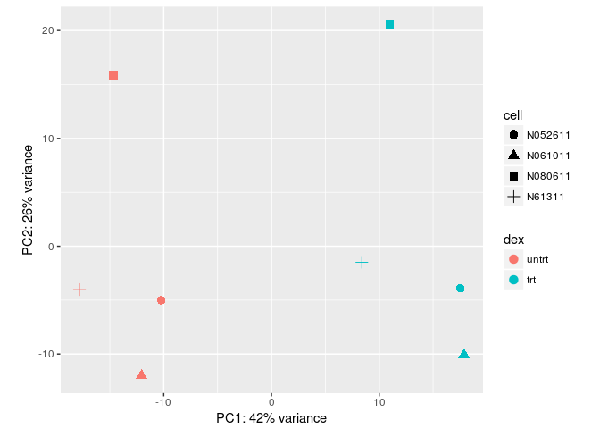

RNAseq practical
================

-   [Introduction](#introduction)
    -   [Experimental Data](#experimental-data)
-   [Exploratory analysis and visualization](#exploratory-analysis-and-visualization)
    -   [Loading and Exploring the data](#loading-and-exploring-the-data)
    -   [The *DESeqDataSet* object, sample information and the design formula](#the-deseqdataset-object-sample-information-and-the-design-formula)
    -   [!!!ADVANCED: The rlog and variance stabilizing transformations](#advanced-the-rlog-and-variance-stabilizing-transformations)
    -   [Clustering and PCA](#clustering-and-pca)
-   [Differential expression analysis](#differential-expression-analysis)
    -   [Running the differential expression pipeline](#running-the-differential-expression-pipeline)
    -   [!!!ADVANCED: Multiple testing](#advanced-multiple-testing)
-   [Reference](#reference)

Introduction
============

This practical is based on the BioConductors' *RNA-seq workflow: gene-level exploratory analysis and differential expression*; a comprehensive workflow that the describes how to go from FASTQ-files to perform a differential expression analysis and annotating results. Here, we will only explore a few steps and focus on the differential expression analysis. The full workflow is described [here](https://www.bioconductor.org/help/workflows/rnaseqGene/). The workflow also appread as a F1000 paper(Love et al. 2015).

Experimental Data
-----------------

The data used in this workflow is stored in the `airway` package that summarizes an RNA-seq experiment wherein airway smooth muscle cells were treated with dexamethasone, a synthetic glucocorticoid steroid with anti-inflammatory effects (Himes et al. 2014). Glucocorticoids are used, for example, by people with asthma to reduce inflammation of the airways. In the experiment, four primary human airway smooth muscle cell lines were treated with 1 micromolar dexamethasone for 18 hours. For each of the four cell lines, we have a treated and an untreated sample. For more description of the experiment see the [PubMed entry 24926665](https://www.ncbi.nlm.nih.gov/pubmed/24926665) and for raw data see the GEO entry [GSE52778](https://www.ncbi.nlm.nih.gov/geo/query/acc.cgi?acc=GSE52778).

Exploratory analysis and visualization
======================================

Loading and Exploring the data
------------------------------

The [airway](http://bioconductor.org/packages/airway/)-package is available from BioConductor as a data-package and contains both the gene expression counts as well as metadata on the experiment and samples. This prepared dataset is what we will use in this practical.

We won't go into the details of how to construct such a dataset or object but it is good to known that many BioConductor package use specialized objects to ease various analyses, for example, later we will see an *DESeqDataSet* which we will use specifically for doing differential expression analysis using the `DESeq2`-package.

> Use the following code to figure out how many samples and genes are in the dataset.

``` r
library(airway)                         #loading the airway library 
data("airway")                          #loading the airway data
se <- airway                            #for ease of typing
se 
```

    ## class: RangedSummarizedExperiment 
    ## dim: 64102 8 
    ## metadata(1): ''
    ## assays(1): counts
    ## rownames(64102): ENSG00000000003 ENSG00000000005 ... LRG_98 LRG_99
    ## rowData names(0):
    ## colnames(8): SRR1039508 SRR1039509 ... SRR1039520 SRR1039521
    ## colData names(9): SampleName cell ... Sample BioSample

``` r
colData(se)
```

    ## DataFrame with 8 rows and 9 columns
    ##            SampleName     cell      dex    albut        Run avgLength
    ##              <factor> <factor> <factor> <factor>   <factor> <integer>
    ## SRR1039508 GSM1275862   N61311    untrt    untrt SRR1039508       126
    ## SRR1039509 GSM1275863   N61311      trt    untrt SRR1039509       126
    ## SRR1039512 GSM1275866  N052611    untrt    untrt SRR1039512       126
    ## SRR1039513 GSM1275867  N052611      trt    untrt SRR1039513        87
    ## SRR1039516 GSM1275870  N080611    untrt    untrt SRR1039516       120
    ## SRR1039517 GSM1275871  N080611      trt    untrt SRR1039517       126
    ## SRR1039520 GSM1275874  N061011    untrt    untrt SRR1039520       101
    ## SRR1039521 GSM1275875  N061011      trt    untrt SRR1039521        98
    ##            Experiment    Sample    BioSample
    ##              <factor>  <factor>     <factor>
    ## SRR1039508  SRX384345 SRS508568 SAMN02422669
    ## SRR1039509  SRX384346 SRS508567 SAMN02422675
    ## SRR1039512  SRX384349 SRS508571 SAMN02422678
    ## SRR1039513  SRX384350 SRS508572 SAMN02422670
    ## SRR1039516  SRX384353 SRS508575 SAMN02422682
    ## SRR1039517  SRX384354 SRS508576 SAMN02422673
    ## SRR1039520  SRX384357 SRS508579 SAMN02422683
    ## SRR1039521  SRX384358 SRS508580 SAMN02422677

> How many million reads are sequenced/aligned to genes for each sample?

``` r
round( colSums(assay(se)) / 1e6, 1 )
```

    ## SRR1039508 SRR1039509 SRR1039512 SRR1039513 SRR1039516 SRR1039517 
    ##       20.6       18.8       25.3       15.2       24.4       30.8 
    ## SRR1039520 SRR1039521 
    ##       19.1       21.2

For the differential expression analysis we will use the [`DESeq2`](http://bioconductor.org/packages/DESeq2/)-package(Love, Huber, and Anders 2014).

The *DESeqDataSet* object, sample information and the design formula
--------------------------------------------------------------------

Here we will construct a *DESeqDataSet* from the airway data and add the design formula containing the covariates on which we will perform the differential expression analysis.

``` r
library(DESeq2)
## it is prefered in R that the first level of a factor be the
## reference level (e.g. control, or untreated samples), so we need to
## relevel the dex factor
se$dex <- relevel(se$dex, "untrt")
dds <- DESeqDataSet(se, design = ~ cell + dex) #add formula
dds
```

    ## class: DESeqDataSet 
    ## dim: 64102 8 
    ## metadata(2): '' version
    ## assays(1): counts
    ## rownames(64102): ENSG00000000003 ENSG00000000005 ... LRG_98 LRG_99
    ## rowData names(0):
    ## colnames(8): SRR1039508 SRR1039509 ... SRR1039520 SRR1039521
    ## colData names(9): SampleName cell ... Sample BioSample

Our *DESeqDataSet* contains many rows with only zeros, and additionally many rows with only a few fragments total. In order to reduce the size of the object, and to increase the speed of our functions, we can remove the rows that have no or nearly no information about the amount of gene expression. Here we apply the most minimal filtering rule: removing rows of the *DESeqDataSet* that have no counts, or only a single count across all samples. Additional weighting/filtering to improve power is applied at a later step in the workflow.

``` r
nrow(dds)
```

    ## [1] 64102

``` r
dds <- dds[ rowSums(counts(dds)) > 1, ]
nrow(dds)
```

    ## [1] 29391

> How many genes have zero counts across all samples?

``` r
table(rowSums(assays(se)$counts) == 0)
```

    ## 
    ## FALSE  TRUE 
    ## 33469 30633

!!!ADVANCED: The rlog and variance stabilizing transformations
--------------------------------------------------------------

Many common statistical methods for exploratory analysis of multidimensional data, for example clustering and principal components analysis (PCA), work best for data that generally has the same range of variance at different ranges of the mean values. When the expected amount of variance is approximately the same across different mean values, the data is said to be homoskedastic. For RNA-seq counts, however, the expected variance grows with the mean. For example, if one performs PCA directly on a matrix of counts or normalized counts (e.g. correcting for differences in sequencing depth), the resulting plot typically depends mostly on the genes with highest counts because they show the largest absolute differences between samples. A simple and often used strategy to avoid this is to take the logarithm of the normalized count values plus a pseudocount of 1; however, depending on the choice of pseudocount, now the genes with the very lowest counts will contribute a great deal of noise to the resulting plot, because taking the logarithm of small counts actually inflates their variance. We can quickly show this property of counts with some simulated data (here, Poisson counts with a range of lambda from 0.1 to 100). We plot the standard deviation of each row (genes) against the mean:

``` r
lambda <- 10^seq(from = -1, to = 2, length = 1000)
cts <- matrix(rpois(1000*100, lambda), ncol = 100)
library(vsn)
msCts <- meanSdPlot(cts, ranks = FALSE, plot=FALSE)
log.cts.one <- log2(cts + 1)
msLog <- meanSdPlot(log.cts.one, ranks = FALSE, plot=FALSE)
library(gridExtra)
grid.arrange(msCts$gg, msLog$gg, nrow=2)
```


The logarithm with a small pseudocount amplifies differences when the values are close to 0. The low count genes with low signal-to-noise ratio will overly contribute to sample-sample distances and PCA plots.

For genes with high counts, the rlog and VST will give similar result to the ordinary log2 transformation of normalized counts. For genes with lower counts, however, the values are shrunken towards the genes’ averages across all samples. The rlog-transformed or VST data then becomes approximately homoskedastic, and can be used directly for computing distances between samples, making PCA plots, or as input to downstream methods which perform best with homoskedastic data.

``` r
library(dplyr)
library(ggplot2)
rld <- rlog(dds, blind = FALSE)
vsd <- vst(dds, blind = FALSE)
dds <- estimateSizeFactors(dds)
df <- bind_rows(
  as_data_frame(log2(counts(dds, normalized=TRUE)[, 1:2]+1)) %>%
         mutate(transformation = "log2(x + 1)"),
  as_data_frame(assay(rld)[, 1:2]) %>% mutate(transformation = "rlog"),
  as_data_frame(assay(vsd)[, 1:2]) %>% mutate(transformation = "vst"))  
colnames(df)[1:2] <- c("x", "y")  
ggplot(df, aes(x = x, y = y)) + geom_hex(bins = 80) +
  coord_fixed() + facet_grid( . ~ transformation)  
```



Scatterplot of transformed counts from two samples. Shown are scatterplots using the log2 transform of normalized counts (left), using the rlog (middle), and using the VST (right). While the rlog is on roughly the same scale as the log2 counts, the VST has a upward shift for the smaller values. It is the differences between samples (deviation from y=x in these scatterplots) which will contribute to the distance calculations and the PCA plot.

We can see how genes with low counts (bottom left-hand corner) seem to be excessively variable on the ordinary logarithmic scale, while the rlog transform and VST compress differences for the low count genes for which the data provide little information about differential expression.

Clustering and PCA
------------------

A useful first step in an RNA-seq analysis is often to assess overall similarity between samples: Which samples are similar to each other, which are different? Does this fit to the expectation from the experiment’s design?

We use the R function dist to calculate the Euclidean distance between samples. To ensure we have a roughly equal contribution from all genes, we use it on the rlog-transformed data. We need to transpose the matrix of values using t, because the dist function expects the different samples to be rows of its argument, and different dimensions (here, genes) to be columns.

``` r
sampleDists <- dist(t(assay(rld)))
sampleDists
```

    ##            SRR1039508 SRR1039509 SRR1039512 SRR1039513 SRR1039516
    ## SRR1039509   45.69859                                            
    ## SRR1039512   39.25239   54.90828                                 
    ## SRR1039513   62.63201   44.52740   48.72579                      
    ## SRR1039516   44.50557   59.06364   43.57856   63.74275           
    ## SRR1039517   64.49410   51.44882   59.22962   49.87992   47.48200
    ## SRR1039520   39.57693   57.46259   36.74434   58.49014   46.40786
    ## SRR1039521   63.36124   45.05732   57.87616   36.49484   65.54600
    ##            SRR1039517 SRR1039520
    ## SRR1039509                      
    ## SRR1039512                      
    ## SRR1039513                      
    ## SRR1039516                      
    ## SRR1039517                      
    ## SRR1039520   63.59942           
    ## SRR1039521   52.31695   50.13430

We visualize the distances in a heatmap in a figure below, using the function `pheatmap` from the [pheatmap](https://cran.r-project.org/web/packages/pheatmap) package.

``` r
library(pheatmap)
library(RColorBrewer)
sampleDistMatrix <- as.matrix( sampleDists )
rownames(sampleDistMatrix) <- paste( rld$dex, rld$cell, sep = " - " )
colnames(sampleDistMatrix) <- NULL
colors <- colorRampPalette( rev(brewer.pal(9, "Blues")) )(255)
pheatmap(sampleDistMatrix,
         clustering_distance_rows = sampleDists,
         clustering_distance_cols = sampleDists,
         col = colors)
```


> Which samples are more similar to each other?

Another way to visualize sample-to-sample distances is a principal components analysis (PCA). In this ordination method, the data points (here, the samples) are projected onto the 2D plane such that they spread out in the two directions that explain most of the differences (figure below). The x-axis is the direction that separates the data points the most. The values of the samples in this direction are written PC1. The y-axis is a direction (it must be orthogonal to the first direction) that separates the data the second most. The values of the samples in this direction are written PC2. The percent of the total variance that is contained in the direction is printed in the axis label. Note that these percentages do not add to 100%, because there are more dimensions that contain the remaining variance (although each of these remaining dimensions will explain less than the two that we see).

``` r
pcaData <- plotPCA(rld, intgroup = c( "dex", "cell"), returnData = TRUE)
pcaData
```

    ##                  PC1        PC2           group   dex    cell       name
    ## SRR1039508 -17.81773  -4.020836  untrt : N61311 untrt  N61311 SRR1039508
    ## SRR1039509   8.38790  -1.490805    trt : N61311   trt  N61311 SRR1039509
    ## SRR1039512 -10.22735  -5.004069 untrt : N052611 untrt N052611 SRR1039512
    ## SRR1039513  17.53277  -3.909890   trt : N052611   trt N052611 SRR1039513
    ## SRR1039516 -14.67169  15.873239 untrt : N080611 untrt N080611 SRR1039516
    ## SRR1039517  10.98782  20.598625   trt : N080611   trt N080611 SRR1039517
    ## SRR1039520 -12.06035 -11.985876 untrt : N061011 untrt N061011 SRR1039520
    ## SRR1039521  17.86863 -10.060389   trt : N061011   trt N061011 SRR1039521

``` r
percentVar <- round(100 * attr(pcaData, "percentVar"))
ggplot(pcaData, aes(x = PC1, y = PC2, color = dex, shape = cell)) +
  geom_point(size =3) +
  xlab(paste0("PC1: ", percentVar[1], "% variance")) +
  ylab(paste0("PC2: ", percentVar[2], "% variance")) +
  coord_fixed()
```



> Which samples are more similar to each other? What can you say about the impact of different cell-lines?

Differential expression analysis
================================

Running the differential expression pipeline
--------------------------------------------

As we have already specified an experimental design when we created the DESeqDataSet, we can run the differential expression pipeline on the raw counts with a single call to the function DESeq:

``` r
dds <- DESeq(dds)
```

    ## using pre-existing size factors

    ## estimating dispersions

    ## gene-wise dispersion estimates

    ## mean-dispersion relationship

    ## final dispersion estimates

    ## fitting model and testing

This function will print out a message for the various steps it performs. These are described in more detail in the manual page for DESeq, which can be accessed by typing ?DESeq. Briefly these are: the estimation of size factors (controlling for differences in the sequencing depth of the samples), the estimation of dispersion values for each gene, and fitting a generalized linear model.

A *DESeqDataSet* is returned that contains all the fitted parameters within it, and the following section describes how to extract out results tables of interest from this object.

``` r
res <- results(dds, alpha = 0.05)
res
```

    ## log2 fold change (MAP): dex trt vs untrt 
    ## Wald test p-value: dex trt vs untrt 
    ## DataFrame with 29391 rows and 6 columns
    ##                    baseMean log2FoldChange      lfcSE       stat
    ##                   <numeric>      <numeric>  <numeric>  <numeric>
    ## ENSG00000000003 708.6021697    -0.37415193 0.09884432 -3.7852648
    ## ENSG00000000419 520.2979006     0.20206144 0.10974240  1.8412340
    ## ENSG00000000457 237.1630368     0.03616620 0.13834538  0.2614196
    ## ENSG00000000460  57.9326331    -0.08446385 0.24990676 -0.3379815
    ## ENSG00000000938   0.3180984    -0.08413904 0.15133427 -0.5559814
    ## ...                     ...            ...        ...        ...
    ## ENSG00000273485   1.2864477     0.03398815  0.2932360  0.1159071
    ## ENSG00000273486  15.4525365    -0.09560732  0.3410333 -0.2803460
    ## ENSG00000273487   8.1632350     0.55007412  0.3725061  1.4766847
    ## ENSG00000273488   8.5844790     0.10515293  0.3683834  0.2854442
    ## ENSG00000273489   0.2758994     0.06947900  0.1512520  0.4593591
    ##                      pvalue        padj
    ##                   <numeric>   <numeric>
    ## ENSG00000000003 0.000153545 0.001207653
    ## ENSG00000000419 0.065587276 0.187241454
    ## ENSG00000000457 0.793768939 0.905590644
    ## ENSG00000000460 0.735377161 0.874863971
    ## ENSG00000000938 0.578223585          NA
    ## ...                     ...         ...
    ## ENSG00000273485   0.9077261          NA
    ## ENSG00000273486   0.7792120   0.8981397
    ## ENSG00000273487   0.1397602   0.3241124
    ## ENSG00000273488   0.7753038   0.8956032
    ## ENSG00000273489   0.6459763          NA

Calling results without any arguments will extract the estimated log2 fold changes and p values for the last variable in the design formula. If there are more than 2 levels for this variable, results will extract the results table for a comparison of the last level over the first level. The comparison is printed at the top of the output: dex trt vs untrt.

The first column, baseMean, is a just the average of the normalized count values, divided by the size factors, taken over all samples in the DESeqDataSet. The remaining four columns refer to a specific contrast, namely the comparison of the trt level over the untrt level for the factor variable dex. We will find out below how to obtain other contrasts.

The column log2FoldChange is the effect size estimate. It tells us how much the gene's expression seems to have changed due to treatment with dexamethasone in comparison to untreated samples. This value is reported on a logarithmic scale to base 2: for example, a log2 fold change of 1.5 means that the gene’s expression is increased by a multiplicative factor of \(2^{1.5} \approx 2.82\).

Of course, this estimate has an uncertainty associated with it, which is available in the column lfcSE, the standard error estimate for the log2 fold change estimate. We can also express the uncertainty of a particular effect size estimate as the result of a statistical test. The purpose of a test for differential expression is to test whether the data provides sufficient evidence to conclude that this value is really different from zero. DESeq2 performs for each gene a hypothesis test to see whether evidence is sufficient to decide against the null hypothesis that there is zero effect of the treatment on the gene and that the observed difference between treatment and control was merely caused by experimental variability (i.e., the type of variability that you can expect between different samples in the same treatment group). As usual in statistics, the result of this test is reported as a p value, and it is found in the column pvalue. Remember that a p value indicates the probability that a fold change as strong as the observed one, or even stronger, would be seen under the situation described by the null hypothesis.

We can also summarize the results with the following line of code, which reports some additional information, that will be covered in later sections.

``` r
summary(res)
```

    ## 
    ## out of 29391 with nonzero total read count
    ## adjusted p-value < 0.05
    ## LFC > 0 (up)     : 2210, 7.5% 
    ## LFC < 0 (down)   : 1804, 6.1% 
    ## outliers [1]     : 0, 0% 
    ## low counts [2]   : 12536, 43% 
    ## (mean count < 7)
    ## [1] see 'cooksCutoff' argument of ?results
    ## [2] see 'independentFiltering' argument of ?results

!!!ADVANCED: Multiple testing
-----------------------------

In high-throughput biology, we are careful to not use the p values directly as evidence against the null, but to correct for multiple testing. What would happen if we were to simply threshold the p values at a low value, say 0.05? There are 5676 genes with a p value below 0.05 among the 29391 genes for which the test succeeded in reporting a p value:

``` r
res.05 <- results(dds, alpha = 0.05)
table(res.05$padj < 0.05)
```

    ## 
    ## FALSE  TRUE 
    ## 12841  4014

Now, assume for a moment that the null hypothesis is true for all genes, i.e., no gene is affected by the treatment with dexamethasone. Then, by the definition of the p value, we expect up to 5% of the genes to have a p value below 0.05. This amounts to 1470 genes. If we just considered the list of genes with a p value below 0.05 as differentially expressed, this list should therefore be expected to contain up to 1470 / 5676 = 26% false positives.

DESeq2 uses the Benjamini-Hochberg (BH) adjustment (Benjamini and Hochberg 1995) as implemented in the base R p.adjust function; in brief, this method calculates for each gene an adjusted p value that answers the following question: if one called significant all genes with an adjusted p value less than or equal to this gene’s adjusted p value threshold, what would be the fraction of false positives (the false discovery rate, FDR) among them, in the sense of the calculation outlined above? These values, called the BH-adjusted p values, are given in the column padj of the res object.

The FDR is a useful statistic for many high-throughput experiments, as we are often interested in reporting or focusing on a set of interesting genes, and we would like to put an upper bound on the percent of false positives in this set.

Hence, if we consider a fraction of 10% false positives acceptable, we can consider all genes with an adjusted p value below 10% = 0.1 as significant. How many such genes are there?

Reference
=========

Himes, B. E., X. Jiang, P. Wagner, R. Hu, Q. Wang, B. Klanderman, R. M. Whitaker, et al. 2014. “RNA-Seq transcriptome profiling identifies CRISPLD2 as a glucocorticoid responsive gene that modulates cytokine function in airway smooth muscle cells.” *PLoS ONE* 9 (6): e99625.

Love, M. I., S. Anders, V. Kim, and W. Huber. 2015. “RNA-Seq workflow: gene-level exploratory analysis and differential expression.” *F1000Res* 4: 1070.

Love, M. I., W. Huber, and S. Anders. 2014. “Moderated estimation of fold change and dispersion for RNA-seq data with DESeq2.” *Genome Biol.* 15 (12): 550.
