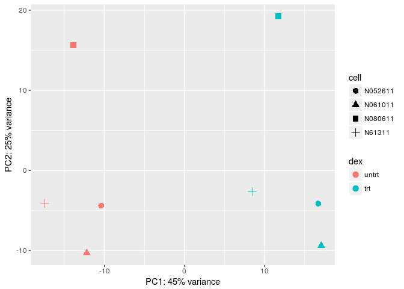

Reproducible Research practical
================

-   [Adding code chunks](#adding-code-chunks)
-   [Adding a figure](#adding-a-figure)
-   [Tip of iceberg](#tip-of-iceberg)

Choose `File` and then `R Markdown` give *Title*, *Author* and press `OK`.

A Rmarkdown template file (*Untitled1*) is generated use the `Knit` button to create your first reproducible document (you will be requested to give the file a name and to store it somewhere).

Adding code chunks
==================

Now add the following code chunks and type a small description of what kind of analysis is performed.

*describe code ...*

``` r
library(airway)
library(DESeq2)
data("airway")
airway$dex <- relevel(airway$dex, "untrt")
dds <- DESeqDataSet(airway, design = ~ cell + dex) #add formula
nrow(dds)
```

    ## [1] 64102

*describe results...*

Filtering un- or lowly expressed genes using counts per million is advocated by the developers of edgeR\[@\] another package for the differential expression analysis (see [section 2.6 Filtering](https://bioconductor.org/packages/release/bioc/vignettes/edgeR/inst/doc/edgeRUsersGuide.pdf)).

``` r
cpm <- 1e6*counts(dds)/colSums(counts(dds))
keep <- rowSums(cpm>1) >= 4                
dds <- dds[keep, ]
nrow(dds)
```

    ## [1] 14360

*describe results...*

*describe code ...*

``` r
dds <- DESeq(dds)
```

    ## estimating size factors

    ## estimating dispersions

    ## gene-wise dispersion estimates

    ## mean-dispersion relationship

    ## final dispersion estimates

    ## fitting model and testing

``` r
res <- results(dds, alpha = 0.05)
res$Symbol <- mapIds(org.Hs.eg.db, rownames(res), "SYMBOL", "ENSEMBL")
```

    ## 'select()' returned 1:many mapping between keys and columns

``` r
res[order(res$padj),]
```

    ## log2 fold change (MAP): dex trt vs untrt 
    ## Wald test p-value: dex trt vs untrt 
    ## DataFrame with 14360 rows and 7 columns
    ##                    baseMean log2FoldChange      lfcSE          stat
    ##                   <numeric>      <numeric>  <numeric>     <numeric>
    ## ENSG00000152583    997.5202       4.293616  0.1721530      24.94071
    ## ENSG00000165995    495.4311       3.174093  0.1274643      24.90182
    ## ENSG00000101347  12708.7527       3.604035  0.1489683      24.19329
    ## ENSG00000120129   3411.4330       2.858802  0.1185387      24.11704
    ## ENSG00000189221   2342.8234       3.216087  0.1366041      23.54312
    ## ...                     ...            ...        ...           ...
    ## ENSG00000009307 15828.50403  -4.327685e-05 0.07700615 -5.619921e-04
    ## ENSG00000123728   546.27594  -4.533937e-05 0.10468659 -4.330962e-04
    ## ENSG00000135722    75.27579   9.042885e-05 0.19991225  4.523427e-04
    ## ENSG00000173531   228.88746  -7.440328e-05 0.15275451 -4.870775e-04
    ## ENSG00000180673    23.73033   2.341427e-06 0.30301019  7.727221e-06
    ##                        pvalue          padj      Symbol
    ##                     <numeric>     <numeric> <character>
    ## ENSG00000152583 2.693499e-137 3.867864e-133     SPARCL1
    ## ENSG00000165995 7.110821e-137 5.105569e-133      CACNB2
    ## ENSG00000101347 2.617388e-129 1.252856e-125      SAMHD1
    ## ENSG00000120129 1.656548e-128 5.947008e-125       DUSP1
    ## ENSG00000189221 1.476513e-122 4.240545e-119        MAOA
    ## ...                       ...           ...         ...
    ## ENSG00000009307     0.9995516     0.9997241       CSDE1
    ## ENSG00000123728     0.9996544     0.9997241       RAP2C
    ## ENSG00000135722     0.9996391     0.9997241       FBXL8
    ## ENSG00000173531     0.9996114     0.9997241        MST1
    ## ENSG00000180673     0.9999938     0.9999938          NA

*describe results...*

Adding a figure
===============

Adding a figure is as easy as a code chunk!

*describe code ...*

``` r
library(vsn)
library(ggplot2)
rld <- rlog(dds, blind = FALSE)
pcaData <- plotPCA(rld, intgroup = c( "dex", "cell"), returnData = TRUE)
pcaData
```

    ##                   PC1        PC2           group   dex    cell       name
    ## SRR1039508 -17.470328  -4.104236  untrt : N61311 untrt  N61311 SRR1039508
    ## SRR1039509   8.454183  -2.638643    trt : N61311   trt  N61311 SRR1039509
    ## SRR1039512 -10.419877  -4.384220 untrt : N052611 untrt N052611 SRR1039512
    ## SRR1039513  16.715160  -4.128324   trt : N052611   trt N052611 SRR1039513
    ## SRR1039516 -13.893510  15.656023 untrt : N080611 untrt N080611 SRR1039516
    ## SRR1039517  11.732798  19.249447   trt : N080611   trt N080611 SRR1039517
    ## SRR1039520 -12.209613 -10.287692 untrt : N061011 untrt N061011 SRR1039520
    ## SRR1039521  17.091186  -9.362354   trt : N061011   trt N061011 SRR1039521

``` r
percentVar <- round(100 * attr(pcaData, "percentVar"))
ggplot(pcaData, aes(x = PC1, y = PC2, color = dex, shape = cell)) +
  geom_point(size =3) +
  xlab(paste0("PC1: ", percentVar[1], "% variance")) +
  ylab(paste0("PC2: ", percentVar[2], "% variance")) +
  coord_fixed()
```



*describe results...*

Tip of iceberg
==============

This is really the *tip of the iceberg* check out the [rmarkdown website](http://rmarkdown.rstudio.com/) or the [knitr website](https://yihui.name/knitr/) that show many applications of `rmarkdown` i.e. how to write complete books, website, scientific manuscripts and much more!
