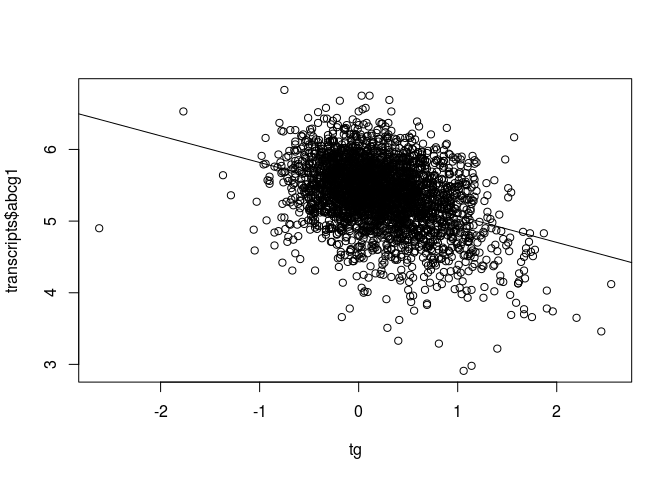

Practical Course: Integrated analysis of multiple -omics data and Mendelian randomization
================

-   [Introduction](#introduction)
-   [Load data](#load-data)
-   [PART 1](#part-1)
-   [Determine association between triglyceride levels and gene transcription](#determine-association-between-triglyceride-levels-and-gene-transcription)
-   [Bidirectional Mendelian randomization](#bidirectional-mendelian-randomization)
-   [Evaluate instrumental variable](#evaluate-instrumental-variable)
-   [Estimate an effect of triglyceride levels on gene transcription](#estimate-an-effect-of-triglyceride-levels-on-gene-transcription)
-   [Estimate an effect of gene transcription on triglyceride levels](#estimate-an-effect-of-gene-transcription-on-triglyceride-levels)
-   [PART 2](#part-2)

Introduction
------------

One of the issues with epigenome-wide and transcriptome-wide association studies, in contrast to genome-wide association studies, is interpreting what is cause and what is consequence. In this practical course you will use genetic variants to infer a causal relationship between variation in blood triglyceride levels, of which high levels are a risk factor for cardiovascular diseases, and gene transcription and DNA methylation of blood cells.

We expect that everyone will be able to complete Part 1 on transcription (questions 1-25), Part 2 on DNA methylation is for fast students. Paste the answers to your questions in a Word document and mail them to <b.t.heijmans@lumc.nl> with your name both in the document AND in the file name.

Load data
---------

``` r
load(url("https://raw.githubusercontent.com/molepi/FOS2017/master/integrative_omics/data.RData"))
```

-   Use **ls()**, **str** and **summary** to explore the data.

``` r
ls() # list of objects in environment
```

    ##  [1] "coefficients"         "cpg_snps"             "cpgs"                
    ##  [4] "fit"                  "i"                    "ivreg_tg_transcripts"
    ##  [7] "ivreg_transcripts_tg" "lm_transcripts_cpgs"  "lm_transcripts_snps" 
    ## [10] "lm_transcripts_tg"    "prop"                 "tg"                  
    ## [13] "tg_snp"               "transcript_snps"      "transcripts"

``` r
str(tg) # structure of object tg
```

    ##  num [1:3000] 0.91 0.04 0.15 0.63 0.3 1.17 -0.53 -0.2 1.42 0.6 ...

``` r
summary(transcripts) # summary of object transcripts
```

    ##      abcg1           srebf1          srebf2           sqle       
    ##  Min.   :2.910   Min.   :4.930   Min.   :5.870   Min.   :-0.510  
    ##  1st Qu.:5.100   1st Qu.:6.010   1st Qu.:6.700   1st Qu.: 2.430  
    ##  Median :5.400   Median :6.210   Median :6.820   Median : 2.670  
    ##  Mean   :5.365   Mean   :6.209   Mean   :6.829   Mean   : 2.662  
    ##  3rd Qu.:5.680   3rd Qu.:6.420   3rd Qu.:6.960   3rd Qu.: 2.920  
    ##  Max.   :6.830   Max.   :7.430   Max.   :7.890   Max.   : 4.220  
    ##  NA's   :78      NA's   :78      NA's   :78      NA's   :78

``` r
summary(cpgs)  # summary of object cpgs
```

    ##    cg06500161        cg11024682        cg16000331       cg09984392    
    ##  Min.   :-0.3200   Min.   :-1.1300   Min.   :-3.980   Min.   :-4.790  
    ##  1st Qu.: 0.2700   1st Qu.:-0.6100   1st Qu.:-2.860   1st Qu.:-2.860  
    ##  Median : 0.3900   Median :-0.4900   Median :-2.640   Median :-2.560  
    ##  Mean   : 0.4022   Mean   :-0.4799   Mean   :-2.645   Mean   :-2.596  
    ##  3rd Qu.: 0.5300   3rd Qu.:-0.3600   3rd Qu.:-2.420   3rd Qu.:-2.280  
    ##  Max.   : 1.7500   Max.   : 0.8100   Max.   :-0.540   Max.   :-0.870  
    ##  NA's   :145       NA's   :145       NA's   :145      NA's   :145

The data are already preprocessed to be suitable for linear regression:

-   **tg** = log-transformed triglyceride levels (log mmol per L)
-   **transcripts** = normalized and log-transformed gene transcript counts per million
-   **cpgs** = normalized and M-transformed DNA methylation levels
-   **tg\_snp**, **transcript\_snps**, **cpg\_snps** = genotypes converted to dosages, i.e. if A and B were the possible alleles for genetic variant X, then the dosage of X would be 0 if AA, 1 if AB or BA and 2 if BB.
-   **tg**, **transcripts** and **cpgs** have been adjusted for age, gender and cell counts

1.  How may genes and CpGs do the data contain?
2.  How many individuals have been measured?
3.  Use [Gene Cards](www.genecards.org) to look up the genes in **transcripts**, what is their reported function?
4.  Use [USCS Genome Browser](https://genome.ucsc.edu/cgi-bin/hgGateway) to look up the CpGs in **cpgs**, what is their nearest gene?
5.  Determine the allele frequencies for **tg\_snp**, see [Allele frequency](https://en.wikipedia.org/w/index.php?title=Allele_frequency).

``` r
prop <- prop.table(table(tg_snp)) # calculate genotype frequencies
c(A=as.numeric(prop[1] + 0.5 * prop[2]), B=as.numeric(prop[3] + 0.5 * prop[2])) # calculate allele frequencies
```

    ##         A         B 
    ## 0.1353333 0.8646667

PART 1
------

Determine association between triglyceride levels and gene transcription
------------------------------------------------------------------------

You will first identify if there is an association between triglyceride levels and transcription for these genes involved in lipid metabolism.

-   Create a scatter plot with triglyceride levels in the x-axis and *ABCG1* transcription on the y-axis.
-   Use **lm** to fit a linear model with triglycerides as explanatory variable and *ABCG1* transcription as response variable and add this to the plot using **abline**.

``` r
plot(tg, transcripts$abcg1)
abline(lm(transcripts$abcg1 ~ tg))
```



1.  Are higher triglyceride levels associated with higher or lower *ABCG1* transcription levels?

-   Use **summary** on the fitted model to obtain the model coefficients.

``` r
summary(lm(transcripts$abcg1 ~ tg))
```

    ## 
    ## Call:
    ## lm(formula = transcripts$abcg1 ~ tg)
    ## 
    ## Residuals:
    ##      Min       1Q   Median       3Q      Max 
    ## -2.14154 -0.26168  0.02613  0.29202  1.35966 
    ## 
    ## Coefficients:
    ##              Estimate Std. Error t value Pr(>|t|)    
    ## (Intercept)  5.445573   0.008943  608.89   <2e-16 ***
    ## tg          -0.371725   0.016954  -21.93   <2e-16 ***
    ## ---
    ## Signif. codes:  0 '***' 0.001 '**' 0.01 '*' 0.05 '.' 0.1 ' ' 1
    ## 
    ## Residual standard error: 0.44 on 2918 degrees of freedom
    ##   (80 observations deleted due to missingness)
    ## Multiple R-squared:  0.1414, Adjusted R-squared:  0.1411 
    ## F-statistic: 480.7 on 1 and 2918 DF,  p-value: < 2.2e-16

1.  Is this association statistically significant?
2.  Should you use a multiple testing correction? If so, for how many test should you adjust?

You could evaluate the association between triglyceride levels and transcription for all 4 genes with the previous approach, however this would be infeasible if we were to scale this up to all 30,000 genes.

-   Use a for-loop that iterates over the transcripts and reports the association coefficients for all genes in one output variable.

``` r
lm_transcripts_tg <- data.frame() # create new data frame
for (i in 1:ncol(transcripts)) { # iterate over number of transcripts
  fit <- lm(transcripts[, i] ~ tg) # fit model for every transcript
  coefficients <- summary(fit)$coefficients[2, , drop=F] # grab the second row of the coefficients, the first row contains the coefficients for the intercept
  lm_transcripts_tg <- rbind(lm_transcripts_tg, coefficients) # append the results to data frame
}
rownames(lm_transcripts_tg) <- colnames(transcripts)
lm_transcripts_tg
```

    ##           Estimate  Std. Error    t value     Pr(>|t|)
    ## abcg1  -0.37172460 0.016954443 -21.924908 9.266156e-99
    ## srebf1 -0.08833961 0.011964755  -7.383320 2.003652e-13
    ## srebf2  0.05557608 0.007737777   7.182434 8.653891e-13
    ## sqle    0.12144071 0.015648990   7.760291 1.163003e-14

1.  Which genes are associated with triglyceride levels?
2.  Based on these associations, can you infer whether blood triglycerides have an effect on transcription in blood cells or whether transcription of these genes has an effect on triglyceride levels? If not, what do you think is biologically more likely?

Bidirectional Mendelian randomization
-------------------------------------

To infer cause and consequence you will use [bidirectional Mendelian randomization](https://academic.oup.com/hmg/article-lookup/doi/10.1093/hmg/ddu328) using genetic variants as causal anchors. You will first estimate an effect of triglyceride levels on gene transcription for the triglyceride-associated genes and then you will estimate the effect of transcription on triglyceride levels.

Evaluate instrumental variable
------------------------------

Mendelian randomization requires genetic variants associated with your explanatory variable. Object **tg\_snp** contains genotype dosages of a genetic variant associated with triglyceride levels obtain from a [GWAS on lipid levels](http://www.nature.com/ng/journal/v45/n11/full/ng.2797.html). You will first verify this association.

-   Create a boxplot of triglyceride levels grouped by **tg\_snp** dosage.

``` r
boxplot(tg ~ tg_snp)
```


1.  What would be the risk allele, i.e. the allele associated with higher triglyceride levels, if AA is 0 and BB is 2?

-   Use **lm** to fit a linear model with triglyceride levels as explanatory variable and the genetic variant as response variable.

``` r
summary(lm(tg ~ tg_snp))
```

    ## 
    ## Call:
    ## lm(formula = tg ~ tg_snp)
    ## 
    ## Residuals:
    ##      Min       1Q   Median       3Q      Max 
    ## -2.80352 -0.32352 -0.03352  0.29648  2.36648 
    ## 
    ## Coefficients:
    ##             Estimate Std. Error t value Pr(>|t|)    
    ## (Intercept)  0.43999    0.03234   13.60  < 2e-16 ***
    ## tg_snp      -0.12823    0.01799   -7.13 1.26e-12 ***
    ## ---
    ## Signif. codes:  0 '***' 0.001 '**' 0.01 '*' 0.05 '.' 0.1 ' ' 1
    ## 
    ## Residual standard error: 0.4763 on 2918 degrees of freedom
    ##   (80 observations deleted due to missingness)
    ## Multiple R-squared:  0.01712,    Adjusted R-squared:  0.01679 
    ## F-statistic: 50.83 on 1 and 2918 DF,  p-value: 1.263e-12

1.  What percentage of variance in triglyceride levels are explained by the genetic variant (see Adjusted R-squared)?
2.  An F-statistic &gt; 10 is considered a good instrumental variable, is the genetic variant a good instrumental variable for triglyceride levels?
3.  Predict triglyceride levels (in mmol per L) for each dosage of the genetic variant.

``` r
exp(0.43999 + c(AA=0, AB=1, BB=2) * -0.12823)
```

    ##       AA       AB       BB 
    ## 1.552692 1.365827 1.201451

Estimate an effect of triglyceride levels on gene transcription
---------------------------------------------------------------

You will now estimate the effect of triglyceride levels on gene transcription using the genetic variant as a causal anchor.

-   Load library **AER**.
-   Use **ivreg** to fit a two-stage least-squares model with *ABCG1* gene transcription as explanatory variable, triglyceride levels as response variable and the genetic variant as instrumental variable.
-   Use summary to obtain the model coefficients.

``` r
library(AER)
summary(ivreg(transcripts$abcg1 ~ tg | tg_snp))
```

    ## 
    ## Call:
    ## ivreg(formula = transcripts$abcg1 ~ tg | tg_snp)
    ## 
    ## Residuals:
    ##      Min       1Q   Median       3Q      Max 
    ## -2.28716 -0.27762  0.01772  0.29885  1.67370 
    ## 
    ## Coefficients:
    ##             Estimate Std. Error t value Pr(>|t|)    
    ## (Intercept)  5.50457    0.03067 179.488  < 2e-16 ***
    ## tg          -0.64221    0.13510  -4.753  2.1e-06 ***
    ## ---
    ## Signif. codes:  0 '***' 0.001 '**' 0.01 '*' 0.05 '.' 0.1 ' ' 1
    ## 
    ## Residual standard error: 0.4588 on 2918 degrees of freedom
    ## Multiple R-Squared: 0.06655, Adjusted R-squared: 0.06623 
    ## Wald test:  22.6 on 1 and 2918 DF,  p-value: 2.096e-06

1.  A P-value &lt; 0.05 of a two-stage least squares model is evidence of an effect, is there evidence of an effect of triglyceride levels on *ABCG1* gene transcription?
2.  Compare the effect size estimate and standard error of the instrumental variable analysis with the earlier association estimate and standard error, what could be an explanation for the difference?

-   Use a modified version of the for-loop to obtain the coefficients for the other genes.

``` r
ivreg_transcripts_tg <- data.frame() # create new data frame
for (i in 1:ncol(transcripts)) { # iterate over number of transcripts
  fit <- ivreg(transcripts[, i] ~ tg | tg_snp) # fit model for every transcript
  coefficients <- summary(fit)$coefficients[2, , drop=F] # grab the second row of the coefficients, the first row contains the coefficients for the intercept
  ivreg_transcripts_tg <- rbind(ivreg_transcripts_tg, coefficients) # append the results to data frame
}
rownames(ivreg_transcripts_tg) <- colnames(transcripts)
ivreg_transcripts_tg
```

    ##          Estimate Std. Error   t value     Pr(>|t|)
    ## abcg1  -0.6422101 0.13510258 -4.753500 2.096117e-06
    ## srebf1 -0.1125255 0.09150152 -1.229766 2.188838e-01
    ## srebf2  0.1991457 0.06252502  3.185056 1.462514e-03
    ## sqle    0.4213258 0.12689577  3.320251 9.104248e-04

1.  For which genes is there an effect of triglyceride levels on gene transcription?

The second part of bidirectional Mendelian randomization evaluates the other direction, i.e. whether there is evidence for an effect of transcription on triglyceride levels.

Estimate an effect of gene transcription on triglyceride levels
---------------------------------------------------------------

**transcript\_snps** contains genetic variants associated *in cis*, i.e. within 250kb of the gene center, with transcription of the genes involved in lipid metabolism obtained from a [GWAS on gene transcription](http://www.nature.com/ng/journal/v49/n1/full/ng.3737.html).

-   Verify the associations between transcript levels and genotypes using a modified version of the previously used for-loop.
-   The order of genes in **transcripts** corresponds to the order of associated genetic variants in **transcript\_snps**.

``` r
lm_transcripts_snps <- data.frame() # create new data frame
for (i in 1:ncol(transcripts)) { # iterate over number of transcripts
  fit <- lm(transcripts[, i] ~ transcript_snps[, i]) # fit model for every transcript
  coefficients <- summary(fit)$coefficients[2, , drop=F] # grab the second row of the coefficients, the first row contains the coefficients for the intercept
  coefficients <- data.frame(coefficients, R.squared=summary(fit)$adj.r.squared, F.statistic=summary(fit)$fstatistic[1]) # add adjusted R-squared and F-statistic
  lm_transcripts_snps <- rbind(lm_transcripts_snps, coefficients) # append the results to data frame
}
rownames(lm_transcripts_snps) <- colnames(transcripts)
lm_transcripts_snps
```

    ##          Estimate  Std..Error   t.value     Pr...t..   R.squared
    ## abcg1  0.10735219 0.017075927  6.286756 3.725822e-10 0.013016726
    ## srebf1 0.13416055 0.007945055 16.886043 4.127996e-61 0.088650916
    ## srebf2 0.01766749 0.005278856  3.346841 8.277286e-04 0.003480261
    ## sqle   0.11169295 0.017676553  6.318706 3.039960e-10 0.013151021
    ##        F.statistic
    ## abcg1     39.52331
    ## srebf1   285.13846
    ## srebf2    11.20135
    ## sqle      39.92605

1.  Are the genetic variants good instrumental variables?
2.  A single genetic variant often explains a small percentage of variance in the explanatory variable, what could you do to improve the amount of variance explained to increase the power of the analysis?

Estimate an effect of gene transcription on triglyceride levels.

``` r
ivreg_tg_transcripts <- data.frame() # create new data frame
for (i in 1:ncol(transcripts)) { # iterate over number of transcripts
  fit <- ivreg(tg ~ transcripts[, i] | transcript_snps[, i]) # fit model for every transcript
  coefficients <- summary(fit)$coefficients[2, , drop=F] # grab the second row of the coefficients, the first row contains the coefficients for the intercept
  ivreg_tg_transcripts <- rbind(ivreg_tg_transcripts, coefficients) # append the results to data frame
}
rownames(ivreg_tg_transcripts) <- colnames(transcripts)
ivreg_tg_transcripts
```

    ##           Estimate Std. Error    t value  Pr(>|t|)
    ## abcg1  -0.08493841 0.15756431 -0.5390714 0.5898787
    ## srebf1 -0.06718198 0.09460779 -0.7101105 0.4776924
    ## srebf2  0.36746763 0.71345203  0.5150558 0.6065530
    ## sqle    0.01625879 0.18534746  0.0877206 0.9301048

1.  Is there evidence of an effect of gene expression on triglyceride levels?
2.  Give an explanation for the lack of evidence for an effect of triglyceride levels on *SREBF1* and vice versa.
3.  Given that your transcription was measured in whole blood, how would you determine if the effect of triglyceride levels on transcription occurs only in blood or also in other tissues?
4.  And if it the effect is present only in blood, how would you determine if the effect occurs in all blood cells or if it is specific to a certain cell type, e.g. monocytes or T-cells?
5.  Google *pleiotropy* and describe how this phenomenon can influence your Mendelian randomization results.

You have now identified several genes where triglyceride levels have an effect on transcription, potentially interesting targets in the etiology of cardiovascular diseases. In part 2 you will use Mendelian randomization to infer cause and consequence between triglyceride levels and DNA methylation.

PART 2
------

-   Replace **transcripts** with **cpgs** and **transcript\_snps** with **cpg\_snps** in the for-loops of Part 1.

1.  Is there an association between triglyceride levels and DNA methylation for the 4 CpGs in **cpgs**?
2.  Is there evidence of an effect of triglyceride levels on DNA methylation for the 4 CpGs in **cpgs**?
3.  Are the genetic variants in **cpg\_snps** good instruments for the CpGs in **cpgs**?
4.  Is there evidence of an effect of DNA methylation on triglyceride levels for the 4 CpGs in **cpgs**?
5.  Is there an association between DNA methylation for the 4 CpGs in **cpgs** and transcription for the 4 genes in **transcripts**?

``` r
lm_transcripts_cpgs <- data.frame() # create new data frame
for (i in 1:ncol(transcripts)) { # iterate over number of transcripts
  fit <- lm(transcripts[, i] ~ cpgs[, i]) # fit model for every transcript and corresponding CpG
  coefficients <- summary(fit)$coefficients[2, , drop=F] # grab the second row of the coefficients, the first row contains the coefficients for the intercept
  coefficients <- data.frame(coefficients, R.squared=summary(fit)$adj.r.squared) # add adjusted R-squared
  lm_transcripts_cpgs <- rbind(lm_transcripts_cpgs, coefficients) # append the results to data frame
}
rownames(lm_transcripts_cpgs) <- paste(colnames(transcripts), colnames(cpgs), sep="_")
lm_transcripts_cpgs
```

    ##                      Estimate Std..Error    t.value     Pr...t..
    ## abcg1_cg06500161  -0.72679237 0.04123655 -17.624956 4.447824e-66
    ## srebf1_cg11024682 -0.33976035 0.02930628 -11.593430 2.113061e-30
    ## srebf2_cg16000331 -0.09533609 0.01097351  -8.687838 6.112081e-18
    ## sqle_cg09984392   -0.15154543 0.01630232  -9.295943 2.812497e-20
    ##                    R.squared
    ## abcg1_cg06500161  0.09787434
    ## srebf1_cg11024682 0.04465665
    ## srebf2_cg16000331 0.02543250
    ## sqle_cg09984392   0.02905836

1.  Can you infer whether DNA methylation affects gene expression or visa versa?
2.  One of the assumptions of Mendelian randomization is that an instrument does not directly affect the response variable independent of its effect on the explanatory variable. Explain how this can be a problem when using genetic variants *in cis* with both CpG and gene.
